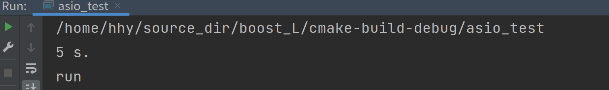
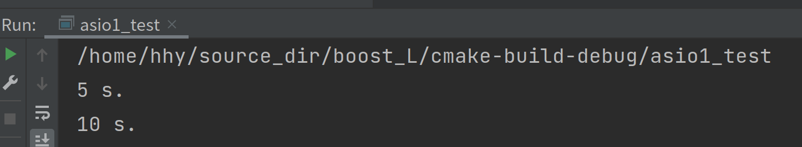
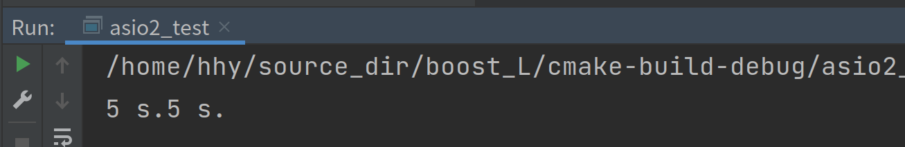
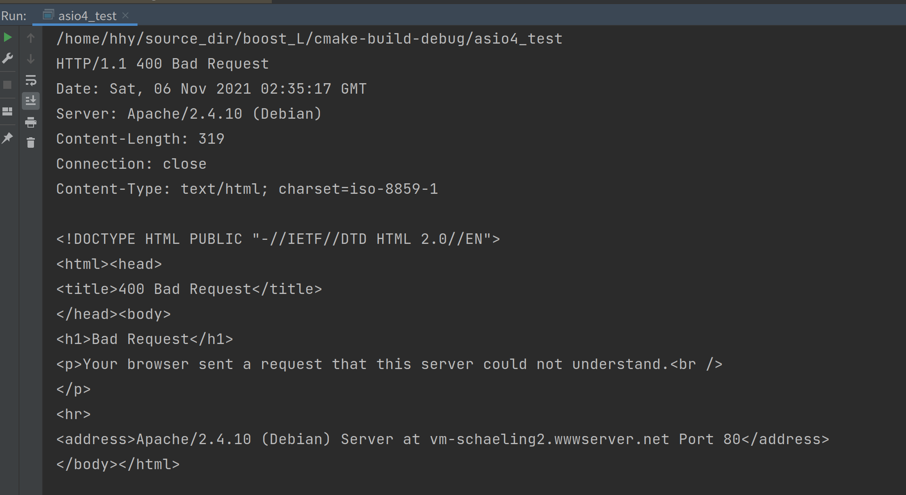
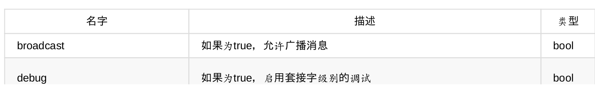
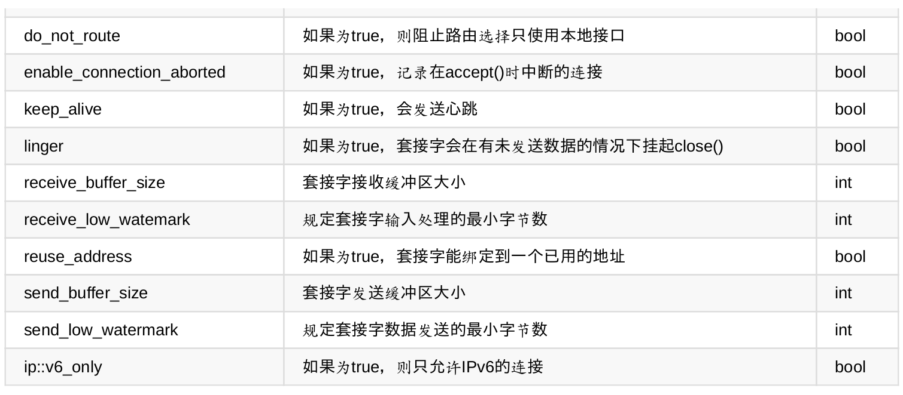
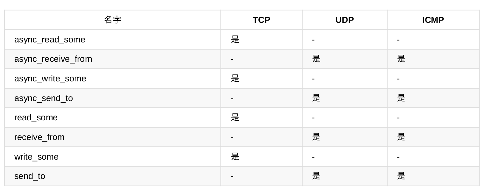

# Boost asio

> 异步数据处理就是指，任务触发后不需要等待它们完成。 相反，Boost.Asio 会在任务完成时触发一个应用。 异步任务的主要优点在于，在等待任务完成时不需要阻塞应用程序，可以去执行其它任务。

> 异步任务的典型例子是网络应用。 如果数据被发送出去了，比如发送至 Internet，通常需要知道数据是否发送成功。 如果没有一个象 Boost.Asio 这样的库，就必须对函数的返回值进行求值。 但是，这样就要求待至所有数据发送完毕，并得到一个确认或是错误代码。 而使用 Boost.Asio，这个过程被分为两个单独的步骤：第一步是作为一个异步任务开始数据传输。 一旦传输完成，不论成功或是错误，应用程序都会在第二步中得到关于相应的结果通知。 主要的区别在于，应用程序无需阻塞至传输完成，而可以在这段时间里执行其它操作。

## 计时器

* ### I/O 服务与 I/O 对象

  >使用 Boost.Asio 进行异步数据处理的应用程序基于两个概念：I/O 服务和 I/O 对象。 I/O 服务抽象了操作系统的接口，允许第一时间进行异步数据处理，而 I/O 对象则用于初始化特定的操作。 鉴于 Boost.Asio 只提供了一个名为 boost::asio::io_service 的类作为 I/O 服务，它针对所支持的每一个操作系统都分别实现了优化的类，另外库中还包含了针对不同 I/O 对象的几个类。 其中，类 boost::asio::ip::tcp::socket 用于通过网络发送和接收数据，而类  boost::asio::deadline_timer 则提供了一个计时器，用于测量某个固定时间点到来或是一段指定的时长过去了。

```c++
/*********************************************************************************
 *File    :asio_test
 *Author  :hanhy
 *Email   :hanhy20@mails.jlu.edu.cn
 *Desc    :
 **********************************************************************************/

#include <boost/asio.hpp>
#include <iostream>

void Handler(const boost::system::error_code &ec) {
  std::cout << "5 s." << std::endl;
}

int main() {
  boost::asio::io_service io_service;
  boost::asio::deadline_timer timer(io_service, boost::posix_time::seconds(5));
  timer.async_wait(Handler);
  io_service.run();
  std::cout<<"run"<<std::endl;
}
```



> async_wait() 的好处是，该函数调用会立即返回，而不是等待五秒钟。 一旦闹钟时间到，作为参数所提供的函数就会被相应调用。 因此，应用程序可以在调用了 async_wait() 之后执行其它操作，而不是阻塞在这里。
>
> 再看看上面的源代码，可以留意到在调用 async_wait() 之后，又在 I/O 服务之上调用了一个名为 run() 的方法。这是必须的，因为控制权必须被操作系统接管，才能在五秒之后调用 handler() 函数。
>
> async_wait() 会启动一个异步操作并立即返回，而 run() 则是阻塞的。因此调用 run() 后程序执行会停止。

```c++
/*********************************************************************************
 *File    :asio1_test
 *Author  :hanhy
 *Email   :hanhy20@mails.jlu.edu.cn
 *Desc    :
 **********************************************************************************/

#include <boost/asio.hpp>
#include <iostream>

void handler1(const boost::system::error_code &ec) {
  std::cout << "5 s." << std::endl;
}

void handler2(const boost::system::error_code &ec) {
  std::cout << "10 s." << std::endl;
}

int main() {
  boost::asio::io_service io_service;
  boost::asio::deadline_timer timer1(io_service, boost::posix_time::seconds(5));
  timer1.async_wait(handler1);
  boost::asio::deadline_timer timer2(io_service,
                                     boost::posix_time::seconds(10));
  timer2.async_wait(handler2);
  io_service.run();
  std::cout<<"run"<<std::endl;
}
```



> 如果 run() 不是阻塞的，main() 就会结束从而中止该应用程序。 如果应用程序不应被阻塞，那么就应该在一个新的线程内部调用 run()，它自然就会仅仅阻塞那个线程。

* ###  可扩展性与多线程

  >  如果在某个 boost::asio::io_service 类型的对象之上调用 run() 方法，则相关联的句柄也会在同一个线程内被执行。 通过使用多线程，应用程序可以同时调用多个 run() 方法。 一旦某个异步操作结束，相应的 I/O 服务就将在这些线程中的某一个之中执行句柄。 如果第二个操作在第一个操作之后很快也结束了，则 I/O 服务可以在另一个线程中执行句柄，而无需等待第一个句柄终止

```c++
/*********************************************************************************
 *File    :asio2_test
 *Author  :hanhy
 *Email   :hanhy20@mails.jlu.edu.cn
 *Desc    :
 **********************************************************************************/
#include <boost/asio.hpp>
#include <boost/thread.hpp>
#include <iostream>

void handler1(const boost::system::error_code &ec) {
  std::cout << "5 s." << std::endl;
}

void handler2(const boost::system::error_code &ec) {
  std::cout << "5 s." << std::endl;
}

boost::asio::io_service io_service;

void run() { io_service.run(); }

int main() {
  boost::asio::deadline_timer timer1(io_service, boost::posix_time::seconds(5));
  timer1.async_wait(handler1);
  boost::asio::deadline_timer timer2(io_service, boost::posix_time::seconds(5));
  timer2.async_wait(handler2);
  boost::thread thread1(run);
  boost::thread thread2(run);
  thread1.join();
  thread2.join();
}
```



> 由于有两个线程，所以 handler1() 和 handler2() 可以同时执行。 如果第二个计时器触发时第一个仍在执行，则第二个句柄就会在第二个线程中执行。 如果第一个计时器的句柄已经终止，则 I/O 服务可以自由选择任一线程。
>
>  以上例子的运行会导致不同信息在标准输出流上混合输出，因为这两个句柄可能会并行运行，访问同一个共享资源：标准输出流 std::cout。 这种访问必须被同步，以保证每一条信息在另一个线程可以向标准输出流写出另一条信息之前被完全写出。 在这种情形下使用线程并不能提供多少好处，如果各个独立句柄不能独立地并行运行。
> 多次调用同一个 I/O 服务的 run() 方法，是为基于 Boost.Asio 的应用程序增加可扩展性的推荐方法。 另外还有一个不同的方法：不要绑定多个线程到单个 I/O 服务，而是创建多个 I/O 服务。 然后每一个 I/O 服务使用一个线程。 如果 I/O 服务的数量与系统的处理器内核数量相匹配，则异步操作都可以在各自的内核上执行。

```c++
/*********************************************************************************
 *File    :asio3_test
 *Author  :hanhy
 *Email   :hanhy20@mails.jlu.edu.cn
 *Desc    :
 **********************************************************************************/

#include <boost/asio.hpp>
#include <boost/thread.hpp>
#include <iostream>

void handler1(const boost::system::error_code &ec) {
  std::cout << "5 s." << std::endl;
}

void handler2(const boost::system::error_code &ec) {
  std::cout << "5 s." << std::endl;
}

boost::asio::io_service io_service1;
boost::asio::io_service io_service2;

void run1() { io_service1.run(); }

void run2() { io_service2.run(); }

int main() {
  boost::asio::deadline_timer timer1(io_service1,
                                     boost::posix_time::seconds(5));
  timer1.async_wait(handler1);
  boost::asio::deadline_timer timer2(io_service2,
                                     boost::posix_time::seconds(5));
  timer2.async_wait(handler2);
  boost::thread thread1(run1);
  boost::thread thread2(run2);
  thread1.join();
  thread2.join();
}
```

## 网络编程 

> Boost.Asio 提供了多个 I/O 对象以开发网络应用。 以下例子使用了 boost::asio::ip::tcp::socket 类来建立与中另一台PC的连接，并下载 'Highscore' 主页；就象一个浏览器在指向 www.highscore.de 时所要做的。

```c++
/*********************************************************************************
 *File    :asio4_test
 *Author  :hanhy
 *Email   :hanhy20@mails.jlu.edu.cn
 *Desc    :
 **********************************************************************************/
#include <boost/array.hpp>
#include <boost/asio.hpp>
#include <iostream>
#include <string>

boost::asio::io_service io_service;
boost::asio::ip::tcp::resolver resolver(io_service);
boost::asio::ip::tcp::socket sock(io_service);
boost::array<char, 4096> buffer;

void read_handler(const boost::system::error_code &ec,
                  std::size_t bytes_transferred) {
  if (!ec) {
    std::cout << std::string(buffer.data(), bytes_transferred) << std::endl;
    sock.async_read_some(boost::asio::buffer(buffer), read_handler);
  }
}

void connect_handler(const boost::system::error_code &ec) {
  if (!ec) {
    boost::asio::write(
        sock,
        boost::asio::buffer("GET / HTTP 1.1\r\nHost: highscore.de\r\n\r\n"));
    sock.async_read_some(boost::asio::buffer(buffer), read_handler);
  }
}

void resolve_handler(const boost::system::error_code &ec,
                     boost::asio::ip::tcp::resolver::iterator it) {
  if (!ec) {
    sock.async_connect(*it, connect_handler);
  }
}

int main() {
  boost::asio::ip::tcp::resolver::query query("www.highscore.de", "80");
  resolver.async_resolve(query, resolve_handler);
  io_service.run();
}
```



>互联网使用了所谓的IP地址来标识每台PC。 IP地址实际上只是一长串数字，难以记住。 而记住象 www.highscore.de 这样的名字就容易得多。 为了在互联网上使用类似的名字，需要通过一个叫作域名解析的过程将它们翻译成相应的IP地址。 
>
>这个过程由所谓的域名解析器来完成，对应的 I/O 对象是：boost::asio::ip::tcp::resolver。
>由于这个过程本身的透明的，只要明白其背后的概念以及为何需要 boost::asio::ip::tcp::resolver I/O 对象就可以了。 由于域名解析不是发生在本地的，所以它也被实现为一个异步操作。 一旦域名解析成功或被某个错误中断，resolve_handler() 函数就会被调用。
>
>开始执行后，该应用将创建一个类型为 boost::asio::ip::tcp::resolver::query 的对象 query，表示一个查询，其中含有名字 www.highscore.de 以及互联网常用的端口80。 这个查询被传递给 async_resolve() 方法以解析该名字。 最后，main() 只要调用 I/O 服务的 run() 方法，将控制交给操作系统进行异步操作即可。
>
> 当域名解析的过程完成后，resolve_handler() 被调用，检查域名是否能被解析。 如果解析成功，则存有错误条件的对象 ec 被设为0。 只有在这种情况下，才会相应地访问 socket 以创建连接。 服务器的地址是通过类型为 boost::asio::ip::tcp::resolver::iterator 的第二个参数来提供的。
>
> 调用了 async_connect() 方法之后，connect_handler() 会被自动调用。 在该句柄的内部，会访问 ec 对象以检查连接是否已建立。 如果连接是有效的，则对相应的 socket 调用 async_read_some() 方法，启动读数据操作。 为了保存接收到的数据，要提供一个缓冲区作为第一个参数。 在以上例子中，缓冲区的类型是 boost::array，它来自 Boost C++ 库 Array，定义于 boost/array.hpp.
>
> 每当有一个或多个字节被接收并保存至缓冲区时，read_handler() 函数就会被调用。 准确的字节数通过 std::size_t 类型的参数 bytes_transferred 给出。 同样的规则，该句柄应该首先看看参数 ec 以检查有没有接收错误。 如果是成功接收，则将数据写出至标准输出流。
>
> 请留意，read_handler() 在将数据写出至 std::cout 之后，会再次调用 async_read_some() 方法。 这是必需的，因为无法保证仅在一次异步操作中就可以接收到整个网页。 async_read_some() 和 read_handler() 的交替调用只有当连接被破坏时才中止，如当 web 服务器已经传送完整个网页时。 这种情况下，在 read_handler() 内部将报告一个错误，以防止进一步将数据输出至标准输出流，以及进一步对该 socket 调用 async_read()  方法。 这时该例程将停止，因为没有更多的异步操作了。

> 而下一个例子则示范了一个简单的 web 服务器。 其主要差别在于，这个应用不会连接至其它PC，而是等待连接。

```C++
/*********************************************************************************
 *File    :asio5_test
 *Author  :hanhy
 *Email   :hanhy20@mails.jlu.edu.cn
 *Desc    :
 **********************************************************************************/
#include <boost/asio.hpp>
#include <string>

boost::asio::io_service io_service;
boost::asio::ip::tcp::endpoint endpoint(boost::asio::ip::tcp::v4(), 8080);
boost::asio::ip::tcp::acceptor acceptor(io_service, endpoint);
boost::asio::ip::tcp::socket sock(io_service);
std::string data = "HTTP/1.1 200 OK\r\nContent-Length: 13\r\n\r\nHello, world!";

void write_handler(const boost::system::error_code &ec,
                   std::size_t bytes_transferred) {}

void accept_handler(const boost::system::error_code &ec) {
  if (!ec) {
    boost::asio::async_write(sock, boost::asio::buffer(data), write_handler);
  }
}

int main() {
  acceptor.listen();
  acceptor.async_accept(sock, accept_handler);
  io_service.run();
}
```

下面是一个基础的同步客户端例子：

```c++
using boost::asio;
io_service service;
ip::tcp::endpoint ep( ip::address::from_string("127.0.0.1"), 2001);
ip::tcp::socket sock(service);
sock.connect(ep);
```

下面是一个简单的使用Boost.Asio的服务端:

```c++
typedef boost::shared_ptr<ip::tcp::socket> socket_ptr;
io_service service;
ip::tcp::endpoint ep( ip::tcp::v4(), 2001)); // listen on 2001
ip::tcp::acceptor acc(service, ep);
while ( true) {
	socket_ptr sock(new ip::tcp::socket(service));
	acc.accept(*sock);
	boost::thread( boost::bind(client_session, sock));
}
void client_session(socket_ptr sock) {
    while ( true) {
		char data[512];
		size_t len = sock->read_some(buffer(data));
		if ( len > 0)
		write(*sock, buffer("ok", 2));
	}
}
```

> 首先，同样是至少需要一个io_service实例。然后你指定你想要监听的端口，再创建一个接收器——一个用来接收客户端连接的对象。 在接下来的循环中，你创建一个虚拟的socket来等待客户端的连接。然后当一
> 个连接被建立时，你创建一个线程来处理这个连接。
>
> 在client_session线程中来读取一个客户端的请求，进行解析，然后返回结果。

而创建一个异步的客户端，你需要做如下的事情

```c++
using boost::asio;
io_service service;
ip::tcp::endpoint ep(ip::address::from_string("127.0.0.1"), 2001);
ip::tcp::socket sock(service);
sock.async_connect(ep, connect_handler);
service.run();
void connect_handler(const boost::system::error_code & ec) {
// 如果ec返回成功我们就可以知道连接成功了
}
```

> 当连接完成时（其完成处理程序）你就异步地连接到了指定的地址和端口，也就是说，connect_handler被
> 调用了。当connect_handler被调用时，检查错误代码（ec），如果成功，你就可以向服务端进行异步的写入.
>
> 注意：只要还有待处理的异步操作，servece.run()循环就会一直运行。在上述例子中，只执行了一个这样
> 的操作，就是socket的async_connect。在这之后，service.run()就退出了。

## 信号量

> Boost.Asio支持信号量，比如SIGTERM（软件终止）、SIGINT（中断信号）、SIGSEGV（段错误）等
> 等。 你可以创建一个signal_set实例，指定异步等待的信号量，然后当这些信号量产生时，就会调用你的异
> 步处理程序：

```c++
void signal_handler(const boost::system::error_code & err, int signal)
{
// 纪录日志，然后退出应用
}
boost::asio::signal_set sig(service, SIGINT, SIGTERM);
sig.async_wait(signal_handler);
```

> 如果SIGINT产生，你就能在你的signal_handler回调中捕获到它。

## 串行端口

> 你可以使用Boost.Asio轻松地连接到一个串行端口。在Windows上端口名称是COM7，在POSIX平台上
> 是/dev/ttyS0。

```c++
io_service service;
serial_port sp(service, "COM7");
```

>  打开端口后，就可以使用下面的代码设置一些端口选项，比如端口的波特率、奇偶校验和停止位。

```c++
serial_port::baud_rate rate(9600);
sp.set_option(rate);
```

> 打开端口后，你可以把这个串行端口看做一个流，然后基于它使用自由函数对串行端口进行读/写操作。比
> 如async_read(), write, async_write(), 就像下面的代码片段：

``` c++
char data[512];
read(sp, buffer(data, 512));
```

> Boost.Asio也可以连接到Windows的文件，然后同样使用自由函数，比如read(), asyn_read()等等，就像下
> 面的代码片段：

```c++
HANDLE h = ::OpenFile(...);
windows::stream_handle sh(service, h);
char data[512];
read(h, buffer(data, 512));
```

> 对于POXIS文件描述符，比如管道，标准I/O和各种设备（但不包括普通文件）你也可以这样做，就像下面
> 的代码所做的一样：

```c++
posix::stream_descriptor sd_in(service, ::dup(STDIN_FILENO));
char data[512];
read(sd_in, buffer(data, 512));
```


## io_service类

> 大部分使用Boost.Asio编写的代码都会使用几个io_service的实例。ios_service是这个库里
> 面最重要的类；它负责和操作系统打交道，等待所有异步操作的结束，然后为每一个异步操作调用其完成
> 处理程序。

有一个io_service实例和一个处理线程的单线程例子

```c++
io_service service; // 所有socket操作都由service来处理
ip::tcp::socket sock1(service); // all the socket operations are handled by service
ip::tcp::socket sock2(service); sock1.asyncconnect( ep, connect_handler);
sock2.async_connect( ep, connect_handler);
deadline_timer t(service, boost::posixtime::seconds(5));
t.async_wait(timeout_handler);
service.run();
```

有一个io_service实例和多个处理线程的多线程例子：

```c++
io_service service;
ip::tcp::socket sock1(service);
ip::tcp::socket sock2(service);
sock1.asyncconnect( ep, connect_handler);
sock2.async_connect( ep, connect_handler);
deadline_timer t(service, boost::posixtime::seconds(5));
t.async_wait(timeout_handler);
for ( int i = 0; i < 5; ++i)
	boost::thread( run_service);

void run_service()
{
	service.run();
}
```

有多个io_service实例和多个处理线程的多线程例子：

```c++
io_service service[2];
ip::tcp::socket sock1(service[0]);ip::tcp::socket sock2(service[1]);
sock1.asyncconnect( ep, connect_handler);
sock2.async_connect( ep, connect_handler);
deadline_timer t(service[0], boost::posixtime::seconds(5));
t.async_wait(timeout_handler);
for ( int i = 0; i < 2; ++i)
	boost::thread( boost::bind(run_service, i));

void run_service(int idx)
{
	service[idx].run();
}
```


## Boost.Asio命名空间

Boost.Asio的所有内容都包含在boost::asio命名空间或者其子命名空间内。

* boost::asio：这是核心类和函数所在的地方。重要的类有io_service和streambuf。类似read, read_at,
  read_until方法，它们的异步方法，它们的写方法和异步写方法等自由函数也在这里。
* boost::asio::ip：这是网络通信部分所在的地方。重要的类有address, endpoint, tcp, udp和icmp，重要
  的自由函数有connect和async_connect。要注意的是在boost::asio::ip::tcp::socket中间，socket只是boost::asio::ip::tcp类中间的一个typedef关键字。
* boost::asio::error：这个命名空间包含了调用I/O例程时返回的错误码
* boost::asio::ssl：包含了SSL处理类的命名空间
* boost::asio::local：这个命名空间包含了POSIX特性的类
* boost::asio::windows：这个命名空间包含了Windows特性的类

## IP地址

对于IP地址的处理，Boost.Asio提供了ip::address , ip::address_v4和ip::address_v6类。 它们提供了相当多
的函数。下面列出了最重要的几个：

* ip::address(v4_or_v6_address):这个函数把一个v4或者v6的地址转换成ip::address
* ip::address:from_string(str)：这个函数根据一个IPv4地址（用.隔开的）或者一个IPv6地址（十六进制
  表示）创建一个地址。
* ip::address::to_string() ：这个函数返回这个地址的字符串。
* ip::address_v4::broadcast([addr, mask]):这个函数创建了一个广播地址 ip::address_v4::any()：这个函数返回一个能表示任意地址的地址。
* ip::address_v4::loopback(), ip_address_v6::loopback()：这个函数返回环路地址（为v4/v6协议）
* ip::host_name()：这个函数用string数据类型返回当前的主机名。
  大多数情况你会选择用ip::address::from_string：


大多数情况会选择用ip::address::from_string：

```c++
ip::address addr = ip::address::from_string("127.0.0.1");
```

如果想要连接到一个主机名，下面的代码片段不会起作用：

```c++
// 抛出异常
ip::address addr = ip::address::from_string("www.yahoo.com");
```

## 端点

端点是你用某个端口连接到的一个地址。不同的类型socket有它自己的endpoint类，比如ip::tcp::endpoint、ip::udp::endpoint,ip::icmp::endpoint
如果想连接到本机的80端口，你可以这样做：

```c++
ip::tcp::endpoint ep(ip::address::from_string("127.0.0.1"), 80);
```

有三种方式来让你建立一个端点：

endpoint()：这是默认构造函数，某些时候可以用来创建UDP/ICMP socket。
endpoint(protocol, port)：这个通常用来创建可以接受新连接的服务器端socket。
endpoint(addr, port):这个创建了一个连接到某地址和端口的端点。

```c++
ip::tcp::endpoint ep1;
ip::tcp::endpoint ep2(ip::tcp::v4(), 80);
ip::tcp::endpoint ep3( ip::address::from_string("127.0.0.1), 80);
```

如果你想连接到一个主机（不是IP地址），你需要这样做：

```c++
// 输出 "87.248.122.122"
io_service service;
ip::tcp::resolver resolver(service);
ip::tcp::resolver::query query("www.yahoo.com", "80");
ip::tcp::resolver::iterator iter = resolver.resolve( query);
ip::tcp::endpoint ep = *iter;
std::cout << ep.address().to_string() << std::endl;
```

## 套接字

Boost.Asio有三种类型的套接字类：ip::tcp, ip::udp和ip::icmp。当然它也是可扩展的，可以创建自己的socket类，尽管这相当复杂。

* ip::tcp::socket, ip::tcp::acceptor, ip::tcp::endpoint,ip::tcp::resolver, ip::tcp::iostream
* ip::udp::socket, ip::udp::endpoint, ip::udp::resolver
* ip::icmp::socket, ip::icmp::endpoint, ip::icmp::resolver

## socket成员方法

注意所有的异步方法都立刻返回，而它们相对的同步实现需要操作完成之后才能返回。

**连接相关的函数**

这些方法是用来连接或绑定socket、断开socket字连接以及查询连接是活动还是非活动的：

* assign(protocol,socket)：这个函数分配了一个原生的socket给这个socket实例。当处理老（旧）程序时会使用它（也就是说，原生socket已经被建立了）
* open(protocol)：这个函数用给定的IP协议（v4或者v6）打开一个socket。你主要在UDP/ICMPsocket，或者服务端socket上使用。
* bind(endpoint)：这个函数绑定到一个地址
* connect(endpoint)：这个函数用同步的方式连接到一个地址
* async_connect(endpoint)：这个函数用异步的方式连接到一个地址
* is_open()：如果套接字已经打开，这个函数返回true
* close()：这个函数用来关闭套接字。调用时这个套接字上任何的异步操作都会被立即关闭，同时返回
  error::operation_aborted错误码。
* shutdown(type_of_shutdown)：这个函数立即使send或者receive操作失效，或者两者都失效。
* cancel()：这个函数取消套接字上所有的异步操作。这个套接字上任何的异步操作都会立即结束，然后
  返回error::operation_aborted错误码。

```c++
ip::tcp::endpoint ep( ip::address::from_string("127.0.0.1"), 80);
ip::tcp::socket sock(service);
sock.open(ip::tcp::v4()); n
sock.connect(ep);
sock.write_some(buffer("GET /index.html\r\n"));
char buff[1024]; sock.read_some(buffer(buff,1024));
sock.shutdown(ip::tcp::socket::shutdown_receive);
sock.close();
```

**读写函数**

这些是在套接字上执行I/O操作的函数。
对于异步函数来说，处理程序的格式void handler(const boost::system::error_code& e, size_t bytes)都是一样的

* async_receive(buffer, [flags,] handler)：这个函数启动从套接字异步接收数据的操作。
* async_read_some(buffer,handler)：这个函数和async_receive(buffer, handler)功能一样。
* async_receive_from(buffer, endpoint[, flags], handler)：这个函数启动从一个指定端点异步接收数据的
  操作。
* async_send(buffer [, flags], handler)：这个函数启动了一个异步发送缓冲区数据的功能。
* async_write_some(buffer, handler)：这个函数和async_send(buffer, handler)功能一致。
* async_send_to(buffer, endpoint, handler)：这个函数启动了一个异步send缓冲区数据到指定端点的功
  能。
* receive(buffer [, flags])：这个函数异步地从所给的缓冲区读取数据。在读完所有数据或者错误出现之
  前，这个函数都是阻塞的。
* read_some(buffer)：这个函数的功能和receive(buffer)是一致的。
* receive_from(buffer, endpoint [, flags])*：这个函数异步地从一个指定的端点获取数据并写入到给
  定的缓冲区。在读完所有数据或者错误出现之前，这个函数都是阻塞的。
* send(buffer [, flags])：这个函数同步地发送缓冲区的数据。在所有数据发送成功或者出现错误之前，
  这个函数都是阻塞的。
* write_some(buffer)：这个函数和send(buffer)的功能一致。
* send_to(buffer, endpoint [, flags])：这个函数同步地把缓冲区数据发送到一个指定的端点。在所有数据
  发送成功或者出现错误之前，这个函数都是阻塞的。
* available()：这个函数返回有多少字节的数据可以无阻塞地进行同步读取。

了解一下标记。标记的默认值是0，但是也可以是以下几种：

* ip::socket_type::socket::message_peek：这个标记只监测并返回某个消息，但是下一次读消息的调用
  会重新读取这个消息。
* ip::socket_type::socket::message_out_of_band：这个标记处理带外（OOB）数据，OOB数据是被标
  记为比正常数据更重要的数据。关于OOB的讨论在这本书的内容之外。
* ip::socket_type::socket::message_do_not_route：这个标记指定数据不使用路由表来发送。
* ip::socket_type::socket::message_end_of_record：这个标记指定的数据标识了记录的结束。在
  Windows下不支持。

```c++
char buff[1024];
sock.receive(buffer(buff), ip::tcp::socket::message_peek );
memset(buff,1024, 0);
// 重新读取之前已经读取过的内容
sock.receive(buffer(buff) );
```

例子1是对一个TCP套接字进行同步的读写：

```c++
ip::tcp::endpoint ep( ip::address::from_string("127.0.0.1"), 80);ip::tcp::socket sock(service);
sock.connect(ep);
sock.write_some(buffer("GET /index.html\r\n"));
std::cout << "bytes available " << sock.available() << std::endl;
char buff[512];
size_t read = sock.read_some(buffer(buff));
```

例子2是对一个UDP套接字进行同步的读写

```c++
ip::udp::socket sock(service);
sock.open(ip::udp::v4());
ip::udp::endpoint receiver_ep("87.248.112.181", 80);
sock.send_to(buffer("testing\n"), receiver_ep);
char buff[512];
ip::udp::endpoint sender_ep;
sock.receive_from(buffer(buff), sender_ep);
```

例子3是从一个UDP服务套接字中异步读取数据：

```c++
using namespace boost::asio;
io_service service;
ip::udp::socket sock(service);
boost::asio::ip::udp::endpoint sender_ep;
char buff[512];
void on_read(const boost::system::error_code & err, std::size_t read_bytes) {
	std::cout << "read " << read_bytes << std::endl;
	sock.async_receive_from(buffer(buff), sender_ep, on_read);
}
int main(int argc, char* argv[]) {
	ip::udp::endpoint ep(ip::address::from_string("127.0.0.1"),8001);
	sock.open(ep.protocol());
	sock.set_option(boost::asio::ip::udp::socket::reuse_address(true));
	sock.bind(ep);
	sock.async_receive_from(buffer(buff,512), sender_ep, on_read);
	service.run();
}
```

## 套接字控制

这些函数用来处理套接字的高级选项：

* get_io_service()：这个函数返回构造函数中传入的io_service实例
* get_option(option)：这个函数返回一个套接字的属性
* set_option(option)：这个函数设置一个套接字的属性
* io_control(cmd)：这个函数在套接字上执行一个I/O指令

这些是可以获取/设置的套接字选项：





```c++
ip::tcp::endpoint ep( ip::address::from_string("127.0.0.1"), 80);
ip::tcp::socket sock(service);
sock.connect(ep);
// TCP套接字可以重用地址
ip::tcp::socket::reuse_address ra(true);
sock.set_option(ra);
// 获取套接字读取的数据
ip::tcp::socket::receive_buffer_size rbs;
sock.get_option(rbs);
std::cout << rbs.value() << std::endl;
// 把套接字的缓冲区大小设置为8192
ip::tcp::socket::send_buffer_size sbs(8192);
sock.set_option(sbs);
```

不是所有的成员方法在所有的套接字类中都可用



## read/write/connect

这些方法对一个流进行读写操作（可以是套接字，或者其他表现得像流的类）：

* async_read(stream, buffer [, completion] ,handler)：这个方法异步地从一个流读取。结束时其处理方
  法被调用。处理方法的格式是：void handler(const boost::system::error_ code & err, size_t bytes);。
  你可以选择指定一个完成处理方法。完成处理方法会在每个read操作调用成功之后调用，然后告诉
  Boost.Asio async_read操作是否完成（如果没有完成，它会继续读取）。它的格式是：size_t
  completion(const boost::system::error_code& err, size_t bytes_transfered) 。当这个完成处理方法返
  回0时，我们认为read操作完成；如果它返回一个非0值，它表示了下一个

* async_read_some操作需要从流中读取的字节数。接下来会有一个例子来详细展示这些。async_write(stream, buffer [, completion], handler)：这个方法异步地向一个流写入数据。参数的意义
  和async_read是一样的。read(stream, buffer [, completion])：这个方法同步地从一个流中读取数据。参数的意义和async_read是一样的。
* write(stream, buffer [, completion]): 这个方法同步地向一个流写入数据。参数的意义和async_read是一样的。

```c++
async_read(stream, stream_buffer [, completion], handler)
async_write(strean, stream_buffer [, completion], handler)
write(stream, stream_buffer [, completion])
read(stream, stream_buffer [, completion])
```

> 首先，要注意第一个参数变成了流，而不单是socket。这个参数包含了socket但不仅仅是socket。比如，你
> 可以用一个Windows的文件句柄来替代socket。 当下面情况出现时，

* 所有read和write操作都会结束：

* 可用的缓冲区满了（当读取时）或者所有的缓冲区已经被写入（当写入时）
* 完成处理方法返回0（如果你提供了这么一个方法）
  错误发生时


下面的代码会异步地从一个socket中间读取数据直到读取到’\n’：

```c++
io_service service;
ip::tcp::socket sock(service);
char buff[512];
int offset = 0;
size_t up_to_enter(const boost::system::error_code &, size_t bytes) {
for ( size_t i = 0; i < bytes; ++i)
	if ( buff[i + offset] == '\n')
		return 0;
	return 1;
}
void on_read(const boost::system::error_code &, size_t) {}
...
async_read(sock, buffer(buff), up_to_enter, on_read);
```

## read_until/async_read_until

这些方法在条件满足之前一直读取：

* async_read_until(stream, stream_buffer, delim, handler):这个方法启动一个异步read操作。read操作
  会在读取到某个分隔符时结束。分隔符可以是字符,std::string或者boost::regex。处理方法的格式
  为：void handler(const boost::system::error_code & err, size_t bytes);。
* async_read_until(strem, stream_buffer, completion, handler)：这个方法和之前的方法是一样的，但是
  没有分隔符，而是一个完成处理方法。完成处理方法的格式为：pair< iterator,bool >
  completion(iterator begin, iterator end);，其中迭代器的类型为buffers_iterator<
  streambuf::const_buffers_type >。你需要记住的是这个迭代器是支持随机访问的。你扫描整个区间
  （begin，end），然后决定read操作是否应该结束。返回的结果是一个结果对，第一个成员是一个迭
  代器，它指向最后被这个方法访问的字符；第二个成员指定read操作是否需要结束，需要时返回true，
  否则返回false。
* read_until(stream, stream_buffer, delim)：这个方法执行一个同步的read操作，参数的意义和
  async_read_until一样。
* read_until(stream, stream_buffer, completion)：这个方法执行一个同步的read操作，参数的意义和
  async_read_until一样。


下面这个例子在读到一个指定的标点符号之前会一直读取：

```c++
typedef buffers_iterator<streambuf::const_buffers_type> iterator;
std::pair<iterator, bool> match_punct(iterator begin, iterator end) {
while ( begin != end)
	if ( std::ispunct(*begin))
		return std::make_pair(begin,true);
	return std::make_pair(end,false);
}
void on_read(const boost::system::error_code &, size_t) {}
...
streambuf buf;
async_read_until(sock, buf, match_punct, on_read);
```

如果我们想读到一个空格时就结束，我们需要把最后一行修改为：

```c++
async_read_until(sock, buff, ' ', on_read);
```

## *_at方法

* async_read_at(stream, offset, buffer [, completion], handler)：这个方法在指定的流的offset处开始执
  行一个异步的read操作，当操作结束时，它会调用handler。handler的格式为：void handler(const
  boost::system::error_code& err, size_t bytes);。buffer可以是普通的wrapper()封装或者streambuf方
  法。如果你指定一个completion方法，它会在每次read操作成功之后调用，然后告诉Boost.Asio
* async_read_at操作已经完成（如果没有，则继续读取）。它的格式为：size_t completion(const
  boost::system::error_code& err, size_t bytes);。当completion方法返回0时，我们认为read操作完成了；如果返回一个非零值，它代表了下一次调用流的async_read_some_at方法的最大读取字节数。
* async_write_at(stream, offset, buffer [, completion], handler)：这个方法执行一个异步的write操作。参
  数的意义和async_read_at是一样的
* read_at(stream, offset, buffer [, completion])：这个方法在一个执行的流上，指定的offset处开始
  read。参数的意义和async_read_at是一样的
* write_at(stream, offset, buffer [, completion])：这个方法在一个执行的流上，指定的offset处开始
  write。参数的意义和async_read_at是一样的

这些方法不支持套接字。它们用来处理流的随机访问；也就是说，流是可以随机访问的。套接字显然不是
这样（套接字是不可回溯的）。
下面这个例子告诉你怎么从一个文件偏移为256的位置读取128个字节：

```c++
io_service service;
int main(int argc, char* argv[]) {
	HANDLE file = ::CreateFile("readme.txt", GENERIC_READ, 0, 0, OPEN_ALWAYS, FILE_ATTRIBUTE_NORMAL |windows::random_access_handle h(service, file);
	streambuf buf;
	read_at(h, 256, buf, transfer_exactly(128));
	std::istream in(&buf);
	std::string line;
	std::getline(in, line);
	std::cout << "first line: " << line << std::endl;
}
```

## 异步run(), runone(), poll(), poll one()

为了实现监听循环，io_service类提供了4个方法，比如：run(), run_one(), poll()和poll_one()。

**run**

如果有等待执行的操作，run()会一直执行，直到手动调用io_service::stop()。

```c++
using namespace boost::asio;
io_service service;
ip::tcp::socket sock(service);
char buff_read[1024], buff_write[1024] = "ok";
void on_read(const boost::system::error_code &err, std::size_t bytes);
void on_write(const boost::system::error_code &err, std::size_t bytes)
{
	sock.async_read_some(buffer(buff_read), on_read);
}
void on_read(const boost::system::error_code &err, std::size_t bytes)
{
	// ... 处理读取操作 ...
	sock.async_write_some(buffer(buff_write,3), on_write);
}
void on_connect(const boost::system::error_code &err) {
	sock.async_read_some(buffer(buff_read), on_read);
}
int main(int argc, char* argv[]) {
	ip::tcp::endpoint ep( 			ip::address::from_string("127.0.0.1"), 2001);
	sock.async_connect(ep, on_connect);
	service.run();
}
```

1. 当service.run()被调用时，有一个异步操作在等待。
2. 当socket连接到服务端时，on_connect被调用了，它会添加一个异步操作。
3. 当on_connect结束时，我们会留下一个等待的操作（read）。
4. 当on_read被调用时，我们写入一个回应，这又添加了另外一个等待的操作。
5. 当on_read结束时，我们会留下一个等待的操作（write）。
6. 当on_write操作被调用时，我们从服务端读取另外一个消息，这也添加了另外一个等待的操作。
7. 当on_write结束时，我们有一个等待的操作（read）。
8. 然后一直继续循环下去，直到我们关闭这个应用。

**run_one**

run_one()方法最多执行和分发一个异步操作：
如果没有等待的操作，方法立即返回0
如果有等待操作，方法在第一个操作执行之前处于阻塞状态，然后返回1

run_once()启动一个异步操作，然后等待它执行完成。

```c++
io_service service;
bool write_complete = false;
void on_write(const boost::system::error_code & err, size_t bytes)
{ write_complete = true; }
…
std::string data = "login ok”;
write_complete = false;
async_write(sock, buffer(data), on_write);

do 
    service.run_once() 
while (!write_complete);
```


## 异步post() VS dispatch() VS wrap()

* service.post(handler)：这个方法能确保其在请求io_service实例，然后调用指定的处理方法之后立即返
  回。handler稍后会在某个调用了service.run()的线程中被调用。
* service.dispatch(handler)：这个方法请求io_service实例去调用给定的处理方法，但是另外一点，如果当前的线程调用了service.run()，它可以在方法中直接调用handler。
* service.wrap(handler)：这个方法创建了一个封装方法，当被调用时它会调用service.dispatch(handler)，这个会让人有点困惑，接下来我会简单地解释它是什么意思。


## strand

> 类boost::asio::io_context::strand的主要作用是在asio中利用[多线程](https://so.csdn.net/so/search?from=pc_blog_highlight&q=多线程)进行事件处理的时候，如果涉及到多线程访问共享资源，借助于strand类，我们不需要显示的使用线程同步相关的类（比如mutex）就可以让多个事件处理函数依次执行。
>
> 若多个线程调用了同一个io_context对象的run方法，那么该对象关联的多个事件处理函数 可能就会被不同的线程同时执行（即并发执行），若这些事件处理函数访问同一个非线程安全的共享资源时，就可能会产生线程同步问题。 但是若我们将这些事件处理函数bind到同一个strand对象上，那么asio库保证在上一个事件处理函数处理完成之前是没法执行下一个事件处理函数的（相当于阻止了并发执行）。

