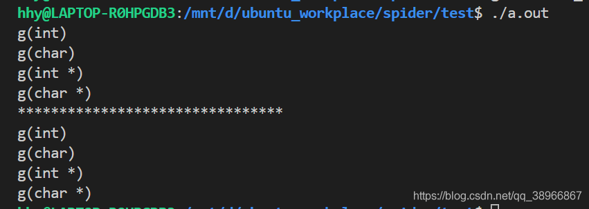

```cpp
#include <iostream>

using namespace std;

void g(int i) { cout << "g(int)" << endl; }
void g(char c) { cout << "g(char)" << endl; }

template <typename T>
struct A {
  using type_t = T;
};

template <typename U>
void fun(U u) {
  typename U::type_t v;
  g(v);
}

int main() {
  A<int> a1;
  fun(a1);

  A<char> a2;
  fun(a2);

  return 0;
}

```


```cpp
#include <iostream>

using namespace std;

void g(int i) { cout << "g(int)" << endl; }
void g(char c) { cout << "g(char)" << endl; }
void g(int* i) { cout << "g(int *)" << endl; }
void g(char* i) { cout << "g(char *)" << endl; }

template <typename T>
struct type_traits {
  using type_t = typename T::type_t;
};

template <>
struct type_traits<int> {
  using type_t = int;
};

template <>
struct type_traits<int*> {
  using type_t = int*;
};

template <>
struct type_traits<char> {
  using type_t = char;
};

template <>
struct type_traits<char*> {
  using type_t = char*;
};

template <typename T>
struct A {
  using type_t = T;
};

template <typename U>
void fun(U u) {
  typename type_traits<U>::type_t v;
  g(v);
}

int main() {
  A<int> a1;
  fun(a1);

  A<char> a2;
  fun(a2);
  A<int*> a3;
  fun(a3);

  A<char*> a4;
  fun(a4);
  cout << "********************************" << endl;
  fun(1);
  fun('a');

  int i = 123;
  fun(&i);

  char c = 'd';
  fun(&c);

  return 0;
}

```

