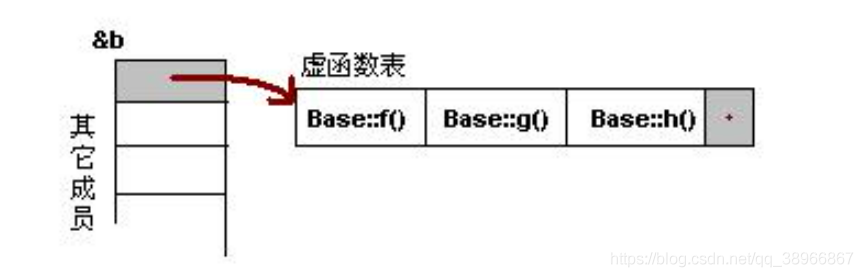

# 参考陈皓的三篇博客


[C++ 虚函数表解析](https://blog.csdn.net/haoel/article/details/1948051)

[C++ 对象的内存布局（上）](https://blog.csdn.net/haoel/article/details/3081328)

[C++ 对象的内存布局（下）](https://blog.csdn.net/haoel/article/details/3081385)

[\[C语言面向对象\]](https://blog.csdn.net/onlyshi/article/details/81672279)
# 虚函数表
> 实例对象的首地址保存着虚函数表指针



```cpp
/*
 * @Description: 测试虚函数指针
 * @Version: 1.0
 * @Autor: hanhy
 */

#include <iostream>

using namespace std;
class Base {
public:
  virtual void f() { cout << "Base::f" << endl; }
  virtual void g() { cout << "Base::g" << endl; }
  virtual void h() { cout << "Base::h" << endl; }
};

int main() {

  cout << "=====================begin test============" << endl;
  Base base;

  cout << "sizeof(base)=" << sizeof(base) << endl; //保存一个虚函数表指针
  cout << "虚函数表地址（虚函数表指针）（16进制）：" << (long *)(&base) << endl;
  cout << "虚函数表中第一个函数地址（10进制）：" << *(long *)(&base) << endl;
  cout << "虚函数表中第一个函数地址（16进制）：" << (long *)*(long *)(&base)
       << endl;

  typedef void (*Fun)(void);

  Fun fun1=(Fun)*((long *)*(long *)(&base)+0);
  fun1();

  Fun fun2=(Fun)*((long *)*(long *)(&base)+1);
  fun2();

  Fun fun3=(Fun)*((long *)*(long *)(&base)+1);
  fun3();
}

```

## 一般继承（无虚函数覆盖）


 ```cpp
 /*
 * @Description:一般继承 无覆盖重写虚函数
 * @Version: 1.0
 * @Autor: hanhy
 */
#include <iostream>

using namespace std;
class Base {
public:
  virtual void f() { cout << "Base::f" << endl; }
  virtual void g() { cout << "Base::g" << endl; }
  virtual void h() { cout << "Base::h" << endl; }
};

class Derive : public Base {};

int main() {

  cout << "=====================begin test============" << endl;
  Derive derive;

  cout << "sizeof(derive)=" << sizeof(derive) << endl; //保存一个虚函数表指针
  cout << "虚函数表地址（虚函数表指针）（16进制）：" << (long *)(&derive) << endl;
  cout << "虚函数表中第一个函数地址（10进制）：" << *(long *)(&derive) << endl;
  cout << "虚函数表中第一个函数地址（16进制）：" << (long *)*(long *)(&derive)
       << endl;

  typedef void (*Fun)();

  Fun fun1=(Fun)*((long *)*(long *)(&derive)+0);
  fun1();

  Fun fun2=(Fun)*((long *)*(long *)(&derive)+1);
  fun2();

  Fun fun3=(Fun)*((long *)*(long *)(&derive)+1);
  fun3();
}
 ```


## 一般继承（有虚函数覆盖）


```cpp

/*
 * @Description: 一般继承有虚函数覆盖
 * @Version: 1.0
 * @Autor: hanhy
 */

#include <iostream>

using namespace std;
class Base {
public:
  virtual void f() { cout << "Base::f" << endl; }
  virtual void g() { cout << "Base::g" << endl; }
  virtual void h() { cout << "Base::h" << endl; }
};

class Derive : public Base {
  void f() override {cout << "Derive::f" << endl;}

};

int main() {

  cout << "=====================begin test============" << endl;
  Derive derive;

  cout << "sizeof(derive)=" << sizeof(derive) << endl; //保存一个虚函数表指针
  cout << "虚函数表地址（虚函数表指针）（16进制）：" << (long *)(&derive) << endl;
  cout << "虚函数表中第一个函数地址（10进制）：" << *(long *)(&derive) << endl;
  cout << "虚函数表中第一个函数地址（16进制）：" << (long *)*(long *)(&derive)
       << endl;

  typedef void (*Fun)();

  Fun fun1=(Fun)*((long *)*(long *)(&derive)+0);
  fun1();

  Fun fun2=(Fun)*((long *)*(long *)(&derive)+1);
  fun2();

  Fun fun3=(Fun)*((long *)*(long *)(&derive)+1);
  fun3();
}
```

## 多重继承（无虚函数覆盖）


```cpp
/*
 * @Description:多重继承（无虚函数覆盖）
 * @Version: 1.0
 * @Autor: hanhy
 */

#include <iostream>

using namespace std;
class Base1 {
public:
  virtual void f() { cout << "Base1::f" << endl; }
  virtual void g() { cout << "Base1::g" << endl; }
  virtual void h() { cout << "Base1::h" << endl; }
};

class Base2 {
public:
  virtual void f() { cout << "Base2::f" << endl; }
  virtual void g() { cout << "Base2::g" << endl; }
  virtual void h() { cout << "Base2::h" << endl; }
};

class Base3 {
public:
  virtual void f() { cout << "Base3::f" << endl; }
  virtual void g() { cout << "Base3::g" << endl; }
  virtual void h() { cout << "Base3::h" << endl; }
};

class Derive : public Base1, public Base2, public Base3 {};

int main() {

  cout << "=====================begin test============" << endl;
  Derive derive;

  cout << "sizeof(derive)=" << sizeof(derive) << endl; //保存个三虚函数表指针
  cout << "虚函数表地址（虚函数表指针）（16进制）：" << (long *)(&derive)
       << endl;
  cout << "虚函数表中第一个函数地址（10进制）：" << *(long *)(&derive) << endl;
  cout << "虚函数表中第一个函数地址（16进制）：" << (long *)*(long *)(&derive)
       << endl;

  typedef void (*Fun)();

  cout << "------------------第一个虚函数表-------------------" << endl;
  Fun fun1 = (Fun) * ((long *)*(long *)(&derive) + 0);
  fun1();
  Fun fun2 = (Fun) * ((long *)*(long *)(&derive) + 1);
  fun2();
  Fun fun3 = (Fun) * ((long *)*(long *)(&derive) + 2);
  fun3();

  cout << "------------------第二个虚函数表-------------------" << endl;
  Fun fun4 = (Fun) * ((long *)*((long *)(&derive) + 1) + 0);
  fun4();
  Fun fun5 = (Fun) * ((long *)*((long *)(&derive) + 1) + 1);
  fun5();
  Fun fun6 = (Fun) * ((long *)*((long *)(&derive) + 1) + 2);
  fun6();

  cout << "------------------第二个虚函数表-------------------" << endl;
  Fun fun7 = (Fun) * ((long *)*((long *)(&derive) + 2) + 0);
  fun7();
  Fun fun8 = (Fun) * ((long *)*((long *)(&derive) + 2) + 1);
  fun8();
  Fun fun9 = (Fun) * ((long *)*((long *)(&derive) + 2) + 2);
  fun9();
}

```

## 多重继承（有虚函数覆盖）


```cpp
/*
 * @Description:多重继承（有虚函数覆盖）
 * @Version: 1.0
 * @Autor: hanhy
 */

#include <iostream>

using namespace std;
class Base1 {
public:
  virtual void f() { cout << "Base1::f" << endl; }
  virtual void g() { cout << "Base1::g" << endl; }
  virtual void h() { cout << "Base1::h" << endl; }
};

class Base2 {
public:
  virtual void f() { cout << "Base2::f" << endl; }
  virtual void g() { cout << "Base2::g" << endl; }
  virtual void h() { cout << "Base2::h" << endl; }
};

class Base3 {
public:
  virtual void f() { cout << "Base3::f" << endl; }
  virtual void g() { cout << "Base3::g" << endl; }
  virtual void h() { cout << "Base3::h" << endl; }
};

class Derive : public Base1, public Base2, public Base3 {
  void f() override { cout << "Derive::f" << endl; }
};


int main() {

  cout << "=====================begin test============" << endl;
  Derive derive;

  cout << "sizeof(derive)=" << sizeof(derive) << endl; //保存个三虚函数表指针
  cout << "虚函数表地址（虚函数表指针）（16进制）：" << (long *)(&derive)
       << endl;
  cout << "虚函数表中第一个函数地址（10进制）：" << *(long *)(&derive) << endl;
  cout << "虚函数表中第一个函数地址（16进制）：" << (long *)*(long *)(&derive)
       << endl;

  typedef void (*Fun)();

  cout << "------------------第一个虚函数表-------------------" << endl;
  Fun fun1 = (Fun) * ((long *)*(long *)(&derive) + 0);
  fun1();
  Fun fun2 = (Fun) * ((long *)*(long *)(&derive) + 1);
  fun2();
  Fun fun3 = (Fun) * ((long *)*(long *)(&derive) + 2);
  fun3();

  cout << "------------------第二个虚函数表-------------------" << endl;
  Fun fun4 = (Fun) * ((long *)*((long *)(&derive) + 1) + 0);
  fun4();
  Fun fun5 = (Fun) * ((long *)*((long *)(&derive) + 1) + 1);
  fun5();
  Fun fun6 = (Fun) * ((long *)*((long *)(&derive) + 1) + 2);
  fun6();

  cout << "------------------第二个虚函数表-------------------" << endl;
  Fun fun7 = (Fun) * ((long *)*((long *)(&derive) + 2) + 0);
  fun7();
  Fun fun8 = (Fun) * ((long *)*((long *)(&derive) + 2) + 1);
  fun8();
  Fun fun9 = (Fun) * ((long *)*((long *)(&derive) + 2) + 2);
  fun9();
}
```

## 访问非public 虚函数
```cpp
/*
 * @Description: 访问非public 虚函数
 * @Version: 1.0
 * @Autor: hanhy
 */

#include <iostream>

using namespace std;
class Base {
private:
  virtual void f() { cout << "Base::f" << endl; }
  virtual void g() { cout << "Base::g" << endl; }
  virtual void h() { cout << "Base::h" << endl; }
};

int main(){
  cout << "=====================begin test============" << endl;
  Base base;

  cout << "sizeof(base)=" << sizeof(base) << endl; //保存一个虚函数表指针
  cout << "虚函数表地址（虚函数表指针）（16进制）：" << (long *)(&base) << endl;
  cout << "虚函数表中第一个函数地址（10进制）：" << *(long *)(&base) << endl;
  cout << "虚函数表中第一个函数地址（16进制）：" << (long *)*(long *)(&base)
       << endl;

  typedef void (*Fun)(void);

  Fun fun1=(Fun)*((long *)*(long *)(&base)+0);
  fun1();
  Fun fun2=(Fun)*((long *)*(long *)(&base)+1);
  fun2();
  Fun fun3=(Fun)*((long *)*(long *)(&base)+1);
  fun3();
}

```

# C++ 对象的内存布局上

## 单一的一般继承
