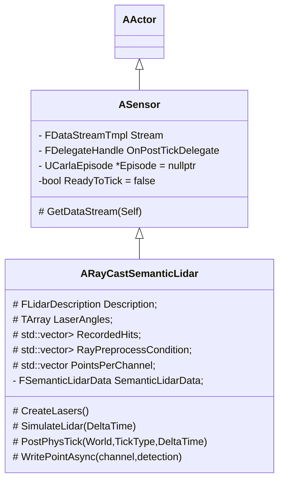
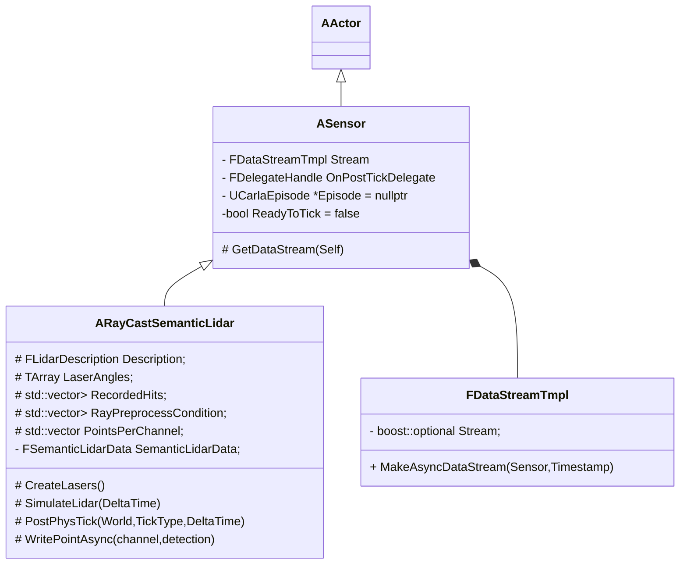
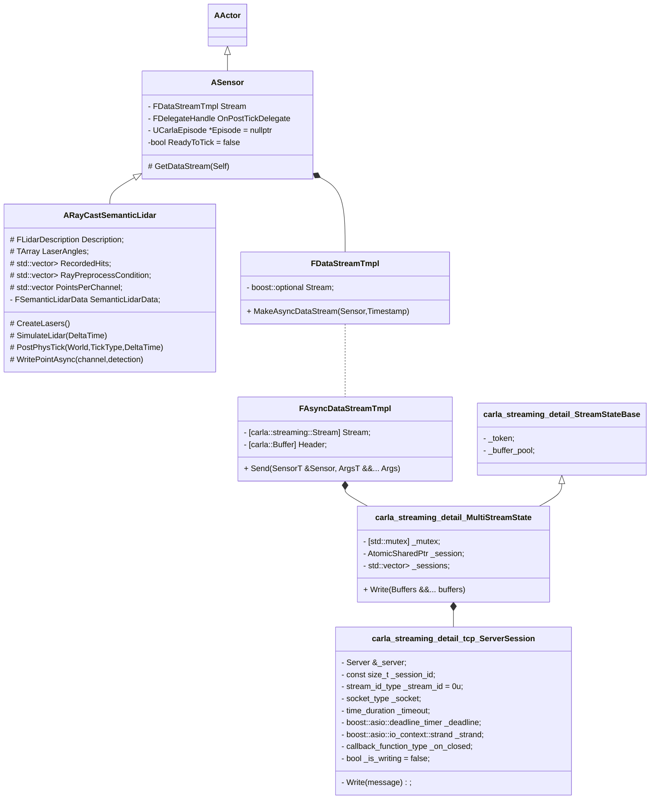

# 插件 RayCastSemanticLidar




## 数据产生





>  RayCastSemanticLidar的数据由插件在UE4中产生

* **设置激光雷达各线垂直角**   

  >**void ARayCastSemanticLidar::CreateLasers()**
  >
  >carla会根据Description.UpperFovLimit 和Description.LowerFovLimit以及Description.Channels线数，在垂直方向上均分各个射线
  >
  >```c++
  >const float VerticalAngle =
  >        Description.UpperFovLimit - static_cast<float>(i) * DeltaAngle;
  >    LaserAngles.Emplace(VerticalAngle);
  >```

* **计算两次Tick时间内，激光雷达各个射线的碰撞点**

  > **void ARayCastSemanticLidar::SimulateLidar(const float DeltaTime) **
  >
  > 首先计算这个时间段内，每个射线扫描点的数量 
  >
  > ```c++
  > const uint32 PointsToScanWithOneLaser = FMath::RoundHalfFromZero(
  >     Description.PointsPerSecond * DeltaTime / float(ChannelCount));
  > ```
  >
  > 然后计算水平角间隔
  >
  > ```c++
  > const float AngleDistanceOfTick =
  >     Description.RotationFrequency * Description.HorizontalFov * DeltaTime;
  > const float AngleDistanceOfLaserMeasure =
  >     AngleDistanceOfTick / PointsToScanWithOneLaser;
  > 
  > ```
  >
  > 通过计算得到的水平角和垂直角 发射射线，只有ShootLaser函数返回为真的时候才执行 WritePointAsync函数
  >
  > ```c++
  > const float VertAngle = LaserAngles[idxChannel];
  > const float HorizAngle =
  >     std::fmod(CurrentHorizontalAngle +
  >                   AngleDistanceOfLaserMeasure * idxPtsOneLaser,
  >               Description.HorizontalFov) -
  >     Description.HorizontalFov / 2;
  > const bool PreprocessResult =
  >     RayPreprocessCondition[idxChannel][idxPtsOneLaser];
  > 
  > if (PreprocessResult &&
  >     ShootLaser(VertAngle, HorizAngle, HitResult, TraceParams)) {
  >   WritePointAsync(idxChannel, HitResult);
  > } 
  > ```


## 数据发送

```c++
void ARayCastSemanticLidar::PostPhysTick:
		auto DataStream = GetDataStream(*this);
FAsyncDataStream GetDataStream(const SensorT &Self):
    return Stream.MakeAsyncDataStream(Self, GetEpisode().GetElapsedGameTime());
auto FDataStreamTmpl::MakeAsyncDataStream(const SensorT &Sensor, double Timestamp):
	 	return FAsyncDataStreamTmpl<T>{Sensor, Timestamp, *Stream};


void ARayCastSemanticLidar::PostPhysTick:
	 DataStream.Send(*this, SemanticLidarData, DataStream.PopBufferFromPool());
void FAsyncDataStreamTmpl<T>::Send(SensorT &Sensor, ArgsT &&... Args):
	 Stream.Write(
      std::move(Header),
      carla::sensor::SensorRegistry::Serialize(Sensor, std::forward<ArgsT>(Args)...));

void Write(Buffers &&... buffers) {
 	 session->Write(std::move(message));

class ServerSession
 		template <typename... Buffers>
    void Write(Buffers &&... buffers) {
      Write(MakeMessage(std::move(buffers)...));
    }
  	void Write(std::shared_ptr<const Message> message);
```


```c++
namespace carla {
namespace streaming {
  using Stream = detail::Stream<detail::MultiStreamState>;
} // namespace streaming
} // namespace carla


namespace carla {
namespace streaming {
namespace detail {
  using Session = tcp::ServerSession;
} // namespace detail
} // namespace streaming
} // namespace carla

```




> UE4插件产生的数据需要输出给客户端

* **写入数据**

  > **void ARayCastSemanticLidar::WritePointAsync(uint32_t channel,FHitResult &detection)**
  >
  > 激光雷达数据被写入到RecordedHits中
  >
  > ```c++
  > RecordedHits[channel].emplace_back(detection);
  > ```
  >
  > 在PostPhysTick结束前执行
  >
  > ```c++
  > DataStream.Send(*this, SemanticLidarData, DataStream.PopBufferFromPool());
  > ```
  >
  > ```c++
  > void ARayCastSemanticLidar::PostPhysTick(UWorld *World, ELevelTick TickType,
  >                                          float DeltaTime) {
  >   TRACE_CPUPROFILER_EVENT_SCOPE(ARayCastSemanticLidar::PostPhysTick);
  >   SimulateLidar(DeltaTime);
  > 
  >   {
  >     TRACE_CPUPROFILER_EVENT_SCOPE_STR("Send Stream");
  >     auto DataStream = GetDataStream(*this);
  >     DataStream.Send(*this, SemanticLidarData, DataStream.PopBufferFromPool());
  >   }
  > }
  > ```
  >
  > Sensor成员函数GetDataStream 返回**FAsyncDataStreamTmpl <carla::streaming::Stream >;**
  >
  > 所以ARayCastSemanticLidar::PostPhysTick函数中的 DataStream类型为FAsyncDataStreamTmpl <carla::streaming::Stream >
  >
  > ```c++
  > using FAsyncDataStream = FAsyncDataStreamTmpl<carla::streaming::Stream>;
  > using FDataStream = FDataStreamTmpl<carla::streaming::Stream>;
  > 
  > FDataStream Stream; 
  > 
  > template <typename SensorT>
  >   FAsyncDataStream GetDataStream(const SensorT &Self) {
  >     return Stream.MakeAsyncDataStream(Self, 					                   
  >                                       GetEpisode().GetElapsedGameTime());
  >   }
  > 
  > ```
  >
  > 在FAsyncDataStreamTmpl <carla::streaming::Stream >;中Stream为carla::streaming::Stream
  >
  > 所以DataStream.Send 执行的是**carla::streaming::Stream.Write( std::move(Header),
  >       carla::sensor::SensorRegistry::Serialize(Sensor, std::forward<ArgsT>(Args)...));**
  >
  > ```c++
  > template <typename SensorT, typename... ArgsT>
  > inline void FAsyncDataStreamTmpl<T>::Send(SensorT &Sensor, ArgsT &&... Args)
  > {
  >   Stream.Write(
  >       std::move(Header),
  >       carla::sensor::SensorRegistry::Serialize(Sensor, std::forward<ArgsT>(Args)...));
  > }
  > 
  > ```
  >
  > 在 LibCarla/source/carla/streaming/Stream.h中，carla::streaming::Stream实际上是detail::Stream< detail::MultiStreamState>;
  >
  > 顺藤摸瓜，DataStream.Send执行的最终是detail::Stream<detail::MultiStreamState >.Write
  >
  > 所以只需分析detail::Stream<detail::MultiStreamState >.Write 函数即明白激光雷达数据是如何发送给客户端的。

* **实际发送**

  > **激光雷达数据会通过MultiStreamState中的Write函数发送出去**
  >
  > ```c++
  >   template <typename... Buffers>
  >     void Write(Buffers &&... buffers) {
  >       auto message = Session::MakeMessage(std::move(buffers)...);
  > 
  >       // try write single stream
  >       auto session = _session.load();
  >       if (session != nullptr) {
  >         session->Write(std::move(message));
  >         // Return here, _session is only valid if we have a 
  >         // single session.
  >         return; 
  >       }
  > 
  >       // try write multiple stream
  >       std::lock_guard<std::mutex> lock(_mutex);
  >       for (auto &s : _sessions) {
  >         if (s != nullptr) {
  >           s->Write(message);
  >         }
  >       }
  >     }
  > 
  > ```
  >
  > 无论是single stream还是multiple stream，detail::Stream<detail::MultiStreamState >.Write 函数都会使用AtomicSharedPtr<Session> _session;来发送数据
  >
  > 在LibCarla/source/carla/streaming/detail/Session.h可以发现，Session实际上是tcp::ServerSession;
  >
  > ```c++
  > using Session = tcp::ServerSession;
  > ```
  >
  > 下面看一下tcp::ServerSession是个什么东西
  >
  > 在LibCarla/source/carla/streaming/detail/tcp/ServerSession.h中给出了ServerSession的声明
  >
  > 在**void ServerSession::Write(std::shared_ptr<const Message> message) **中
  >
  > ```c++
  > using socket_type = boost::asio::ip::tcp::socket;
  > socket_type _socket;
  > 
  > 
  > auto handle_sent = [this, self, message](const boost::system::error_code &ec, size_t DEBUG_ONLY(bytes)) {
  >         _is_writing = false;
  >         if (ec) {
  >           log_info("session", _session_id, ": error sending data :", ec.message());
  >           CloseNow();
  >         } else {
  >           DEBUG_ONLY(log_debug("session", _session_id, ": successfully sent", bytes, "bytes"));
  >           DEBUG_ASSERT_EQ(bytes, sizeof(message_size_type) + message->size());
  >         }
  >       };
  > 
  > _deadline.expires_from_now(_timeout);
  >       boost::asio::async_write(
  >           _socket,
  >           message->GetBufferSequence(),
  >           handle_sent);
  > 
  > //_deadline实际上boost::asio::deadline_timer
  >  boost::asio::deadline_timer _deadline;
  > ```


# 客户端

在 LibCarla/source/carla/client/Client.h中 Client的定义如下, Client只有一个成员变量 

**std::shared_ptr<detail::Simulator > _simulator;**

```c++
 inline Client::Client(
      const std::string &host,
      uint16_t port,
      size_t worker_threads)
    : _simulator(
        new detail::Simulator(host, port, worker_threads),
        PythonUtil::ReleaseGILDeleter()) {}
```

  Simulator的构造函数 ，Simulator中包含这真正的_client; **Client _client;**

该类在LibCarla/source/carla/client/detail/Client.h文件中声明。

类Client中只包含一个成员变量**const std::unique_ptr<Pimpl > _pimpl**

```c++
  Simulator::Simulator(
      const std::string &host,
      const uint16_t port,
      const size_t worker_threads,
      const bool enable_garbage_collection)
    : LIBCARLA_INITIALIZE_LIFETIME_PROFILER("SimulatorClient("s + host + ":" + std::to_string(port) + ")"),
      _client(host, port, worker_threads),
      _light_manager(new LightManager()),
      _gc_policy(enable_garbage_collection ?
        GarbageCollectionPolicy::Enabled : GarbageCollectionPolicy::Disabled) {}
```

下面分析 const std::unique_ptr<Pimpl> _pimpl;

_pimpl detail中的Client中声明并实现

```c++
class Client : private NonCopyable {
  public:
    .......

  private:

    class Pimpl;
    const std::unique_ptr<Pimpl> _pimpl;
  };
```

**class Pimpl** 包含两个成员变量

  ```c++
     rpc::Client rpc_client;
     streaming::Client streaming_client;
  ```

**rpc::Client rpc_client** 是最重要的成员变量, 客户端主要通过RPC实现与服务端的通信

下面分析rpc::Client，该类在LibCarla/source/carla/rpc/Client.h 文件中声明，目前疫情出现了三个Client ，可见命名空间是很有必要的

rpc::Client 中只有一个成员变量 **::rpc::client _client;** 这是第四个client 

**::rpc::client _client;** 由\#include <rpc/client.h>中包含，它是第三方rpc，也是真正起作用的RPC

比如在Examples/CppClient/main.cpp中的代码：

```c++
client.SetTimeout(40s);
```

实际上调用的是 **::rpc::client _client**中的_client.set_timeout(value);

在文件LibCarla/source/carla/rpc/Client.h中

```c++
  void set_timeout(int64_t value) {
      _client.set_timeout(value);
    }
```

Carla 通过 （ip,port）构造了**::rpc::client _client ** LibCarla/source/carla/rpc/Client.h

```c++
  class Client {
  public:

    template <typename... Args>
    explicit Client(Args &&... args)
      : _client(std::forward<Args>(args)...) {}

    void set_timeout(int64_t value) {
      _client.set_timeout(value);
    }
...........

  private:

    ::rpc::client _client;
  };
```

```C++
  template <typename T>
  EpisodeProxyImpl<T>::EpisodeProxyImpl(SharedPtrType simulator)
    : _episode_id(simulator != nullptr ? simulator->GetCurrentEpisodeId() : 0u),
      _simulator(std::move(simulator)) {}
```


