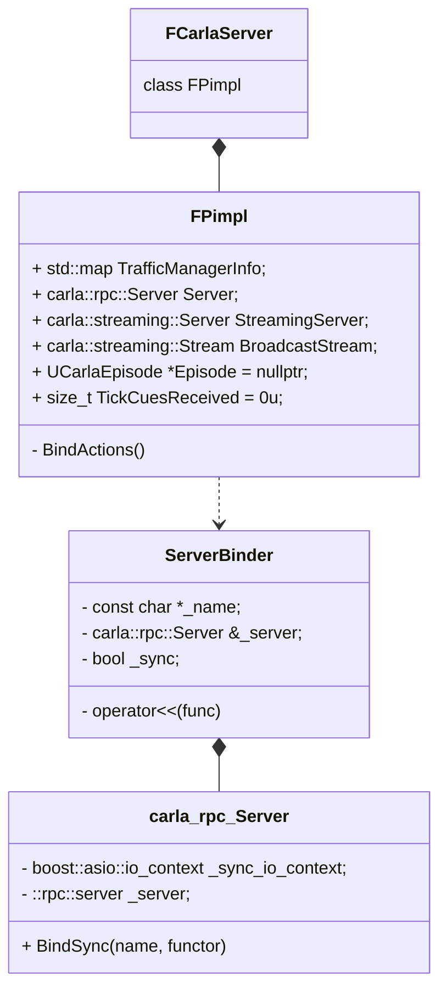
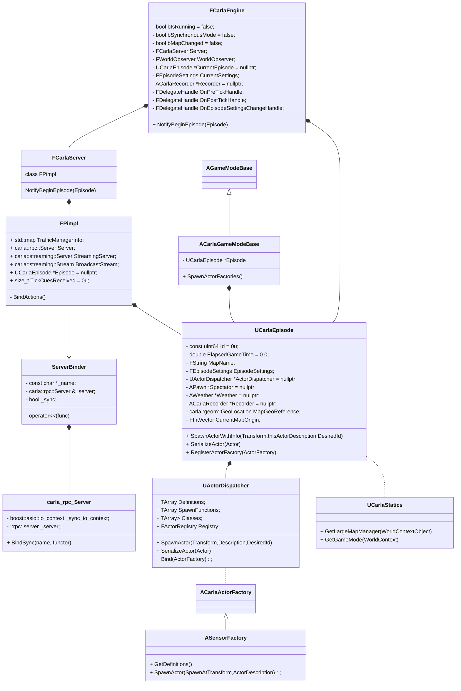
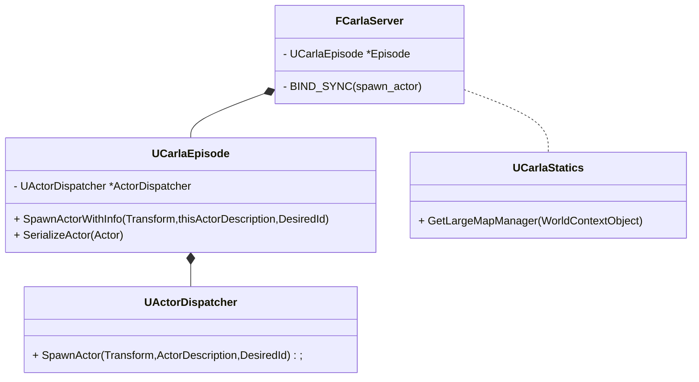

**class FCarlaServer** 在文件*Unreal/CarlaUE4/Plugins/Carla/Source/Carla/Server/CarlaServer.h* 中声明

有两个重要的宏定义

```c++
#define BIND_SYNC(name)   auto name = ServerBinder(# name, Server, true)
#define BIND_ASYNC(name)  auto name = ServerBinder(# name, Server, false)
```

```c++
class ServerBinder
{
public:
  constexpr ServerBinder(const char *name, carla::rpc::Server &srv, bool sync)
    : _name(name),
      _server(srv),
      _sync(sync) {}

  template <typename FuncT>
  auto operator<<(FuncT func)
  {
    if (_sync)
    {
      _server.BindSync(_name, func);
    }
    else
    {
      _server.BindAsync(_name, func);
    }
    return func;
  }
private:
  const char *_name;
  carla::rpc::Server &_server;
  bool _sync;
};
```

文件**LibCarla/source/carla/client/detail/Client.cpp**中有很多

return _pimpl->CallAndWait<std::string >("version"); 之类的RPC调用。这些客户端RPC调用，对应

*Unreal/CarlaUE4/Plugins/Carla/Source/Carla/Server/CarlaServer.h* 中的BIND_SYNC




 class FPimpl 中的成员函数BindActions()包含了很多**BIND_SYNC** 分别对应各自的RPC, BIND_SYNC 使用的是 ServerBinder中的成员方法**operator<<**, operator<<会调用carla::rpc::Server中的成员方法**BindSync**

RPC函数 BIND_SYNC(spawn_actor) << 返回一个carla::rpc::Actor SerializedActor

```c++
 template <typename FunctorT>
  inline void Server::BindAsync(const std::string &name, FunctorT &&functor) {
    using Wrapper = detail::FunctionWrapper<FunctorT>;
    _server.bind(
        name,
        Wrapper::WrapAsyncCall(std::forward<FunctorT>(functor)));
  }
```

以**“spawn_actor”** RPC调用为例，当客户端发起RPC“spawn_actor”时，服务端绑定的相应函数会被执行(lambda函数)

```c++
template <typename T>
using R = carla::rpc::Response<T>;

BIND_SYNC(spawn_actor) << [this](
      cr::ActorDescription Description,
      const cr::Transform &Transform) -> R<cr::Actor>
  {................................................
    auto Result = Episode->SpawnActorWithInfo(Transform, std::move(Description));
	 ...............................................
    ALargeMapManager* LargeMap = UCarlaStatics::GetLargeMapManager(Episode->GetWorld());
    if(LargeMap)
    {
      LargeMap->OnActorSpawned(*Result.Value);
    }

    return Episode->SerializeActor(Result.Value);
  };
```





**服务端生成Actor**

* ```c
  BIND_SYNC(spawn_actor):
  	auto Result = Episode->SpawnActorWithInfo(Transform, std::move(Description));
  UCarlaEpisode::SpawnActorWithInfo:
  	auto result = ActorDispatcher->SpawnActor(LocalTransform, thisActorDescription, 	
                                              DesiredId);
  UActorDispatcher::SpawnActor
    FActorSpawnResult Result = SpawnFunctions[Description.UId - 1](Transform, 		 			
                                                                   Description);
  ```

* ```c++
  ALargeMapManager* LargeMap = UCarlaStatics::GetLargeMapManager(Episode->GetWorld());
  ```

* ```c++
  return Episode->SerializeActor(Result.Value);
  ```

  



**"spawn_actor_with_parent"** 对应的服务端RPC, **"spawn_actor_with_parent"和 "spawn_actor"对应的RPC**x相似

```c++
  BIND_SYNC(spawn_actor_with_parent) << [this](
      cr::ActorDescription Description,
      const cr::Transform &Transform,
      cr::ActorId ParentId,
      cr::AttachmentType InAttachmentType) -> R<cr::Actor>
  {.............................................
    auto Result = Episode->SpawnActorWithInfo(Transform, std::move(Description));
	 .............................................
    FCarlaActor* CarlaActor = Episode->FindCarlaActor(Result.Value->GetActorId());
   .............................................
    FCarlaActor* ParentCarlaActor = Episode->FindCarlaActor(ParentId);
   .............................................
    CarlaActor->SetParent(ParentId);
    CarlaActor->SetAttachmentType(InAttachmentType);
    ParentCarlaActor->AddChildren(CarlaActor->GetActorId());

    // Only is possible to attach if the actor has been really spawned and
    // is not in dormant state
    if(!ParentCarlaActor->IsDormant())
    {
      Episode->AttachActors(
          CarlaActor->GetActor(),
          ParentCarlaActor->GetActor(),
          static_cast<EAttachmentType>(InAttachmentType));
    }
    else
    {
      Episode->PutActorToSleep(CarlaActor->GetActorId());
    }

    return Episode->SerializeActor(CarlaActor);
  };
```


Carla服务端通过**UActorDispatcher::SpawnActor**中的**SpawnFunctions**生成Actor

SpawnFunctions由如下代码进行初始化

```c++
void UActorDispatcher::Bind(FActorDefinition Definition, SpawnFunctionType Functor)
{
  if (UActorBlueprintFunctionLibrary::CheckActorDefinition(Definition))
  {
    Definition.UId = static_cast<uint32>(SpawnFunctions.Num()) + 1u;
    Definitions.Emplace(Definition);
    SpawnFunctions.Emplace(Functor);
    Classes.Emplace(Definition.Class);
  }
  else
  {
    UE_LOG(LogCarla, Warning, TEXT("Invalid definition '%s' ignored"), *Definition.Id);
  }
}

void UActorDispatcher::Bind(ACarlaActorFactory &ActorFactory)
{
  for (const auto &Definition : ActorFactory.GetDefinitions())
  {
    Bind(Definition, [&](const FTransform &Transform, const FActorDescription &Description) {
      return ActorFactory.SpawnActor(Transform, Description);
    });
  }
}
```

