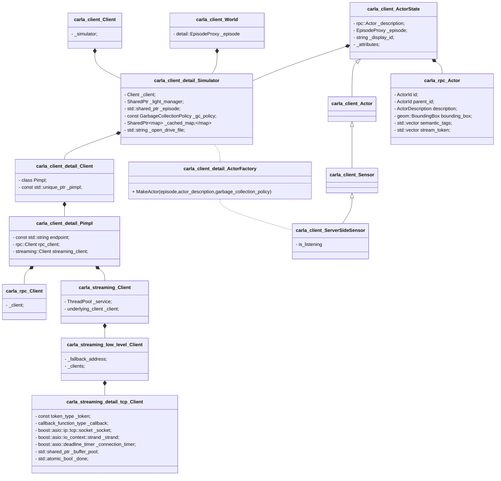

## Actor

* **创建一个Actor，以传感器为例**

```c++
// Spawn the vehicle.
    auto actor = world.SpawnActor(blueprint, transform);
```

```c++
  SharedPtr<Actor> World::SpawnActor(
      const ActorBlueprint &blueprint,
      const geom::Transform &transform,
      Actor *parent_actor,
      rpc::AttachmentType attachment_type) {
    return _episode.Lock()->SpawnActor(blueprint, transform, parent_actor, attachment_type);
  }
```

World中的**_episode**实际上是一个Simulator的Strong或者Weak指针

所以  **world.SpawnActor(blueprint, transform);** 最终调用的是**Simulator::SpawnActor**函数

**class Actor**在文件LibCarla/source/carla/rpc/Actor.h中声明，actor的描述信息由RPC提供，客户端根据描述信息创建一个Actor

 ``` auto result = ActorFactory::MakeActor(GetCurrentEpisode(), actor, gca);```

RPC实际返回了一个rpc::Actor description，客户端创建传感器的时候，会将rpc::Actor description作为ActorState的成员变量，该rpc::Actor description 包含了一个stream_token，是订阅传感器数据的依据。

客户端会根据token建立连接，进而接收数据

```c++
SharedPtr<Actor> SpawnActor(
        const ActorBlueprint &blueprint,
        const geom::Transform &transform,
        Actor *parent = nullptr,
        rpc::AttachmentType attachment_type = rpc::AttachmentType::Rigid,
        GarbageCollectionPolicy gc = GarbageCollectionPolicy::Inherit);{  
................................................
    actor = _client.SpawnActor(
          blueprint.MakeActorDescription(),
          transform);
................................................
    _episode->RegisterActor(actor);
    const auto gca = (gc == GarbageCollectionPolicy::Inherit ? _gc_policy : gc);
    auto result = ActorFactory::MakeActor(GetCurrentEpisode(), actor, gca);
................................................   
    return result;
  }
```

```c++
rpc::ActorDescription ActorBlueprint::MakeActorDescription() const {
    rpc::ActorDescription description;
    description.uid = _uid;
    description.id = _id;
    description.attributes.reserve(_attributes.size());
    for (const auto &attribute : *this) {
      description.attributes.push_back(attribute);
    }
    return description;
  }

class ActorDescription{
    ActorDescription() = default;
    ActorId uid = 0u;
    std::string id;
    std::vector<ActorAttributeValue> attributes;
....................................................
}
```

通过RPC实现**"spawn_actor" **，_pimpl->CallAndWait会调用实际的RPC函数

```c++
  rpc::Actor Client::SpawnActor(
      const rpc::ActorDescription &description,
      const geom::Transform &transform) {
    return _pimpl->CallAndWait<rpc::Actor>("spawn_actor", description, transform);
  }
```

```c++
 SharedPtr<Actor> ActorFactory::MakeActor(
      EpisodeProxy episode,
      rpc::Actor description,
      GarbageCollectionPolicy gc) {
    auto init = ActorInitializer{description, episode};
.........................................................
    return MakeActorImpl<ServerSideSensor>(std::move(init), gc);
.........................................................
  }

```

 **class ServerSideSensor**

```C++
  class ServerSideSensor final : public Sensor {
  public:
    using Sensor::Sensor;
    ~ServerSideSensor();
    /// Register a @a callback to be executed each time a new measurement is
    /// received.
    ///
    /// @warning Calling this function on a sensor that is already listening
    /// steals the data stream from the previously set callback. Note that
    /// several instances of Sensor (even in different processes) may point to
    /// the same sensor in the simulator.
    void Listen(CallbackFunctionType callback) override;
    /// Stop listening for new measurements.
    void Stop() override;
    /// Return whether this Sensor instance is currently listening to the
    /// associated sensor in the simulator.
    bool IsListening() const override {
      return _is_listening;
    }
    /// @copydoc Actor::Destroy()
    ///
    /// Additionally stop listening.
    bool Destroy() override;
  private:
    bool _is_listening = false;
  };
```

```C++
  class Sensor : public Actor {
  public:
    using CallbackFunctionType = std::function<void(SharedPtr<sensor::SensorData>)>;
    using Actor::Actor;
    /// Register a @a callback to be executed each time a new measurement is
    /// received.
    virtual void Listen(CallbackFunctionType callback) = 0;
    /// Stop listening for new measurements.
    virtual void Stop() = 0;
    /// Return whether this Sensor instance is currently listening to new data.
    virtual bool IsListening() const = 0;
  };
```

传感器注册回调函数 

```c++
 // Register a callback to save images to disk.
    camera->Listen([](auto data) {
      auto image = boost::static_pointer_cast<csd::Image>(data);
      EXPECT_TRUE(image != nullptr);
      SaveSemSegImageToDisk(*image);
    });
```

```c++
 void ServerSideSensor::Listen(CallbackFunctionType callback) {
    log_debug(GetDisplayId(), ": subscribing to stream");
    GetEpisode().Lock()->SubscribeToSensor(*this, std::move(callback));
    _is_listening = true;
  }

void Simulator::SubscribeToSensor(
      const Sensor &sensor,
      std::function<void(SharedPtr<sensor::SensorData>)> callback) {
    DEBUG_ASSERT(_episode != nullptr);
    _client.SubscribeToStream(
        sensor.GetActorDescription().GetStreamToken(),
        [cb=std::move(callback), ep=WeakEpisodeProxy{shared_from_this()}](auto buffer) {
          auto data = sensor::Deserializer::Deserialize(std::move(buffer));
          data->_episode = ep.TryLock();
          cb(std::move(data));
        });
  }

// LibCarla/source/carla/client/detail/Client.cpp
  void Client::SubscribeToStream(
      const streaming::Token &token,
      std::function<void(Buffer)> callback) {
    _pimpl->streaming_client.Subscribe(token, std::move(callback));
  }
```

最终执行的订阅函数在文件LibCarla/source/carla/streaming/Client.h中定义

```c++
    /// @warning cannot subscribe twice to the same stream (even if it's a
    /// MultiStream).
    template <typename Functor>
    void Subscribe(const Token &token, Functor &&callback) {
      _client.Subscribe(_service.io_context(), token, std::forward<Functor>(callback));
    }
```

该文件中声明的Client 只有两个成员变量

```c++
  using underlying_client = low_level::Client<detail::tcp::Client>;
  ThreadPool _service;
  underlying_client _client;
```

**low_level::Client<detail::tcp::Client >** 在LibCarla/source/carla/streaming/low_level/Client.h声明

所以代码```_client.Subscribe(_service.io_context(), token, std::forward<Functor>(callback));```

调用的是LibCarla/source/carla/streaming/low_level/Client.h的

``` void Subscribe(boost::asio::io_context &io_context,token_type token,Functor &&callback) ```

```C++
// @warning cannot subscribe twice to the same stream (even if it's a
    /// MultiStream).
    template <typename Functor>
    void Subscribe(
        boost::asio::io_context &io_context,
        token_type token,
        Functor &&callback) {
      DEBUG_ASSERT_EQ(_clients.find(token.get_stream_id()), _clients.end());
      if (!token.has_address()) {
        token.set_address(_fallback_address);
      }
      auto client = std::make_shared<underlying_client>(
          io_context,
          token,
          std::forward<Functor>(callback));
      client->Connect();
      _clients.emplace(token.get_stream_id(), std::move(client));
    }

```

LibCarla/source/carla/streaming/low_level/Client.h文件中的类Client 含有两个成员变量

```c++
 boost::asio::ip::address _fallback_address;
 std::unordered_map<detail::stream_id_type,std::shared_ptr<underlying_client>> _clients;
```

由上述代码可知，Subscribe的目的是生成一个client,建立连接，并将其放入到_clients中

```c++
 auto client = std::make_shared<underlying_client>(
          io_context,
          token,
          std::forward<Functor>(callback));
      client->Connect();
      _clients.emplace(token.get_stream_id(), std::move(client));
```

而**underlying_client**的类型实际上为**detail::tcp::Client **

所以只需要弄清**detail::tcp::Client **就能分析出传感器Listen的本质，该Client在文件LibCarla/source/carla/streaming/detail/tcp/Client.h 声明

```c++
class Client
    ........................
    using endpoint = boost::asio::ip::tcp::endpoint;
    using protocol_type = endpoint::protocol_type;
    using callback_function_type = std::function<void (Buffer)>;
    Client::Client(
      boost::asio::io_context &io_context,
      const token_type &token,
      callback_function_type callback)
    : LIBCARLA_INITIALIZE_LIFETIME_PROFILER(
          std::string("tcp client ") + std::to_string(token.get_stream_id())),
      _token(token),
      _callback(std::move(callback)),
      _socket(io_context),
      _strand(io_context),
      _connection_timer(io_context),
      _buffer_pool(std::make_shared<BufferPool>()) {
    if (!_token.protocol_is_tcp()) {
      throw_exception(std::invalid_argument("invalid token, only TCP tokens supported"));
    }
  }
...........................
    void Connect();
............................
    const token_type _token;
    callback_function_type _callback;
    boost::asio::ip::tcp::socket _socket;
    boost::asio::io_context::strand _strand;
    boost::asio::deadline_timer _connection_timer;
    std::shared_ptr<BufferPool> _buffer_pool;
    std::atomic_bool _done{false};
```

在detail::tcp::Client的Connect()中，async_connect连接_token.to_tcp_endpoint()

```c++
const auto ep = _token.to_tcp_endpoint();
..................................................
 _socket.async_connect(ep, boost::asio::bind_executor(_strand, handle_connect));
```

**_token** 在detail::tcp::Client的构造函数中创建，该变量最初是**sensor.GetActorDescription().GetStreamToken()**  

该*sensor* 由函数SharedPtr<Actor> ActorFactory::MakeActor创建

```C++
auto init = ActorInitializer{description, episode};
.....................
return MakeActorImpl<ServerSideSensor>(std::move(init), gc);
```

而代码``auto init = ActorInitializer{description, episode};`` 的description实际上是有如下代码创建

```c++
SharedPtr<Actor> Simulator::SpawnActor(
.......................................
      actor = _client.SpawnActor(
          blueprint.MakeActorDescription(),
          transform);
.......................................
  }

```

## Listen

**订阅传感器数据** 

Examples/CppClient/main.cpp

```c++
  // Register a callback to save images to disk.
    camera->Listen([](auto data) {
      auto image = boost::static_pointer_cast<csd::Image>(data);
      EXPECT_TRUE(image != nullptr);
      SaveSemSegImageToDisk(*image);
    });
```

LibCarla/source/carla/client/ServerSideSensor.cpp

```c++
  void ServerSideSensor::Listen(CallbackFunctionType callback) {
    log_debug(GetDisplayId(), ": subscribing to stream");
    GetEpisode().Lock()->SubscribeToSensor(*this, std::move(callback));
    _is_listening = true;
  }
```

LibCarla/source/carla/client/detail/Simulator.cpp

```c++
  void Simulator::SubscribeToSensor(
      const Sensor &sensor,
      std::function<void(SharedPtr<sensor::SensorData>)> callback) {
    DEBUG_ASSERT(_episode != nullptr);
    _client.SubscribeToStream(
        sensor.GetActorDescription().GetStreamToken(),
        [cb=std::move(callback), ep=WeakEpisodeProxy{shared_from_this()}](auto buffer) {
          auto data = sensor::Deserializer::Deserialize(std::move(buffer));
          data->_episode = ep.TryLock();
          cb(std::move(data));
        });
  }
```

LibCarla/source/carla/client/detail/Client.cpp

```c++
void Client::SubscribeToStream(
      const streaming::Token &token,
      std::function<void(Buffer)> callback) {
    _pimpl->streaming_client.Subscribe(token, std::move(callback));
  }
```

LibCarla/source/carla/streaming/Client.h

```c++
 /// @warning cannot subscribe twice to the same stream (even if it's a
    /// MultiStream).
    template <typename Functor>
    void Subscribe(const Token &token, Functor &&callback) {
      _client.Subscribe(_service.io_context(), token, std::forward<Functor>(callback));
    }
```

LibCarla/source/carla/streaming/low_level/Client.h

```c++
  /// @warning cannot subscribe twice to the same stream (even if it's a
    /// MultiStream).
    template <typename Functor>
    void Subscribe(
        boost::asio::io_context &io_context,
        token_type token,
        Functor &&callback) {
      DEBUG_ASSERT_EQ(_clients.find(token.get_stream_id()), _clients.end());
      if (!token.has_address()) {
        token.set_address(_fallback_address);
      }
      auto client = std::make_shared<underlying_client>(
          io_context,
          token,
          std::forward<Functor>(callback));
      client->Connect();
      _clients.emplace(token.get_stream_id(), std::move(client));
    }
```

**成员**



**加载地图**

```Mermaid
classDiagram
	carla_client_Client*--carla_client_detail_Simulator
	carla_client_detail_Simulator*--carla_client_detail_Client
	carla_client_detail_Client*--carla_client_detail_Pimpl
	carla_client_detail_Pimpl*--carla_rpc_Client
	

	 class carla_client_Client{
          + LoadWorld(map_name) World
      }
      
      class carla_client_detail_Simulator{
     	 + LoadEpisode(map_name)
      }
      
      class carla_client_detail_Client{
         + LoadEpisode(map_name)
      }
      
      class carla_client_detail_Pimpl{
     	+ CallAndWait(function,...)
     	+ RawCall(function,...)
      }
      
      
      class carla_rpc_Client{
         - call(function,...)
      }
```


**生成Actor**  *ServerSideSensor*

```Mermaid
classDiagram
	carla_client_detail_Simulator*--carla_client_detail_Client
	carla_client_detail_Client*--carla_client_detail_Pimpl
	carla_client_detail_Pimpl*--carla_rpc_Client
	carla_client_detail_Pimpl*--carla_streaming_Client
	carla_client_World*--carla_client_detail_Simulator
	
	
	
	carla_client_detail_Simulator..carla_client_detail_ActorFactory
	
	
     class carla_client_World{
      	+ SpawnActor(blueprint,transform,...)
     }

      
      class carla_client_detail_Simulator{
     	 + SpawnActor(blueprint,transform,...)
      }
      
      class carla_client_detail_ActorFactory{
        + MakeActor( episode,actor_description,garbage_collection_policy)
      }
      
      class carla_client_detail_Client{
      }
      
      class carla_client_detail_Pimpl{
      }
      
      
      class carla_rpc_Client{

      }
      
      class carla_streaming_Client{
    
      }
     
      
   
```


**订阅传感器数据**

```Mermaid
classDiagram
	carla_client_Client*--carla_client_detail_Simulator
	carla_client_detail_Simulator*--carla_client_detail_Client
	carla_client_detail_Client*--carla_client_detail_Pimpl
	carla_client_detail_Pimpl*--carla_rpc_Client
	carla_client_detail_Pimpl*--carla_streaming_Client
	carla_client_World*--carla_client_detail_Simulator
	
	carla_client_detail_Simulator..carla_client_detail_ActorFactory
	
	carla_client_ActorState*--carla_client_detail_Simulator
	

     class carla_client_World{
      -  detail::EpisodeProxy _episode
     }
	

	 class carla_client_Client{
          - _simulator;
      }
      
      class carla_client_detail_Simulator{
     	 - Client _client;
     	 - SharedPtr<LightManager> _light_manager;
     	 - std::shared_ptr<Episode> _episode;
         - const GarbageCollectionPolicy _gc_policy;
         - SharedPtr<Map> _cached_map;
         - std::string _open_drive_file;
         - SubscribeToSensor(sensor,callback)
      }
      
      class carla_client_detail_ActorFactory{
        + MakeActor( episode,actor_description,garbage_collection_policy)
      }
      
      
      class carla_client_detail_Client{
         - class Pimpl;
    	 - const std::unique_ptr<Pimpl> _pimpl;
    	 - SubscribeToStream(token,callback)
      }
      
      class carla_client_detail_Pimpl{
      	 - const std::string endpoint;
      	 - rpc::Client rpc_client;
      	 - streaming::Client streaming_client;
      }
      
      
      class carla_rpc_Client{
         - _client; 
      }
      
      class carla_streaming_Client{
      	 - ThreadPool _service;
    	 - underlying_client _client;
    	 - Subscribe(token,callback)
      }
      
        carla_streaming_Client*--carla_streaming_low_level_Client
  
  		class carla_streaming_low_level_Client{
  		 - _fallback_address;
   		 - _clients;
   		 - Subscribe(io_context,token,callback) 
       }
       
     carla_streaming_low_level_Client*--carla_streaming_detail_tcp_Client
  
 	 class carla_streaming_detail_tcp_Client{
  	- const token_type _token;
  	- callback_function_type _callback;
    - boost::asio::ip::tcp::socket _socket;
    - boost::asio::io_context::strand _strand;
    - boost::asio::deadline_timer _connection_timer;
    - std::shared_ptr<BufferPool> _buffer_pool;
    - std::atomic_bool _done;
    
    - Connect()
  }
      
      
      carla_client_ActorState<|--carla_client_Actor
      carla_client_Actor<|--carla_client_Sensor
      carla_client_Sensor<|--carla_client_ServerSideSensor
      carla_client_ActorState*--carla_rpc_Actor
      
      carla_client_detail_ActorFactory..carla_client_ServerSideSensor
      
      
      class carla_client_ServerSideSensor{
      	- is_listening
      	Listen(CallbackFunctionType callback)
      }
     
    	class carla_client_Sensor{
    	
    	}
    	
    	class carla_client_Actor{
    	
    	}
      
       class carla_client_ActorState{
       - rpc::Actor _description;
       - EpisodeProxy _episode;
       - string _display_id;
       - _attributes;
       }
       
       class carla_rpc_Actor{
       	- ActorId id;
    	- ActorId parent_id;
    	- ActorDescription description;
    	- geom::BoundingBox bounding_box;
    	- std::vector<uint8_t> semantic_tags;
    	- std::vector<unsigned char> stream_token;
       }
```

* **Connect** LibCarla/source/carla/streaming/detail/tcp/Client.cpp

```c++
void Client::Connect() {
    auto self = shared_from_this();
    boost::asio::post(_strand, [this, self]() {
      ............................................
      const auto ep = _token.to_tcp_endpoint();
      auto handle_connect = [this, self, ep](error_code ec) {
        if (!ec) {
          if (_done) {
            return;
          }
          // This forces not using Nagle's algorithm.
          // Improves the sync mode velocity on Linux by a factor of ~3.
          _socket.set_option(boost::asio::ip::tcp::no_delay(true));
          log_debug("streaming client: connected to", ep);
          // Send the stream id to subscribe to the stream.
          const auto &stream_id = _token.get_stream_id();
          log_debug("streaming client: sending stream id", stream_id);
          boost::asio::async_write(
              _socket,
              boost::asio::buffer(&stream_id, sizeof(stream_id)),
              boost::asio::bind_executor(_strand, [=](error_code ec, size_t DEBUG_ONLY(bytes)) {
                // Ensures to stop the execution once the connection has been stopped.
                if (_done) {
                  return;
                }
                if (!ec) {
                  DEBUG_ASSERT_EQ(bytes, sizeof(stream_id));
                  // If succeeded start reading data.
                  ReadData();
                } else {
                  // Else try again.
                  log_info("streaming client: failed to send stream id:", ec.message());
                  Connect();
                }
              }));
        } else {
          log_info("streaming client: connection failed:", ec.message());
          Reconnect();
        }
      };

      log_debug("streaming client: connecting to", ep);
      _socket.async_connect(ep, boost::asio::bind_executor(_strand, handle_connect));
    });
 
```

