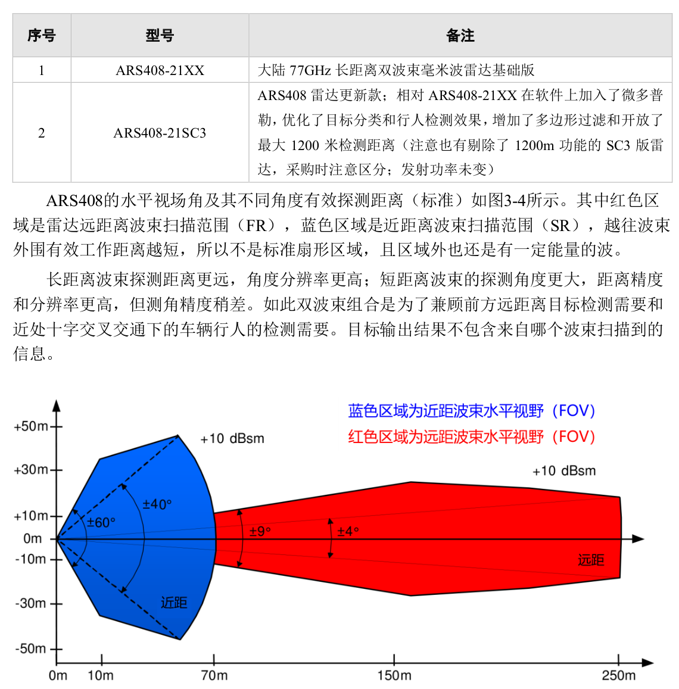
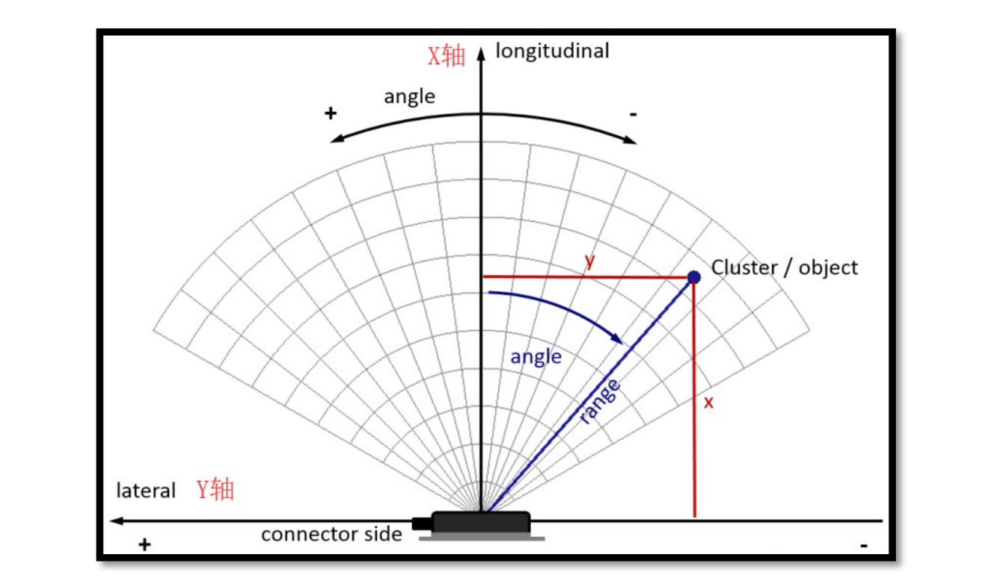
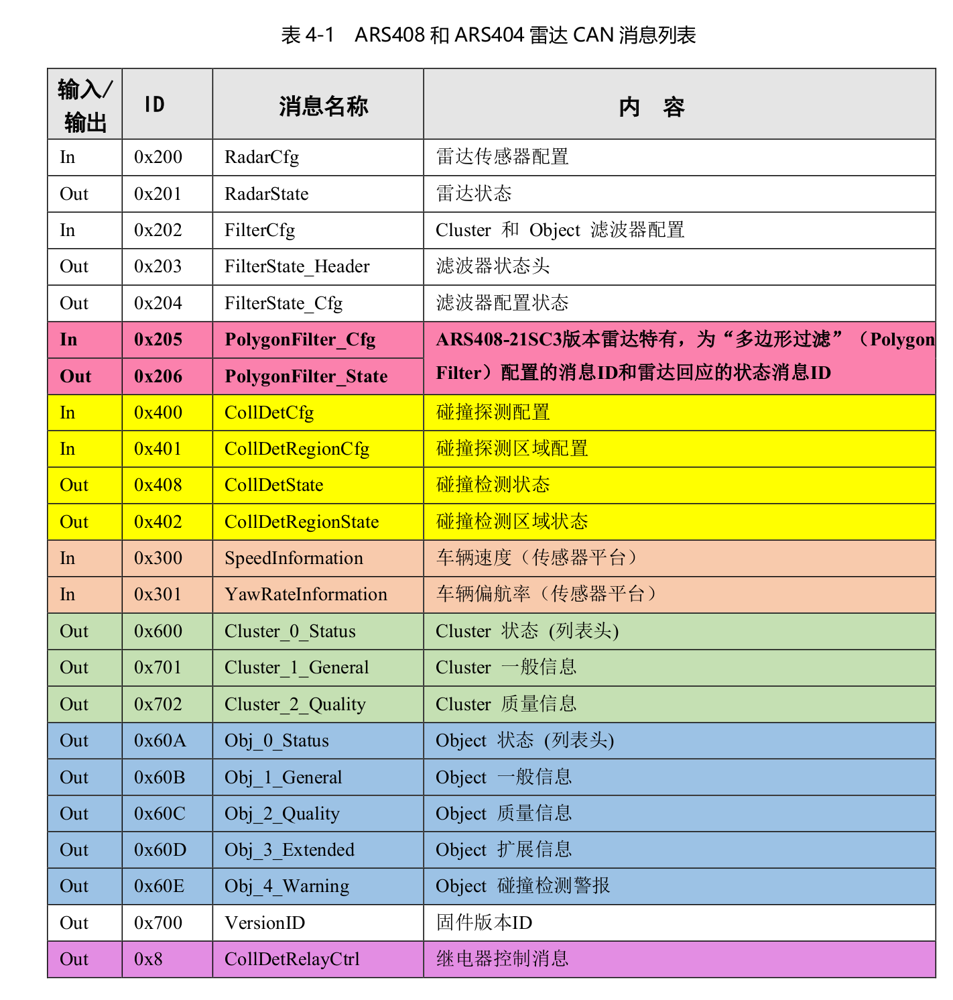
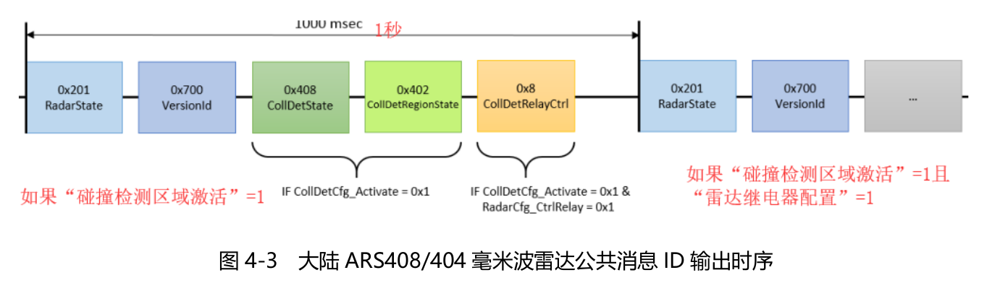

linux  ***can_frame***所在位置\#include <linux/can.h>

```c++
typedef __u32 canid_t;

/**
 * struct can_frame - basic CAN frame structure
 * @can_id:  CAN ID of the frame and CAN_*_FLAG flags, see canid_t definition
 * @can_dlc: frame payload length in byte (0 .. 8) aka data length code
 *           N.B. the DLC field from ISO 11898-1 Chapter 8.4.2.3 has a 1:1
 *           mapping of the 'data length code' to the real payload length
 * @__pad:   padding
 * @__res0:  reserved / padding
 * @__res1:  reserved / padding
 * @data:    CAN frame payload (up to 8 byte)
 */
struct can_frame {
	canid_t can_id;  /* 32 bit CAN_ID + EFF/RTR/ERR flags */
	__u8    can_dlc; /* frame payload length in byte (0 .. CAN_MAX_DLEN) */
	__u8    __pad;   /* padding */
	__u8    __res0;  /* reserved / padding */
	__u8    __res1;  /* reserved / padding */
	__u8    data[CAN_MAX_DLEN] __attribute__((aligned(8)));
};
```





以雷达正面最突出部分几何中心为雷达坐标系原点，垂直于雷达面向前（即雷达正面法线方向）为X轴正方向，沿着ARS408/ARS404雷达接口向左为Y轴正方向。

**ARS 408 雷达不输出目标的高度/俯仰角信息，只输出目标在雷达水平方向
的方位角【注：基于ARS408硬件、网口输出的ARS430成像雷达头支持输出目标大概的高
度/俯仰角，输出更密集的Cluster目标】**


## **ARS408/404 雷达数据消息组成**

> ARS传感器使用雷达辐射来探测其周围环境，处理反射信号并在多个信号处理步骤后，以Cluster和Object的形式展示出来。Cluster反映了目标原始的位置、速度和信号强度等信息，他们每个测量周期都进行新的评估。而Object由Clusters聚类和跟踪后组成，反映了目标的历史轨迹和维度。所以，对接雷达传感器的上位机可以在Cluster模式数据基础上用自己的聚类和跟踪等算法来处理雷达数据，也可以直接使用雷达传感器处理好的Object数据。
>
> 除了ARS408-21SC3雷达多了0x205和0x206信息，其余ARS408和ARS404雷达传感器的CAN通讯协议相同，CAN消息清单如表4-1所示（表中以雷达传感器ID0的为例。若修改了雷达传感器的ID，其CAN消息ID随之变化，具体见上一小节；表中不同底色的消息ID属于不同功能模块相关的）。



注：冲突检测/碰撞检测功能表现可能不佳，所以与碰撞检测和继电器控制
相关的消息（0x8、 0x400、 0x401、 0x408、 0x402、 0x60E）可以无视和不要使用，
而在用户自己的控制器中实现类似功能。

## **ARS408/404 雷达数据消息使用要点**

（1）**传感器状态**输出与传感器状态配置
传感器总是周期性（每秒1次）发送当前传感器状态RadarState (0x201)信息、传感器固件版本VersionID (0x700)消息输出当前固件版本。上位机软件通过RadarCfg（0x200）对雷达传感器状态进行配置后，可以通过读取和解析随后的传感器状态RadarState (0x201)信息来验证配置是否成功和生效。
（2）传感器**过滤器配置**和状态查询
上位机软件通过FilterCfg（0x202）对雷达传感器过滤器进行配置后，雷达传感器会应答一条FilterState_Header（0x203）消息来回复已配置的**过滤器数量**和一条FilterState_Cfg（0x204）消息来回复已经配置的**过滤器状态**信息。注意0x203和0x204只在配置过滤器后各回复一次，不会像0x201那样自动周期重复发出。
（3）冲突检测/碰撞检测区域配置和状态查询
通过消息CollDetCfg（0x400）可以激活基于区域的冲突检测/碰撞检测。当某些碰撞检测区域处于激活状态时，传感器会周期性地（每秒1次）发送CollDetState（0x408）消息来输出当前已配置的碰撞检测区域配置和警告状态，并在CollDetRegionState（0x402）消息中发送各个区域状态。此外，如果RadarCfg_CtrlRelay被激活，则会发送继电器控制消息CollDetRelayCtrl（0x8）。它们也都是周期性发送（每秒1次）。如RadarCfg_OutputType设置为Objects（值为0x2），则碰撞检测仅适用于 Objects（目标）。然后，为每个Objects（目标）发送Obj_4_Warning（0x60E）消息，表明该Objects（目标）是否正在进入某碰撞检测区域。此外，如果使传感器状态消息内的RadarCfg_CtrlRelay激活（值为0x1:active），则还会发送继电器控制消息CollDetRelayCtrl（0x8）它包含一个带有当前区域警告的状态位，用于控制继电器。
	注：若碰撞检测相关功能准确度不满足需求，建议就不要用，不要配置相关参数，而在用户自己上位机设备中实现类似的功能。



（4）Cluster模式特有消息输出特点
**如果在信号RadarCfg_OutputType(0x200)中选择了clusters，则雷达工作在Cluster模式，****只输出Cluster目标，每个Cluster目标对应输出最多三个以固定间隔**（约70到80毫秒）发送的消息**。说“最多”，是因为0x702默认不输出，只有在配置传感器状态消息内的RadarCfg_SendQuality的值为1时才会输出。

​	**0x600消息是一个Cluster模式目标输出信息循环的开始**，**包含了本测量周期分别对应近距波束扫描和远距波束扫描到的Cluster目标数量信息。每周期一共最多250个Cluster目标**；在开启质量信息且CAN总线超载前（应当极力避免这种情况发生）约110-120个Cluster目标。MeasCounter是雷达测量周期计数器，在雷达开机时初始值为0，之后递增到65535，然后归“1”重新递增（雷达开机后初始值为0，之后不会是0，可以依此检测雷达是否重启
了）。注意递增步进，**ARS408雷达是2，即1、3、5、7、9……；ARS404雷达是1，即1、2、3、4、5……**。一般地，有多少个Cluster目标，就会有多少个0x701消息输出，总线超载前也会有多少个0x702输出（目标数量太多时可能会丢弃部分0x702以保证下一测量周期数据及时输出；造成CAN报文过多的原因除了本雷达，还可能是其他雷达、ADAS摄像头等挂在同一根CAN线上的设备）。

5）Object模式特有消息输出特点
**如果在信号RadarCfg_OutputType(0x200)中选择了objects，则，则雷达工作在Object模式，只输出Object目标，**每个Object目标对应输出最多五个以固定间隔**（约70到80毫秒）发送的消息**。同上，说“最多”，是因0x60C、0x60D、0x60E默认不输出，只有在分别配置传感器状态消息内的RadarCfg_SendQuality的值为1、RadarCfg_SendExtInfo的值为1、CollDetCfg_Activate的值为1时才会输出。**0x60A消息是一个Object模式目标输出信息循环的开始，包含了本测量周期的Object目标数量信息。每周期最多100个Object目标**。


## ARS408/404 雷达数据帧的生成和解析

思路：要对雷达输出的CAN报文数据进行解析或要生成雷达配置CAN报文，主要是要先明确对应协议文档中相应信息的意思、**长度（Len）、起始位（Start）、字节序/编码格式（Byte Order）、数据类型（Value Type）、分辨率（Res）、偏移量（Offset）**来代入以下转换公式进行计算：
					**十进制的实际物理值=数据帧的十进制值×Res+Offset**

下面举例说明一下如何解析和生成雷达传感器的数据帧。

（1）根据协议和需要生成雷达配置数据帧
首先是通过RadarCfg（0x200）将雷达传感器状态中的“最大工作距离”配置为200米、输出模式配置为objects并配置输出质量信息和扩展信息：①RadarCfg（0x200）中的参数可以一次只更改一个，也可以一次更改多个。对于每个参数，数据帧中都包含一个与其对应的配置有效位Valid（例如参数RadarCfg_SendQuality对应RadarCfg_SendQuality_valid）。如果配置有效位设置为有效（值为0x1），则此次配置后相应的新参数将在雷达中更新和生效，否则本次配置将被忽略，但雷达还是会回复对应消息ID（例如用0x201回复0x200，用0x203和0x204回复0x202）。
