# 绪论

## TensorFlow2与TensorFlow1.x

> TensorFlow 2 是一个与 TensorFlow 1.x 使用体验完全不同的框架，TensorFlow 2 不兼容TensorFlow 1.x 的代码，同时在编程风格、函数接口设计等上也大相径庭，TensorFlow 1.x的代码需要依赖人工的方式迁移，自动化迁移方式并不靠谱。
>
> Google 即将停止支持TensorFlow 1.x，不建议学习 TensorFlow 1.x 版本。 TensorFlow 2 支持动态图优先模式，在计算时可以同时获得计算图与数值结果，可以代码中调试实时打印数据，搭建网络也像搭积木一样，层层堆叠，非常符合软件开发思维。以简单的2.0 + 4.0的相加运算为例，在 TensorFlow 1.x 中，首先创建计算图：

```python
import tensorflow as tf
# 1.创建计算图阶段
# 创建 2 个输入端子，指定类型和名字
a_ph = tf.placeholder(tf.float32, name='variable_a')
b_ph = tf.placeholder(tf.float32, name='variable_b') # 创建输出端子的运算操作，并命名

c_op = tf.add(a_ph, b_ph, name='variable_c')
```

> 创建计算图的过程就类比通过符号建立公式𝑐 = 𝑎 + 𝑏的过程，仅仅是记录了公式的计算步骤，并没有实际计算公式的数值结果，需要通过运行公式的输出端子𝑐，并赋值𝑎 = 2.0, 𝑏 = 4.0才能获得𝑐的数值结果：

```python
# 2.运行计算图阶段
# 创建运行环境
sess = tf.InteractiveSession()
# 初始化步骤也需要作为操作运行
init = tf.global_variables_initializer()
sess.run(init) # 运行初始化操作，完成初始化
# 运行输出端子，需要给输入端子赋值
c_numpy = sess.run(c_op, feed_dict={a_ph: 2., b_ph: 4.})
# 运算完输出端子才能得到数值类型的 c_numpy
print('a+b=',c_numpy)
```

> 可以看到，在 TensorFlow 中完成简单的2.0 + 4.0尚且如此繁琐，更别说创建复杂的神经网络算法有多艰难，这种先创建计算图后运行的编程方式叫做符号式编程。

> 接下来我们使用 TensorFlow 2 来完成2.0 + 4.0运算：

```python
import tensorflow as tf
# 1.创建输入张量
a = tf.constant(2.)
b = tf.constant(4.)
# 2.直接计算并打印
print('a+b=',a+b)
```

> 这种运算时同时创建计算图𝑎 + 𝑏和计算数值结果2.0 + 4.0的方式叫做命令式编程，也称为动态图优先模式。TensorFlow 2 和 PyTorch 都是采用动态图(优先)模式开发，调试方便，所见即所得。一般来说，动态图模型开发效率高，但是运行效率可能不如静态图模式，TensorFlow 2 也支持通过 tf.function 将动态图优先模式的代码转化为静态图模式，实现开发和运行效率的双赢。

## 功能演示

### GPU矩阵加速计算

```python
# 创建在 CPU 上运算的 2 个矩阵
with tf.device('/cpu:0'):
	cpu_a = tf.random.normal([1, n])
	cpu_b = tf.random.normal([n, 1])
	print(cpu_a.device, cpu_b.device)

# 创建使用 GPU 运算的 2 个矩阵
with tf.device('/gpu:0'):
	gpu_a = tf.random.normal([1, n])
	gpu_b = tf.random.normal([n, 1])
	print(gpu_a.device, gpu_b.device)
```

> 并通过 timeit.timeit()函数来测量 2 个矩阵的运算时间：

```python
def cpu_run():
	with tf.device('/cpu:0'):
	c = tf.matmul(cpu_a, cpu_b)
	return c

def gpu_run():
	with tf.device('/gpu:0'):
	c = tf.matmul(gpu_a, gpu_b)
	return c 

# 第一次计算需要热身，避免将初始化阶段时间结算在内
cpu_time = timeit.timeit(cpu_run, number=10)
gpu_time = timeit.timeit(gpu_run, number=10)
print('warmup:', cpu_time, gpu_time)

# 正式计算 10 次，取平均时间
cpu_time = timeit.timeit(cpu_run, number=10)
gpu_time = timeit.timeit(gpu_run, number=10)
print('run time:', cpu_time, gpu_time)
```

> 我们将不同大小的 n 下的 CPU 和 GPU 的运算时间绘制为曲线，如图 1.21 所示。可以看到，在矩阵 A 和 B 较小时，CPU 和 GPU 时间几乎一致，并不能体现出 GPU 并行计算的优势；在矩阵较大时，CPU 的计算时间明显上升，而 GPU 充分发挥并行计算优势，运算时间几乎不变。

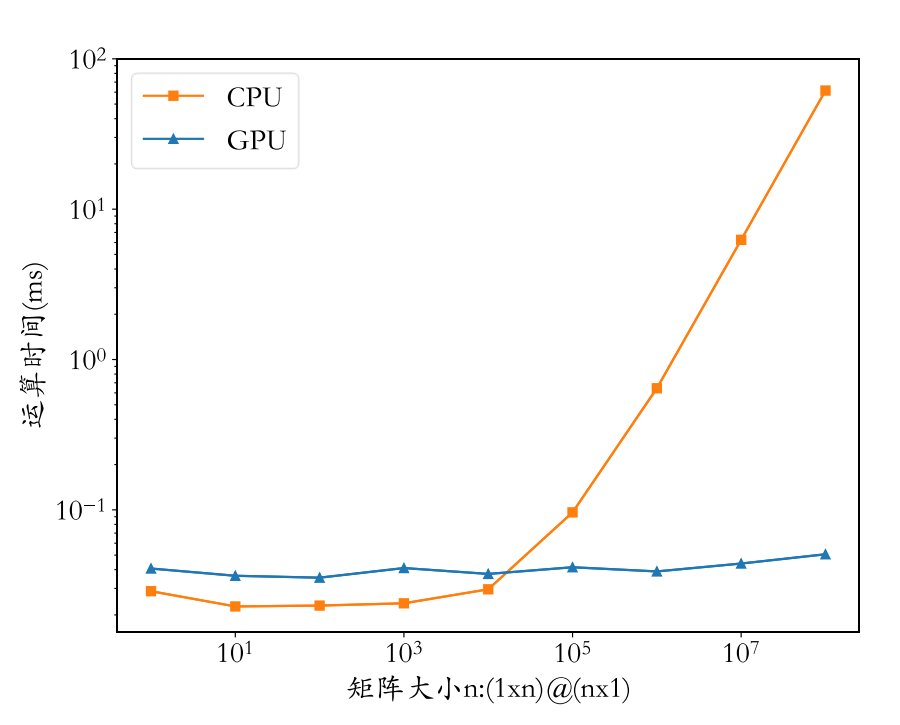

### 自动梯度

> 在使用 TensorFlow 构建前向计算过程的时候，除了能够获得数值结果，TensorFlow 还会自动构建计算图，通过 TensorFlow 提供的自动求导的功能，可以不需要手动推导，即可计算出输出对网络的偏导数。

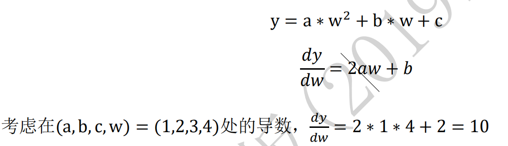


```python
import tensorflow as tf 

# 创建4个张量
a = tf.constant(1.)
b = tf.constant(2.)
c = tf.constant(3.)
w = tf.constant(4.)


with tf.GradientTape() as tape:# 构建梯度环境
	tape.watch([w]) # 将w加入梯度跟踪列表
	# 构建计算过程
	y = a * w**2 + b * w + c
# 求导
[dy_dw] = tape.gradient(y, [w])
print(dy_dw)

###tf.Tensor(10.0, shape=(), dtype=float32)
```

# 分类问题

## 手写数字图片数据集

> 为了方便业界统一测试和评估算法， (Lecun, Bottou, Bengio, & Haffner, 1998)发布了手写数字图片数据集，命名为 MNIST，它包含了 0~9 共 10 种数字的手写图片，每种数字一共有 7000 张图片，采集自不同书写风格的真实手写图片，一共 70000 张图片。其中  60000张图片作为训练集𝔻train(Training Set)，用来训练模型，剩下 10000 张图片作为测试集𝔻test(Test Set)，用来预测或者测试，训练集和测试集共同组成了整个 MNIST 数据集。目前常用的深度学习框架，如 TensorFlow，PyTorch 等，都可以非常方便的通过数行代码自动下载、管理和加载 MNIST 数据集，不需要我们额外编写代码，使用起来非常方便。我们这里利用 TensorFlow 自动在线下载 MNIST 数据集，并转换为 Numpy 数组格式：

```python
import os
import tensorflow as tf # 导入 TF 库
from tensorflow import keras # 导入 TF 子库
from tensorflow.keras import layers, optimizers, datasets # 导入 TF 子库

(x, y), (x_val, y_val) = datasets.mnist.load_data() # 加载数据集
x = 2*tf.convert_to_tensor(x, dtype=tf.float32)/255.-1 # 转换为张量，缩放到-1~1
y = tf.convert_to_tensor(y, dtype=tf.int32) # 转换为张量
y = tf.one_hot(y, depth=10) # one-hot 编码
print(x.shape, y.shape) ## (60000, 28, 28) (60000, 10)
print(x_val.shape,y_val.shape) ## (10000, 28, 28) (10000,)

train_dataset = tf.data.Dataset.from_tensor_slices((x, y)) # 构建数据集对象
train_dataset = train_dataset.batch(512) # 批量训练
```

> load_data()函数返回两个元组(tuple)对象，第一个是训练集，第二个是测试集，每个 tuple的第一个元素是多个训练图片数据X，第二个元素是训练图片对应的类别数字Y。其中训练集X的大小为(60000,28,28)，代表了 60000 个样本，每个样本由 28 行、28 列构成，由于是灰度图片，故没有 RGB 通道；训练集Y的大小为(60000, )，代表了这 60000 个样本的标签数字，每个样本标签用一个 0~9 的数字表示。测试集 X 的大小为(10000,28,28)，代表了10000 张测试图片，Y 的大小为(10000)

> 从 TensorFlow 中加载的 MNIST 数据图片，数值的范围在[0,255]之间。在机器学习中间，一般希望数据的范围在 0 周围小范围内分布。通过预处理步骤，我们把[0,255]像素范围归一化(Normalize)到[0,1.]区间，再缩放到[−1,1]区间，从而有利于模型的训练。

> 每一张图片的计算流程是通用的，我们在计算的过程中可以一次进行多张图片的计算，充分利用 CPU 或 GPU 的并行计算能力。一张图片我们用 shape 为[h, w]的矩阵来表示，对于多张图片来说，我们在前面添加一个数量维度(Dimension)，使用 shape 为[𝑏, ℎ, 𝑤]的张量来表示，其中的𝑏代表了 batch size(批量)；多张彩色图片可以使用 shape 为[𝑏, ℎ, 𝑤, 𝑐]的张量来表示，其中的𝑐表示通道数量(Channel)，彩色图片𝑐 = 3。通过 TensorFlow 的 Dataset 对象可以方便完成模型的批量训练，只需要调用 batch()函数即可构建带 batch 功能的数据集对象。

## 模型构建

回顾我们在回归问题讨论的生物神经元结构。我们把一组长度为𝑑𝑖𝑛的输入向量𝒙 = [𝑥1, 𝑥2, … , 𝑥𝑑𝑖𝑛]𝑇简化为单输入标量 *x*，模型可以表达成𝑦 = 𝑥 ∗ 𝑤 + 𝑏。如果是多输入、单输出的模型结构的话，我们需要借助于向量形式：

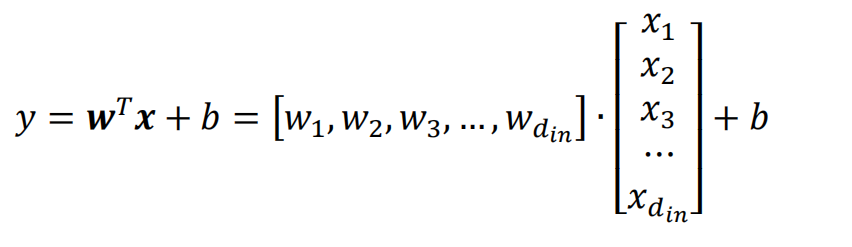

更一般地，通过组合多个多输入、单输出的神经元模型，可以拼成一个多输入、多输出的模型： 

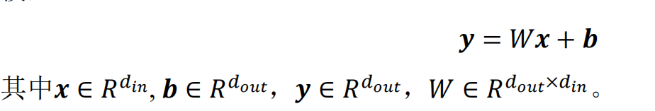

对于多输出节点、批量训练方式，我们将模型写成张量形式： 

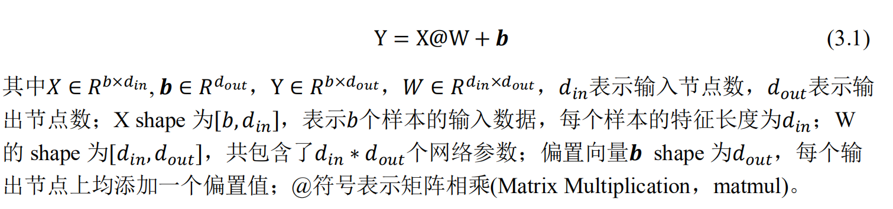


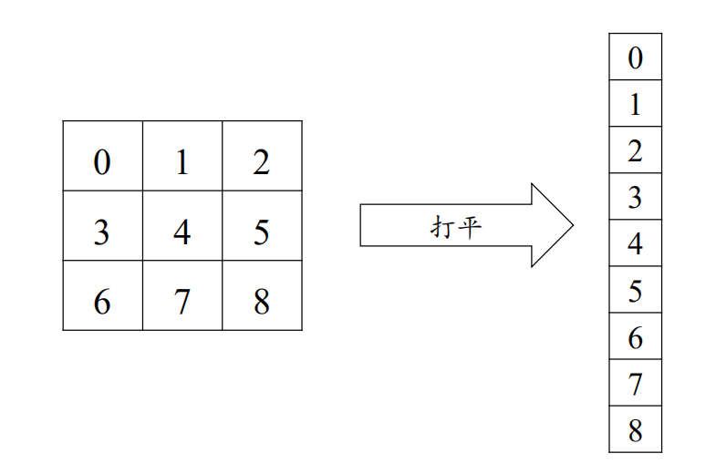


> 对于输出标签，前面我们已经介绍了数字编码，它可以用一个数字来表示便签信息，例如数字 1 表示猫，数字 3 表示鱼等。但是数字编码一个最大的问题是，数字之间存在天然的大小关系，比如1 < 2 < 3，如果 1、2、3 分别对应的标签是猫、狗、鱼，他们之间并没有大小关系，所以采用数字编码的时候会迫使模型去学习到这种不必要的约束。

> 那么怎么解决这个问题呢？可以将输出设置为𝑑𝑜𝑢𝑡个输出节点的向量，𝑑𝑜𝑢𝑡与类别数相同，让第𝑖 ∈ [1, 𝑑𝑜𝑢𝑡]个输出值表示当前样本属于类别𝑖的概率𝑃(𝑥属于类别𝑖|𝑥)。我们只考虑输入图片只输入一个类别的情况，此时输入图片的真实的标注已经明确：如果物体属于第𝑖类话，那么索引为𝑖的位置上设置为 1，其他位置设置为 0，我们把这种编码方式叫做 one-hot 编码(独热编码)。以图 3.6 中的“猫狗鱼鸟”识别系统为例，所有的样本只属于“猫狗鱼鸟”4 个类别中其一，我们将第1,2,3,4号索引位置分别表示猫狗鱼鸟的类别，对于所有猫的图片，它的数字编码为 0，One-hot 编码为[1,0,0,0]；对于所有狗的图片，它的数字编码为 1，One-hot 编码为[0,1,0,0],以此类推。

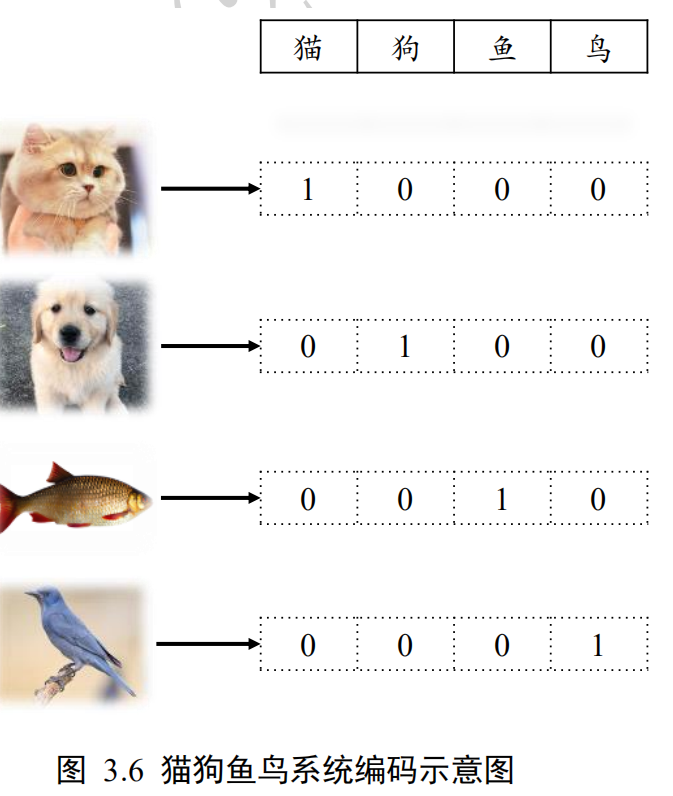

> One-hot 编码是非常稀疏(Sparse)的，相对于数字编码来说，占用较多的存储空间，所以一般在存储时还是采用数字编码，在计算时，根据需要来把数字编码转换成 One-hot 编码，通过 tf.one_hot 即可实现：

```python
y = tf.constant([0,1,2,3]) # 数字编码
y = tf.one_hot(y, depth=10) # one-hot 编码
print(y)
Out[1]:
tf.Tensor(
[[1. 0. 0. 0. 0. 0. 0. 0. 0. 0.]
[0. 1. 0. 0. 0. 0. 0. 0. 0. 0.]
[0. 0. 1. 0. 0. 0. 0. 0. 0. 0.]
[0. 0. 0. 1. 0. 0. 0. 0. 0. 0.]], shape=(4, 10), dtype=float32)
```

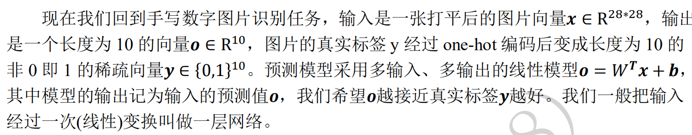

## 误差计算

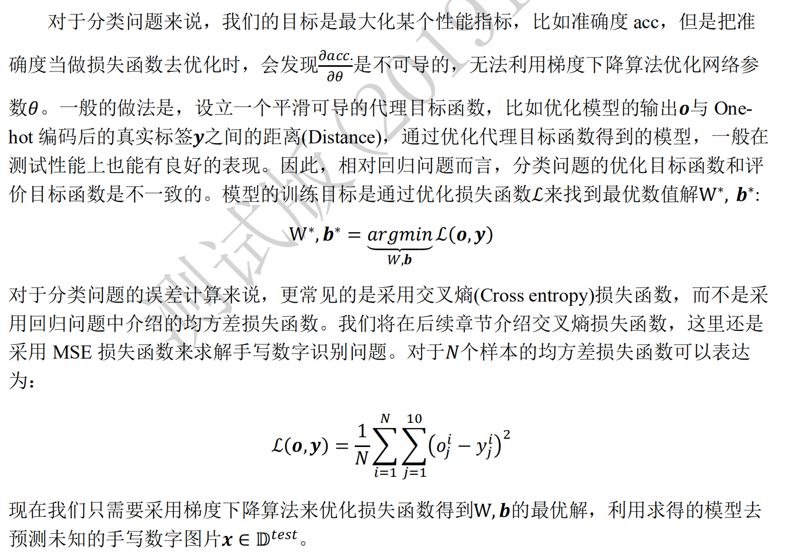

## 线性模型

>  **线性模型** 线性模型是机器学习中间最简单的数学模型之一，参数量少，计算简单，但是只能表达线性关系。即使是简单如数字图片识别任务，它也是属于图片识别的范畴，人类目前对于复杂大脑的感知和决策的研究尚处于初步探索阶段，如果只使用一个简单的线性模型去逼近复杂的人脑图片识别模型，很显然不能胜任

> **表达能力** 上面的解决方案只使用了少量神经元组成的一层网络模型，相对于人脑中千亿级别的神经元互联结构，它的表达能力明显偏弱，其中表达能力体现为逼近复杂分布的能力

> 模型的表达能力与数据模态之间的示意图如图 3.7 所示，图中绘制了带观测误差的采样点的分布，人为推测数据的真实分布可能是某 2 次抛物线模型。如图 3.7(a)所示，如果使用表达能力偏弱的线性模型去学习，很难学习到比较好的模型；如果使用合适的多项式函数模型去学习，则能学到比较合适的模型，如图 3.7(b)；但模型过于复杂，表达能力过强时，则很有可能会过拟合，伤害模型的泛化能力，如图 3.7(c)。 

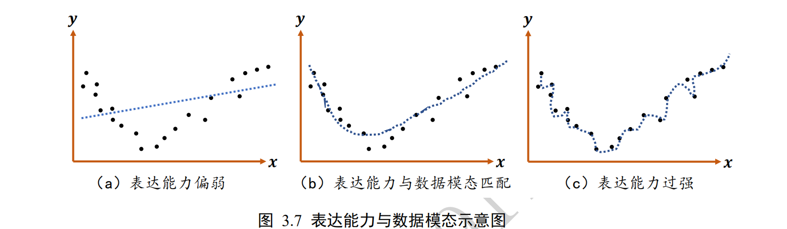


> 目前我们所采用的多神经元模型仍是线性模型，表达能力偏弱，接下来我们尝试解决这 个问题。

## 非线性模型

> 既然线性模型不可行，我们可以给线性模型嵌套一个非线性函数，即可将其转换为非线性模型。我们把这个非线性函数称为激活函数(Activation function)，用𝜎表示：

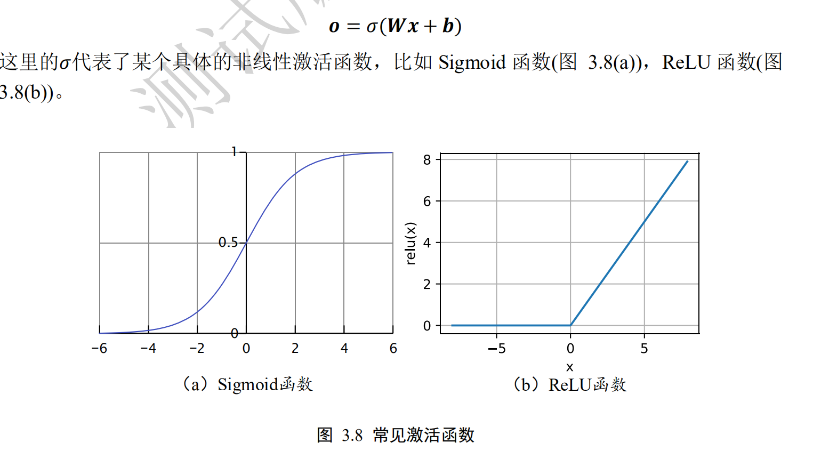

## 表达能力

> 针对于模型的表达能力偏弱的问题，可以通过重复堆叠多次变换来增加其表达能力：

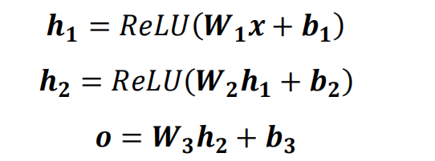

> 把第一层神经元的输出值𝒉𝟏作为第二层神经元模型的输入，把第二层神经元的输出𝒉𝟐作为第三层神经元的输入，最后一层神经元的输出作为模型的输出 。 从网络结构上看，如图 3.9 所示，函数的嵌套表现为网络层的前后相连，每堆叠一个(非)线性环节，网络层数增加一层。我们把数据节点所在的层叫做输入层，每一个非线性模块的输出𝒉𝒊连同它的网络层参数𝑾𝒊和𝒃𝒊称为一层网络层，特别地，对于网络中间的层，叫做隐藏层，最后一层叫做输出层。这种由大量神经元模型连接形成的网络结构称为(前 馈)神经网络(Neural Network)。 

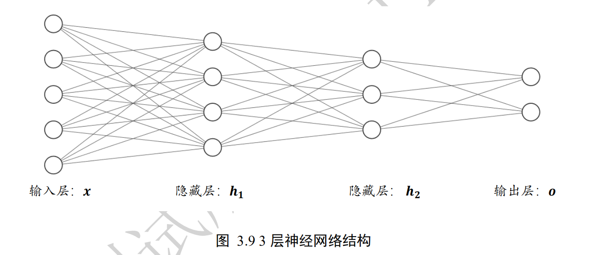

## 优化方法

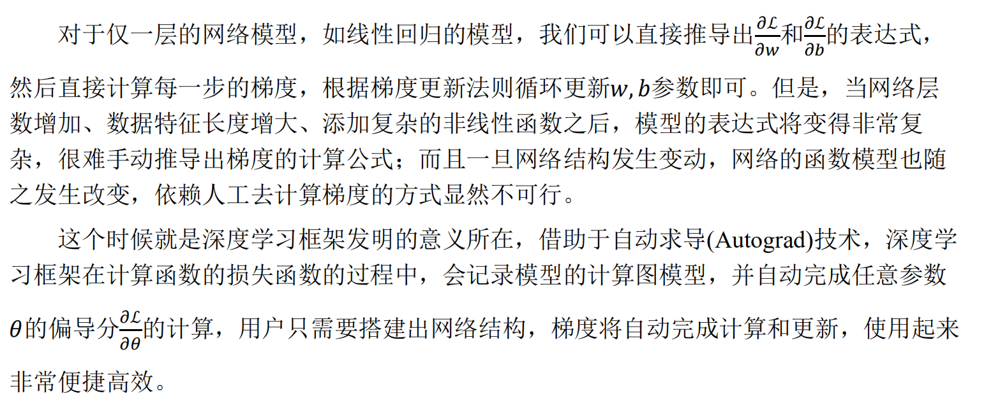

## 手写数字图片识别体验

> **网络搭建** 对于第一层模型来说，他接受的输入𝒙 ∈ R784，输出𝒉𝟏 ∈ 𝑅256设计为长度为 256的向量，我们不需要显式地编写𝒉𝟏 = 𝑅𝑒𝐿𝑈(𝑾𝟏𝒙 + 𝒃𝟏)的计算逻辑，在 TensorFlow 中通过一行代码即可实现：

```python
layers.Dense(256, activation='relu'),
```

> 使用 TensorFlow 的 Sequential 容器可以非常方便地搭建多层的网络。对于 3 层网络，我们可以快速完成 3 层网络的搭建，第 1 层的输出节点数设计为 256，第 2 层设计为 128，输出层节点数设计为 10。直接调用这个模型对象 model(x)就可以返回模型最后一层的输出 。

```python
model = keras.Sequential([ # 3 个非线性层的嵌套模型
 layers.Dense(256, activation='relu'),
 layers.Dense(128, activation='relu'),
 layers.Dense(10)])
```

> **模型训练** 得到模型输出 后，通过 MSE 损失函数计算当前的误差ℒ：

```python
with tf.GradientTape() as tape: # 构建梯度记录环境
 # 打平，[b, 28, 28] => [b, 784]
 x = tf.reshape(x, (-1, 28*28))
 # Step1. 得到模型输出 output
 # [b, 784] => [b, 10]
 out = model(x)
```

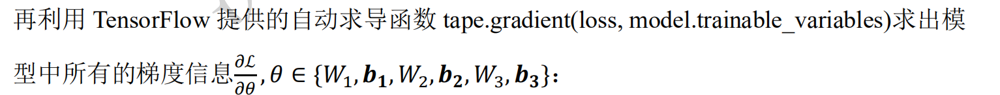

```python
# Step3. 计算参数的梯度 w1, w2, w3, b1, b2, b3
 grads = tape.gradient(loss, model.trainable_variables)
```

> 计算获得的梯度结果使用 grads 变量保存。再使用 optimizers 对象自动按着梯度更新法则去更新模型的参数𝜃。

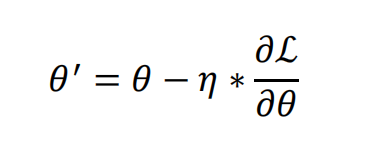

```python
grads = tape.gradient(loss, model.trainable_variables)
 # w' = w - lr * grad，更新网络参数
optimizer.apply_gradients(zip(grads, model.trainable_variables))
```


> 循环迭代多次后，就可以利用学好的模型𝑓𝜃去预测未知的图片的类别概率分布。模型的测试部分暂不讨论。手写数字图片 MNIST 数据集的训练误差曲线如图 3.10 所示，由于 3 层的神经网络表达能力较强，手写数字图片识别任务简单，误差值可以较快速、稳定地下降，其中对数据集的所有图片迭代一遍叫做一个 Epoch，我们可以在间隔数个 Epoch 后测试模型的准确率等指标，方便监控模型的训练效果。

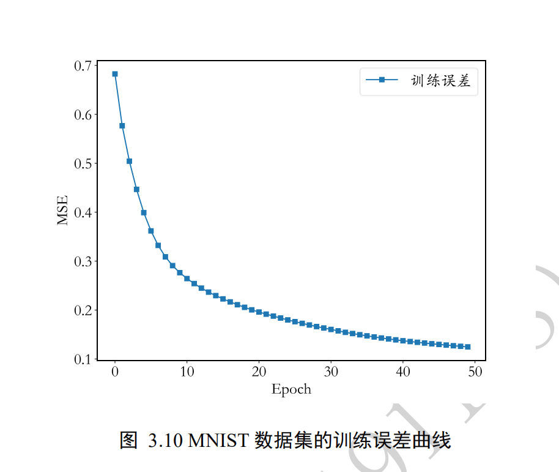

```python
import  os
os.environ['TF_CPP_MIN_LOG_LEVEL']='2'

import  tensorflow as tf
from    tensorflow import keras
from    tensorflow.keras import layers, optimizers, datasets

(x, y), (x_val, y_val) = datasets.mnist.load_data() 
x = tf.convert_to_tensor(x, dtype=tf.float32) / 255.
y = tf.convert_to_tensor(y, dtype=tf.int32)
y = tf.one_hot(y, depth=10)
print(x.shape, y.shape)
print(x_val.shape,y_val.shape)
train_dataset = tf.data.Dataset.from_tensor_slices((x, y))
train_dataset = train_dataset.batch(200)


model = keras.Sequential([
    layers.Dense(512, activation='relu'),
    layers.Dense(256, activation='relu'),
    layers.Dense(10)])

optimizer = optimizers.SGD(learning_rate=0.001)

def train_epoch(epoch):

    # Step4.loop
    for step, (x, y) in enumerate(train_dataset):

        with tf.GradientTape() as tape:
            # [b, 28, 28] => [b, 784]
            x = tf.reshape(x, (-1, 28*28))
            # Step1. compute output
            # [b, 784] => [b, 10]
            out = model(x)
            # Step2. compute loss
            loss = tf.reduce_sum(tf.square(out - y)) / x.shape[0]

        # Step3. optimize and update w1, w2, w3, b1, b2, b3
        grads = tape.gradient(loss, model.trainable_variables)
        # w' = w - lr * grad
        optimizer.apply_gradients(zip(grads, model.trainable_variables))

        if step % 100 == 0:
            print(epoch, step, 'loss:', loss.numpy())

def train():

    for epoch in range(30):
        train_epoch(epoch)

if __name__ == '__main__':
    train()
```


# TensorFlow 基础

## 数据类型

 

**数值类型**

数值类型的张量是 TensorFlow 的主要数据载体，分为：

> ❑ 标量(Scalar) 单个的实数，如 1.2, 3.4 等，维度数(Dimension，也叫秩)为 0，shape 为[] 
>
> ❑ 向量(Vector) n 个实数的有序集合，通过中括号包裹，如[1.2]，[1.2,3.4]等，维度数为 1，长度不定，shape 为[𝑛] 
>
> ❑ 矩阵(Matrix) n 行 m 列实数的有序集合，如[[1,2],[3,4]]
>
> ❑ 张量(Tensor) 所有维度数dim > 2的数组统称为张量。张量的每个维度也做轴(Axis)，一般维度代表了具体的物理含义，比如 Shape 为[2,32,32,3]的张量共有 4 维，如果表示图片数据的话，每个维度/轴代表的含义分别是：图片数量、图片高度、图片宽度、图片通道数，其中 2 代表了 2 张图片，32 代表了高宽均为 32，3 代表了 RGB 3 个通道。张量的维度数以及每个维度所代表的具体物理含义需要由用户自行定义在 TensorFlow 中间，为了表达方便，一般把标量、向量、矩阵也统称为张量，不作区分，需要根据张量的维度数和形状自行判断。

> 首先来看标量在 TensorFlow 是如何创建的：

```python
In [1]:
a = 1.2
aa = tf.constant(1.2) # 创建标量
type(a), type(aa), tf.is_tensor(aa)
Out[1]:
(float, tensorflow.python.framework.ops.EagerTensor, True)
```

> 必须通过 TensorFlow 规定的方式去创建张量，而不能使用 Python 语言的标准变量创建方式。通过 print(x)或 x 可以打印出张量 x 的相关信息：

```pyhton
In [2]: x = tf.constant([1,2.,3.3])
x
Out[2]:
<tf.Tensor: id=165, shape=(3,), dtype=float32, numpy=array([1. , 2. , 3.3], 
dtype=float32)>
```

> 其中 id 是 TensorFlow 中内部索引对象的编号，shape 表示张量的形状，dtype 表示张量的数 值精度，张量 numpy()方法可以返回 Numpy.array 类型的数据，方便导出数据到系统的其他模块：

```python
In [3]: x.numpy()
Out[3]:
array([1. , 2. , 3.3], dtype=float32)
```

> 同样的方法定义矩阵

```python
In [6]:
a = tf.constant([[1,2],[3,4]])
a, a.shape
Out[6]:
(<tf.Tensor: id=13, shape=(2, 2), dtype=int32, numpy=
array([[1, 2],
 [3, 4]])>, TensorShape([2, 2]))
```

**字符串类型**

> 除了丰富的数值类型外，TensorFlow 还支持字符串(String)类型的数据，例如在表示图片数据时，可以先记录图片的路径，再通过预处理函数根据路径读取图片张量。通过传入字符串对象即可创建字符串类型的张量：

```python
In [8]:
a = tf.constant('Hello, Deep Learning.')
Out[8]:
<tf.Tensor: id=17, shape=(), dtype=string, numpy=b'Hello, Deep Learning.'>
```

> 在 tf.strings 模块中，提供了常见的字符串型的工具函数，如拼接 join()，长度 length()，切分 split()等等：

```python
In [9]:
tf.strings.lower(a)
Out[9]:
<tf.Tensor: id=19, shape=(), dtype=string, numpy=b'hello, deep learning.'>
```

**布尔类型**

>为了方便表达比较运算操作的结果，TensorFlow 还支持布尔类型(Boolean, bool)的张量。布尔类型的张量只需要传入 Python 语言的布尔类型数据，转换成 TensorFlow 内部布尔型即可：

```python
In [10]: a = tf.constant(True)
Out[10]:
<tf.Tensor: id=22, shape=(), dtype=bool, numpy=True>
```

> 传入布尔类型的向量：

```python
In [11]:
a = tf.constant([True, False])
Out[11]:
<tf.Tensor: id=25, shape=(2,), dtype=bool, numpy=array([ True, False])
```

> 需要注意的是，TensorFlow 的布尔类型和 Python 语言的布尔类型并不对等，不能通用：

```python
In [11]:
a = tf.constant(True) # 创建布尔张量
a == True

Out[11]:
False
```

## 数值精度

> 对于数值类型的张量，可以保持为不同字节长度的精度，如浮点数 3.14 既可以保存为16-bit 长度，也可以保存为 32-bit 甚至 64-bit 的精度。Bit 位越长，精度越高，同时占用的内存空间也就越大。常用的精度类型有 tf.int16, tf.int32, tf.int64, tf.float16, tf.float32, tf.float64，其中 tf.float64 即为 tf.double。

> 在创建张量时，可以指定张量的保存精度：

```python
In [12]:
tf.constant(123456789, dtype=tf.int16)
tf.constant(123456789, dtype=tf.int32)
Out[12]:
<tf.Tensor: id=33, shape=(), dtype=int16, numpy=-13035>
<tf.Tensor: id=35, shape=(), dtype=int32, numpy=123456789>
```

> 可以看到，保存精度过低时，数据 123456789 发生了溢出，得到了错误的结果，一般使用tf.int32, tf.int64 精度。对于浮点数，高精度的张量可以表示更精准的数据，例如采用tf.float32 精度保存𝜋时

```python
In [13]:
import numpy as np
np.pi
tf.constant(np.pi, dtype=tf.float32)
Out[13]:
<tf.Tensor: id=29, shape=(), dtype=float32, numpy=3.1415927>
```

**读取精度**

> 通过访问张量的 dtype 成员属性可以判断张量的保存精度：

```python
In [15]:
print('before:',a.dtype)
if a.dtype != tf.float32:
    a = tf.cast(a,tf.float32) # 转换精度
print('after :',a.dtype)
Out[15]:
before: <dtype: 'float16'>
after : <dtype: 'float32'>
```

> 对于某些只能处理指定精度类型的运算操作，需要提前检验输入张量的精度类型，并将不符合要求的张量进行类型转换。

**类型转换**

> 系统的每个模块使用的数据类型、数值精度可能各不相同，对于不符合要求的张量的类型及精度，需要通过 tf.cast 函数进行转换：

```python
In [16]:
a = tf.constant(np.pi, dtype=tf.float16)
tf.cast(a, tf.double)
Out[16]:
<tf.Tensor: id=44, shape=(), dtype=float64, numpy=3.140625>
```

> 布尔型与整形之间相互转换也是合法的，是比较常见的操作：

```python
In [18]:
a = tf.constant([True, False])
tf.cast(a, tf.int32)
Out[18]:
<tf.Tensor: id=48, shape=(2,), dtype=int32, numpy=array([1, 0])>
```

## 待优化张量

>为了区分需要计算梯度信息的张量与不需要计算梯度信息的张量，TensorFlow 增加了一种专门的数据类型来支持梯度信息的记录：tf.Variable。tf.Variable 类型在普通的张量类型基础上添加了 name，trainable 等属性来支持计算图的构建。由于梯度运算会消耗大量的计算资源，而且会自动更新相关参数，对于不需要的优化的张量，如神经网络的输入 X，不需要通过 tf.Variable 封装；相反，对于需要计算梯度并优化的张量，如神经网络层的W 和𝒃，需要通过 tf.Variable 包裹以便 TensorFlow 跟踪相关梯度信息。

> 通过 tf.Variable()函数可以将普通张量转换为待优化张量：

```python
In [20]:
a = tf.constant([-1, 0, 1, 2])
aa = tf.Variable(a)
aa.name, aa.trainable
Out[20]:
('Variable:0', True)
```

>其中张量的 name 和 trainable 属性是 Variable 特有的属性，name 属性用于命名计算图中的变量，这套命名体系是 TensorFlow 内部维护的，一般不需要用户关注 name 属性；trainable表征当前张量是否需要被优化，创建 Variable 对象是默认启用优化标志，可以设置trainable=False 来设置张量不需要优化。

>除了通过普通张量方式创建 Variable，也可以直接创建：

```python
In [21]:
a = tf.Variable([[1,2],[3,4]])
Out[21]:
<tf.Variable 'Variable:0' shape=(2, 2) dtype=int32, numpy=
array([[1, 2],
 [3, 4]])>
```

## 创建张量

**从** **Numpy, List** **对象创建**

> 通过 tf.convert_to_tensor 可以创建新 Tensor，并将保存在 Python List 对象或者 Numpy Array 对象中的数据导入到新 Tensor 中

```python
In [22]:
tf.convert_to_tensor([1,2.])
Out[22]:
<tf.Tensor: id=86, shape=(2,), dtype=float32, numpy=array([1., 2.], 
dtype=float32)>
In [23]:
tf.convert_to_tensor(np.array([[1,2.],[3,4]]))
Out[23]:
<tf.Tensor: id=88, shape=(2, 2), dtype=float64, numpy=
array([[1., 2.],
 [3., 4.]])>
```

> 需要注意的是，Numpy 中浮点数数组默认使用 64-Bit 精度保存数据，转换到 Tensor 类型时精度为 tf.float64，可以在需要的时候转换为 tf.float32 类型。实际上，tf.constant()和 tf.convert_to_tensor()都能够自动的把 Numpy 数组或者 Python List 数据类型转化为 Tensor 类型，这两个 API 命名来自 TensorFlow 1.x 的命名习惯，在TensorFlow 2 中函数的名字并不是很贴切，使用其一即可

**创建全** **0**，全**1** **张量**

> 将张量创建为全 0 或者全 1 数据是非常常见的张量初始化手段。考虑线性变换𝒚 = 𝑊𝒙 + 𝒃，将权值矩阵 W 初始化为全 1 矩阵，偏置 **b** 初始化为全 0 向量，此时线性变化层输出𝒚 = 𝒙，是一种比较好的层初始化状态。通过 tf.zeros()和 tf.ones()即可创建任意形状全 0 或全 1 的张量。例如，创建为 0 和为 1 的标量张量:

```python
In [24]: tf.zeros([]),tf.ones([])
Out[24]:
(<tf.Tensor: id=90, shape=(), dtype=float32, numpy=0.0>,
<tf.Tensor: id=91, shape=(), dtype=float32, numpy=1.0>)
创建全 0 和全 1 的向量：
In [25]: tf.zeros([1]),tf.ones([1])
Out[25]:
(<tf.Tensor: id=96, shape=(1,), dtype=float32, numpy=array([0.], 
dtype=float32)>,
<tf.Tensor: id=99, shape=(1,), dtype=float32, numpy=array([1.], 
dtype=float32)>)
```

> 创建全 0 的矩阵：

```python
In [26]: tf.zeros([2,2])
Out[26]:
<tf.Tensor: id=104, shape=(2, 2), dtype=float32, numpy=
    array([[0., 0.],
 [0., 0.]], dtype=float32)>
```

> 创建全 1 的矩阵：

```python
In [27]: tf.ones([3,2])
Out[27]:
<tf.Tensor: id=108, shape=(3, 2), dtype=float32, numpy=
array([[1., 1.],
 [1., 1.],
 [1., 1.]], dtype=float32)>
```

> 通过 tf.zeros_like, tf.ones_like 可以方便地新建与某个张量 shape 一致，内容全 0 或全 1
>
> 的张量。例如，创建与张量 a 形状一样的全 0 张量：

```python
In [28]: a = tf.ones([2,3])
tf.zeros_like(a)
Out[28]:
<tf.Tensor: id=113, shape=(2, 3), dtype=float32, numpy=
array([[0., 0., 0.],
 [0., 0., 0.]], dtype=float32)>
```

> 创建与张量 a 形状一样的全 1 张量：

```python
In [29]: a = tf.zeros([3,2])
tf.ones_like(a)
Out[29]:
<tf.Tensor: id=120, shape=(3, 2), dtype=float32, numpy=
array([[1., 1.],
 [1., 1.],
 [1., 1.]], dtype=float32)>
```

**创建自定义数值张量**

> 除了初始化为全 0，或全 1 的张量之外，有时也需要全部初始化为某个自定义数值的张量，比如将张量的数值全部初始化为-1 等。
>
> 通过 tf.fill(shape, value)可以创建全为自定义数值 value 的张量。例如，创建元素为-1 的标量：

```python
##创建所有元素为-1 的向量：
In [31]:tf.fill([1], -1)
Out[31]:
<tf.Tensor: id=128, shape=(1,), dtype=int32, numpy=array([-1])>
```

**创建已知分布的张量**

> 正态分布(Normal Distribution，或 Gaussian Distribution)和均匀分布(Uniform Distribution)是最常见的分布之一，创建采样自这 2 种分布的张量非常有用，比如在卷积神经网络中，卷积核张量 W 初始化为正态分布有利于网络的训练；在对抗生成网络中，隐藏变量 z 一般采样自均匀分布。

> 通过 tf.random.normal(shape, mean=0.0, stddev=1.0)可以创建形状为 shape，均值为mean，标准差为 stddev 的正态分𝒩(𝑚𝑒𝑎𝑛
>
> , 𝑠𝑡𝑑𝑑𝑒𝑣2)。例如，创建均值为 0，标准差为 1的正太分布

```python
In [33]: tf.random.normal([2,2])
Out[33]:
<tf.Tensor: id=143, shape=(2, 2), dtype=float32, numpy=
array([[-0.4307344 , 0.44147003],
 [-0.6563149 , -0.30100572]], dtype=float32)>
```

> 创建均值为 1，标准差为 2 的正太分布：

```python
In [34]: tf.random.normal([2,2], mean=1,stddev=2)
Out[34]:
<tf.Tensor: id=150, shape=(2, 2), dtype=float32, numpy=
array([[-2.2687864, -0.7248812],
 [ 1.2752185, 2.8625617]], dtype=float32)>
```

> 通过 tf.random.uniform(shape, minval=0, maxval=None, dtype=tf.float32)可以创建采样自[𝑚𝑖𝑛𝑣𝑎𝑙, 𝑚𝑎𝑥𝑣𝑎𝑙]区间的均匀分布的张量。例如创建采样自区间[0,1]，shape 为[2,2]的矩阵：

```python
In [35]: tf.random.uniform([2,2])
Out[35]:
<tf.Tensor: id=158, shape=(2, 2), dtype=float32, numpy=
    array([[0.65483284, 0.63064325],
 [0.008816 , 0.81437767]], dtype=float32)>
```

> 创建采样自区间[0,10]，shape 为[2,2]的矩阵：

```python
In [36]: tf.random.uniform([2,2],maxval=10)
Out[36]:
<tf.Tensor: id=166, shape=(2, 2), dtype=float32, numpy=
array([[4.541913 , 0.26521802],
 [2.578913 , 5.126876 ]], dtype=float32)>
```

> 如果需要均匀采样整形类型的数据，必须指定采样区间的最大值 maxval 参数，同时制定数据类型为 tf.int*型：

```python
In [37]:tf.random.uniform([2,2],maxval=100,dtype=tf.int32)
Out[37]:
<tf.Tensor: id=171, shape=(2, 2), dtype=int32, numpy=
array([[61, 21],
 [95, 75]])>
```

**创建序列**

> 在循环计算或者对张量进行索引时，经常需要创建一段连续的整形序列，可以通过tf.range()函数实现。tf.range(limit, delta=1)可以创建[0,𝑙𝑖𝑚𝑖𝑡)之间，步长为 delta 的整形序列，不包含 limit 本身。例如，创建 0~9，步长为 1 的整形序列：

```python
In [38]: tf.range(10)
Out[38]:
<tf.Tensor: id=180, shape=(10,), dtype=int32, numpy=array([0, 1, 2, 3, 4, 5, 
6, 7, 8, 9])>
```

> 创建 0~9，步长为 2 的整形序列：

```python
In [39]: tf.range(10,delta=2)
Out[39]:
<tf.Tensor: id=185, shape=(5,), dtype=int32, numpy=array([0, 2, 4, 6, 8])>
```

> 通过 tf.range(start, limit, delta=1)可以创建[𝑠𝑡𝑎𝑟𝑡, 𝑙𝑖𝑚𝑖𝑡)，步长为 delta 的序列，不包含 limit本身：

```python
In [40]: tf.range(1,10,delta=2)
Out[40]:
<tf.Tensor: id=190, shape=(5,), dtype=int32, numpy=array([1, 3, 5, 7, 9])>
```


##  张量的典型应用

**标量**

> 在 TensorFlow 中，标量最容易理解，它就是一个简单的数字，维度数为 0，shape 为 []。标量的典型用途之一是误差值的表示、各种测量指标的表示，比如准确度(Accuracy, acc)，精度(Precision)和召回率(Recall)等。

> 以均方差误差函数为例，经过 tf.keras.losses.mse(或 tf.keras.losses.MSE)返回每个样本上的误差值，最后取误差的均值作为当前 batch 的误差，它是一个标量：

```python
In [41]: 
out = tf.random.uniform([4,10]) #随机模拟网络输出
y = tf.constant([2,3,2,0]) # 随机构造样本真实标签
y = tf.one_hot(y, depth=10) # one-hot 编码
loss = tf.keras.losses.mse(y, out) # 计算每个样本的 MSE
loss = tf.reduce_mean(loss) # 平均 MSE
print(loss)
Out[41]:
tf.Tensor(0.19950335, shape=(), dtype=float32)
```

**向量**

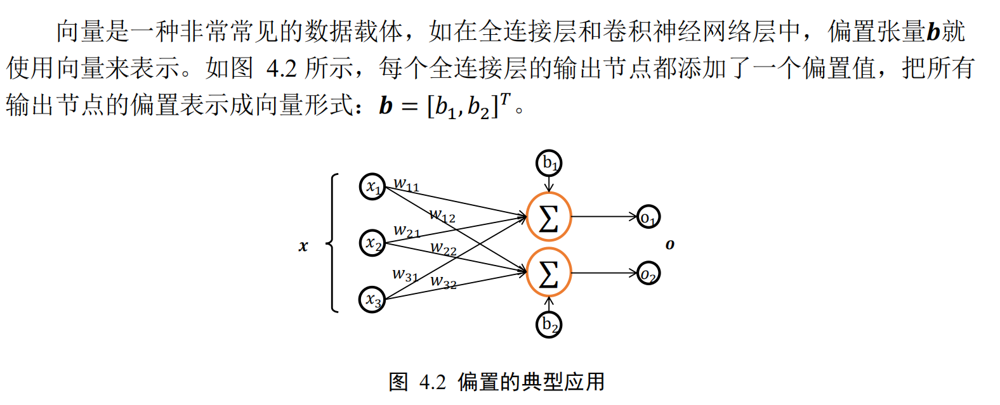

>考虑 2 个输出节点的网络层，我们创建长度为 2 的偏置向量𝒃，并累加在每个输出节点

```python
In [42]: 
# z=wx,模拟获得激活函数的输入 z
z = tf.random.normal([4,2])
b = tf.zeros([2]) # 模拟偏置向量
z = z + b # 累加偏置
Out[42]:
<tf.Tensor: id=245, shape=(4, 2), dtype=float32, numpy=
array([[ 0.6941646 , 0.4764454 ],
 [-0.34862405, -0.26460952],
 [ 1.5081744 , -0.6493869 ],
 [-0.26224667, -0.78742725]], dtype=float32)>
```

> 注意到这里 shape 为[4,2]的𝒛和 shape 为[2]的𝒃张量可以直接相加，这是为什么呢？让我们在 Broadcasting 一节为大家揭秘。

> 通过高层接口类 Dense()方式创建的网络层，张量 W 和𝒃存储在类的内部，由类自动创建并管理。可以通过全连接层的 bias 成员变量查看偏置变量𝒃，例如创建输入节点数为 4，输出节点数为 3 的线性层网络，那么它的偏置向量 **b** 的长度应为 3：

```python
In [43]: 
fc = layers.Dense(3) # 创建一层 Wx+b，输出节点为 3 # 通过 build 函数创建 W,b 张量，输入节点为 4
fc.build(input_shape=(2,4))
fc.bias # 查看偏置
Out[43]:
<tf.Variable 'bias:0' shape=(3,) dtype=float32, numpy=array([0., 0., 0.], 
dtype=float32)>
```

> 可以看到，类的偏置成员 bias 初始化为全 0，这也是偏置𝒃的默认初始化方案。

**矩阵**

> 矩阵也是非常常见的张量类型，比如全连接层的批量输入𝑋 = [𝑏, 𝑑𝑖𝑛]，其中𝑏表示输入样本的个数，即 batch size，𝑑𝑖𝑛表示输入特征的长度。比如特征长度为 4，一共包含 2 个样本的输入可以表示为矩阵：

```python
x = tf.random.normal([2,4])
```

> 令全连接层的输出节点数为 3，则它的权值张量 W 的 shape 为[4,3]:

```python
In [44]: 
w = tf.ones([4,3]) # 定义 W 张量
b = tf.zeros([3]) # 定义 b 张量
o = x@w+b # X@W+b 运算
Out[44]:
<tf.Tensor: id=291, shape=(2, 3), dtype=float32, numpy=
array([[ 2.3506963, 2.3506963, 2.3506963],
 [-1.1724043, -1.1724043, -1.1724043]], dtype=float32)>
```

> 其中 X，W 张量均是矩阵。x@w+b 网络层称为线性层，在 TensorFlow 中可以通过 Dense类直接实现，Dense 层也称为全连接层。我们通过 Dense 类创建输入 4 个节点，输出 3 个节点的网络层，可以通过全连接层的 kernel 成员名查看其权值矩阵 W：

```python
In [45]: 
fc = layers.Dense(3) # 定义全连接层的输出节点为 3
fc.build(input_shape=(2,4)) # 定义全连接层的输入节点为 4
fc.kernel
Out[45]:
<tf.Variable 'kernel:0' shape=(4, 3) dtype=float32, numpy=
array([[ 0.06468129, -0.5146048 , -0.12036425],
       [ 0.71618867, -0.01442951, -0.5891943 ],
 	   [-0.03011459, 0.578704 , 0.7245046 ],
       [ 0.73894167, -0.21171576, 0.4820758 ]], dtype=float32)>
```

**3** **维张量**

> 三维的张量一个典型应用是表示序列信号，它的格式是𝑋 = [𝑏, 𝑠𝑒𝑞𝑢𝑒𝑛𝑐𝑒 𝑙𝑒𝑛, 𝑓𝑒𝑎𝑡𝑢𝑟𝑒 𝑙𝑒𝑛].其中𝑏表示序列信号的数量，sequence len 表示序列信号在时间维度上的采样点数，feature len 表示每个点的特征长度。

> 考虑自然语言处理中句子的表示，如评价句子的是否为正面情绪的情感分类任务网络，如图 4.3 所示。为了能够方便字符串被神经网络处理，一般将单词通过嵌入层(Embedding Layer)编码为固定长度的向量，比如“a”编码为某个长度 3 的向量，那么 2 个等长(单词数为 5)的句子序列可以表示为 shape 为[2,5,3]的 3 维张量，其中 2 表示句子个数，5 表示单词数量，3 表示单词向量的长度：

```python
In [46]: # 自动加载 IMDB 电影评价数据集
(x_train,y_train),(x_test,y_test)=keras.datasets.imdb.load_data(num_words=10
000) # 将句子填充、截断为等长 80 个单词的句子
x_train = keras.preprocessing.sequence.pad_sequences(x_train,maxlen=80)
x_train.shape
Out [46]: (25000, 80)
```

> 可以看到 x_train 张量的 shape 为[25000,80]，其中 25000 表示句子个数，80 表示每个句子共 80 个单词，每个单词使用数字编码方式。我们通过 layers.Embedding 层将数字编码的单词转换为长度为 100 个词向量：

```python
In [47]: # 创建词向量 Embedding 层类
embedding=layers.Embedding(10000, 100) # 将数字编码的单词转换为词向量
out = embedding(x_train)
out.shape
Out[47]: TensorShape([25000, 80, 100])
```

> 可以看到，经过 Embedding 层编码后，句子张量的 shape 变为[25000,80,100]，其中 100 表示每个单词编码为长度 100 的向量。

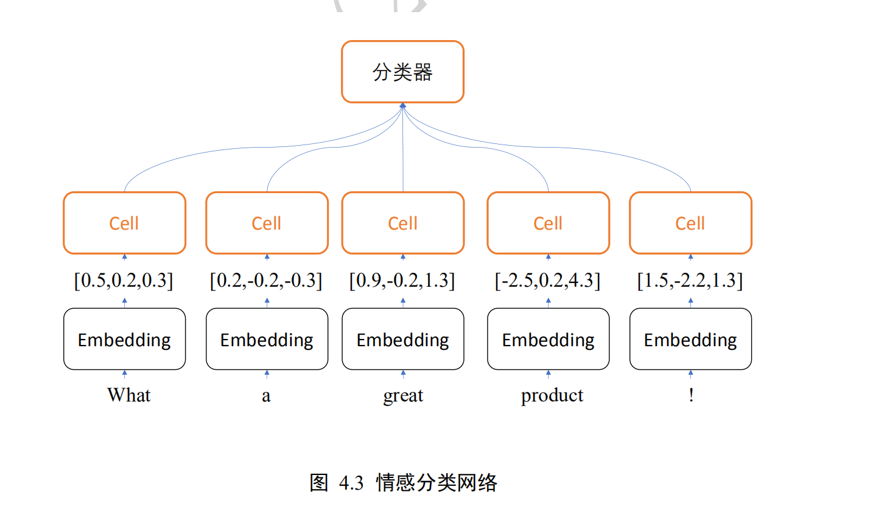

>对于特征长度为 1 的序列信号，比如商品价格在 60 天内的变化曲线，只需要一个标量即可表示商品的价格，因此 2 件商品的价格变化趋势可以使用 shape 为[2,60]的张量表示。为了方便统一格式，也将价格变化趋势表达为 shape 为 [2,60,1]的张量，其中的 1 表示特征长度为 1。

**4** **维张量**

> 我们这里只讨论 3/4 维张量，大于 4 维的张量一般应用的比较少，如在元学习(meta learning)中会采用 5 维的张量表示方法，理解方法与 3/4 维张量类似。 4 维张量在卷积神经网络中应用的非常广泛，它用于保存特征图(Feature maps)数据，格式一般定义为
>
> [𝑏, ℎ, , 𝑐]。其中𝑏表示输入的数量，h/w分布表示特征图的高宽，𝑐表示特征图的通道数，部分深度学习框架也会使用[𝑏, 𝑐, ℎ, w]格式的特征图张量，例如 PyTorch。图片数据是特征图的一种，对于含有 RGB 3 个通道的彩色图片，每张图片包含了 h 行 w 列像素点，每个点需要 3 个数值表示 RGB 通道的颜色强度，因此一张图片可以表示为[h,w, 3]。如图 4.4 所示，最上层的图片表示原图，它包含了下面 3 个通道的强度信息。

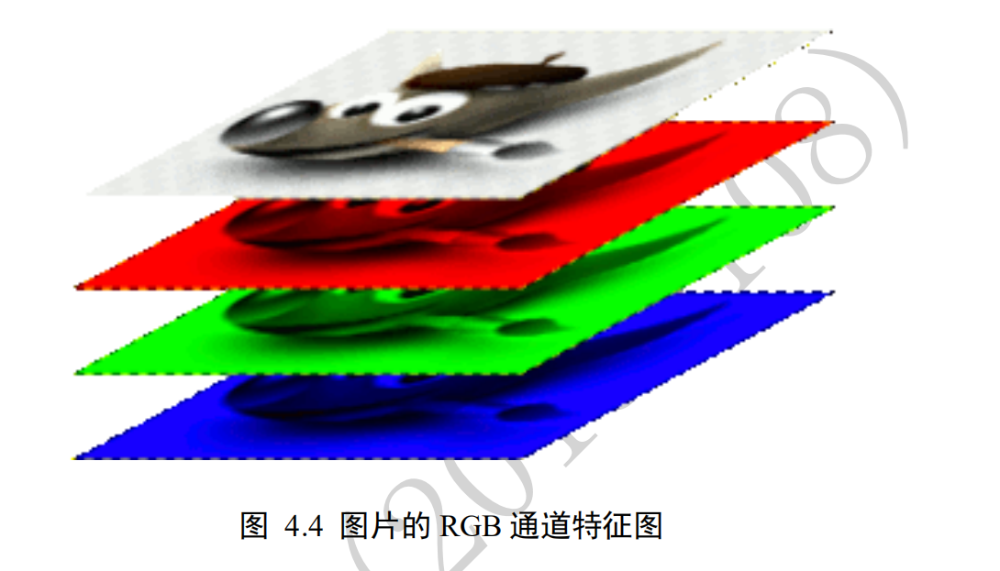

> 神经网络中一般并行计算多个输入以提高计算效率，故𝑏张图片的张量可表示为[𝑏, ℎ,w , 3]。

```python
In [48]:
# 创建 32x32 的彩色图片输入，个数为 4 
x = tf.random.normal([4,32,32,3])
# 创建卷积神经网络
layer = layers.Conv2D(16,kernel_size=3)
out = layer(x) # 前向计算
out.shape # 输出大小
Out[48]: TensorShape([4, 30, 30, 16])
其中卷积核张量也是 4 维张量，可以通过 kernel 成员变量访问：
In [49]: layer.kernel.shape
Out[49]: TensorShape([3, 3, 3, 16])
```

> 其中卷积核张量也是 4 维张量，可以通过 kernel 成员变量访问：

```python
In [49]: layer.kernel.shape
Out[49]: TensorShape([3, 3, 3, 16])
```

## 索引与切片

> 通过索引与切片操作可以提取张量的部分数据，使用频率非常高

**索引**

> 在 TensorFlow 中，支持基本的𝑖][𝑗]…标准索引方式，也支持通过逗号分隔索引号的索引方式。考虑输入 X 为 4 张 32x32 大小的彩色图片(为了方便演示，大部分张量都使用随 即分布模拟产生，后文同)，shape 为[4,32,32,3]，首先创建张量：

```python
x = tf.random.normal([4,32,32,3])
```

> 接下来我们使用索引方式读取张量的部分数据。

```python
##❑ 取第 1 张图片的数据：
In [51]: x[0]
Out[51]:<tf.Tensor: id=379, shape=(32, 32, 3), dtype=float32, numpy=
array([[[ 1.3005302 , 1.5301839 , -0.32005513],
 [-1.3020388 , 1.7837263 , -1.0747638 ], ...
 [-1.1092019 , -1.045254 , -0.4980363 ],
 [-0.9099222 , 0.3947732 , -0.10433522]]], dtype=float32)>

##❑ 取第 1 张图片的第 2 行：
In [52]: x[0][1]
Out[52]:
<tf.Tensor: id=388, shape=(32, 3), dtype=float32, numpy=
array([[ 4.2904025e-01, 1.0574218e+00, 3.1540772e-01],
 [ 1.5800388e+00, -8.1637271e-02, 6.3147342e-01], ...,
 [ 2.8893018e-01, 5.8003378e-01, -1.1444757e+00],
 [ 9.6100050e-01, -1.0985689e+00, 1.0827581e+00]], dtype=float32)>
W
##❑ 取第 1 张图片，第 2 行，第 3 列的像素：
In [53]: x[0][1][2]
Out[53]:
<tf.Tensor: id=401, shape=(3,), dtype=float32, numpy=array([-0.55954427, 
0.14497331, 0.46424514], dtype=float32)>
    
##❑ 取第 3 张图片，第 2 行，第 1 列的像素，B 通道(第 2 个通道)颜色强度值：
In [54]: x[2][1][0][1]
Out[54]:
<tf.Tensor: id=418, shape=(), dtype=float32, numpy=-0.84922135>
```

> 当张量的维度数较高时，使用[𝑖][𝑗]. . .[𝑘]的方式书写不方便，可以采用[𝑖,𝑗, … , 𝑘]的方式索引，它们是等价的。

```python
##❑ 取第 2 张图片，第 10 行，第 3 列：
In [55]: x[1,9,2]
Out[55]:
    <tf.Tensor: id=436, shape=(3,), dtype=float32, numpy=array([ 1.7487534 , -
0.41491988, -0.2944692 ], dtype=float32)>
```

**切片**

> 通过𝑠𝑡𝑎𝑟𝑡: 𝑒𝑛𝑑: 𝑠𝑡𝑒𝑝切片方式可以方便地提取一段数据，其中 start 为开始读取位置的索引，end 为结束读取位置的索引(不包含 end 位)，step 为读取步长。以 shape 为[4,32,32,3]的图片张量为例：

```python
##❑ 读取第 2,3 张图片：
In [56]: x[1:3]
Out[56]:
<tf.Tensor: id=441, shape=(2, 32, 32, 3), dtype=float32, numpy=
array([[[[ 0.6920027 , 0.18658352, 0.0568333 ],
 [ 0.31422952, 0.75933754, 0.26853144],
 [ 2.7898 , -0.4284912 , -0.26247284],...
```

> start: end: step切片方式有很多简写方式，其中 start、end、step 3 个参数可以根据需要选择性地省略，全部省略时即::，表示从最开始读取到最末尾，步长为 1，即不跳过任何元素。如 x[0,::]表示读取第 1 张图片的所有行，其中::表示在行维度上读取所有行，它等于x[0]的写法：

```python
In [57]: x[0,::]
Out[57]:
<tf.Tensor: id=446, shape=(32, 32, 3), dtype=float32, numpy=
array([[[ 1.3005302 , 1.5301839 , -0.32005513],
 [-1.3020388 , 1.7837263 , -1.0747638 ],
 [-1.1230233 , -0.35004002, 0.01514002],
 ...
```

> 为了更加简洁，::可以简写为单个冒号:，如

```python
In [58]: x[:,0:28:2,0:28:2,:]
Out[58]:
<tf.Tensor: id=451, shape=(4, 14, 14, 3), dtype=float32, numpy=
array([[[[ 1.3005302 , 1.5301839 , -0.32005513],
 [-1.1230233 , -0.35004002, 0.01514002],
 [ 1.3474811 , 0.639334 , -1.0826371 ],
 ...
```

> 表示取所有图片，隔行采样，隔列采样，所有通道信息，相当于在图片的高宽各缩放至原来的 50%。

> 特别地，step 可以为负数，考虑最特殊的一种例子，step = −1时，start: end: −1表示从 start 开始，逆序读取至 end 结束(不包含 end)，索引号𝑒𝑛𝑑 ≤ 𝑠𝑡𝑎𝑟𝑡。考虑一 0~9 简单序列，逆序取到第 1 号元素，不包含第1号

```python
In [59]: x = tf.range(9)
x[8:0:-1]
Out[59]:
<tf.Tensor: id=466, shape=(8,), dtype=int32, numpy=array([8, 7, 6, 5, 4, 3, 
2, 1])>
```

##  维度变换

> 考虑线性层的批量形式：Y = X@W + 𝒃其中 X 包含了 2 个样本，每个样本的特征长度为 4，X 的 shape 为[2,4]。线性层的输出为 3个节点，即 W 的 shape 定义为[4,3]，偏置𝒃的 shape 定义为[3]。那么X@W的运算张量shape 为[2,3]，需要叠加上 shape 为[3]的偏置𝒃。不同 shape 的 2 个张量怎么直接相加呢？

> 回到我们设计偏置的初衷，我们给每个层的每个输出节点添加一个偏置，这个偏置数据是对所有的样本都是共享的，换言之，每个样本都应该累加上同样的偏置向量𝒃，如图 4.5 所示：

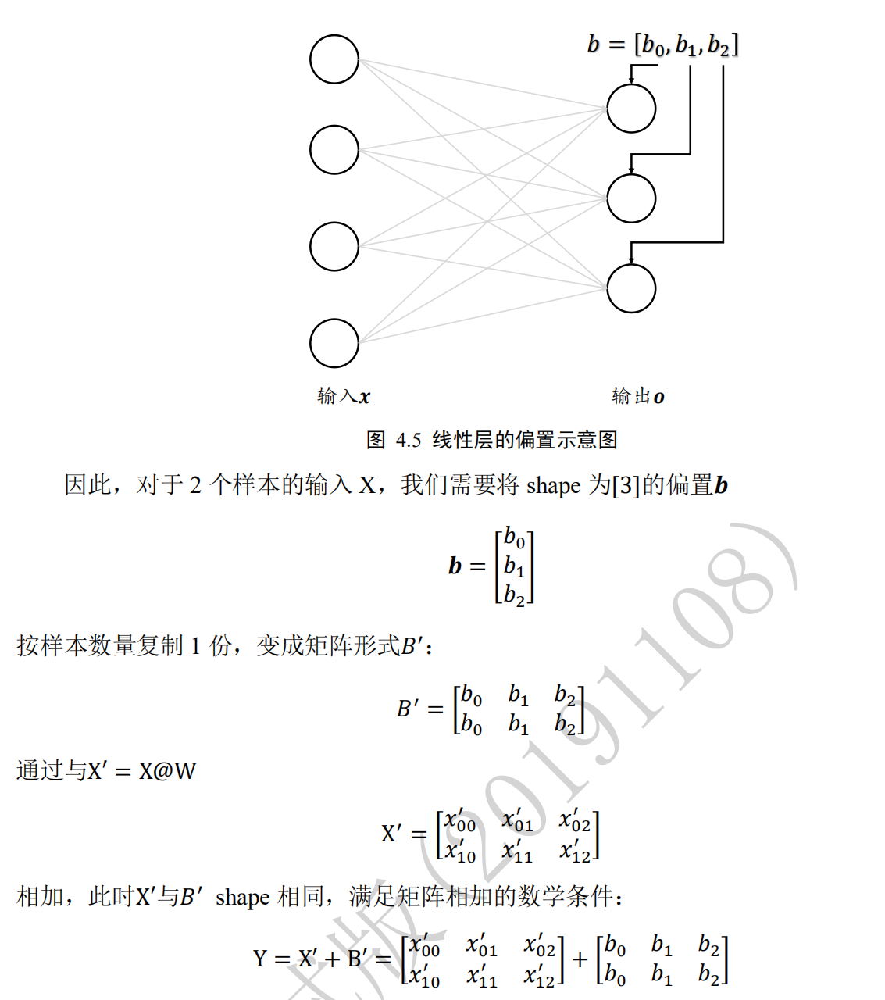

>通过这种方式，既满足了数学上矩阵相加需要 shape 一致的条件，又达到了给每个输入样本的输出节共享偏置的逻辑。为了实现这种运算方式，我们将𝒃插入一个新的维度，并把它定义为 batch 维度，然后在 batch 维度将数据复制 1 份，得到变换后的B′，新的 shape 为 [2,3]。

> 算法的每个模块对于数据张量的格式有不同的逻辑要求，当现有的数据格式不满足算法要求时，需要通过维度变换将数据调整为正确的格式。这就是维度变换的功能。基本的维度变换包含了改变视图 reshape，插入新维度 expand_dims，删除维度squeeze，交换维度 transpose，复制数据 tile 等。

**Reshape**

> 在介绍改变视图操作之前，我们先来认识一下张量的存储和视图(View)的概念。张量的视图就是我们理解张量的方式，比如 shape 为[2,4,4,3]的张量 A，我们从逻辑上可以理解为 2 张图片，每张图片 4 行 4 列，每个位置有 RGB 3 个通道的数据；张量的存储体现在张量在内存上保存为一段连续的内存区域，对于同样的存储，我们可以有不同的理解方式，比如上述 A，我们可以在不改变张量的存储下，将张量 A 理解为 2 个样本，每个样本的特征为长度 48 的向量。这就是存储与视图的关系。

>我们通过 tf.range()模拟生成 x 的数据：

```python
In [67]: x=tf.range(96)
x=tf.reshape(x,[2,4,4,3])
Out[67]:
<tf.Tensor: id=11, shape=(2, 4, 4, 3), dtype=int32, numpy=
array([[[[ 0, 1, 2],
 [ 3, 4, 5],
 [ 6, 7, 8],
 [ 9, 10, 11]],…
```

>在存储数据时，内存并不支持这个维度层级概念，只能以平铺方式按序写入内存，因此这种层级关系需要人为管理，也就是说，每个张量的存储顺序需要人为跟踪。为了方便表达，我们把张量 shape 中相对靠左侧的维度叫做大维度，shape 中相对靠右侧的维度叫做小维度，比如[2,4,4,3]的张量中，图片数量维度与通道数量相比，图片数量叫做大维度，通道数叫做小维度。在优先写入小维度的设定下，上述布局为：


> 数据在创建时按着初始的维度顺序写入，改变张量的视图仅仅是改变了张量的理解方式，并不会改变张量的存储顺序，这在一定程度上是从计算效率考虑的，大量数据的写入操作会消耗较多的计算资源。改变视图操作在提供便捷性的同时，也会带来很多逻辑隐患，这主要的原因是张量的视图与存储不同步造成的。我们先介绍合法的视图变换操作，再介绍不合法的视图变换。

> 比如张量按着初始视图[𝑏, ℎ, , 𝑐]写入的内存布局，我们改变初始视图[𝑏, ℎ, , 𝑐]的理解方式，它可以有多种合法理解方式： 
>
> ❑ [𝑏, ℎ ∗w , 𝑐] 张量理解为 b 张图片，h*w 个像素点，c 个通道
>
> ❑ [𝑏, ℎ, w∗ 𝑐] 张量理解为 b 张图片，h 行，每行的特征长度为 w*c
>
> ❑ [𝑏, ℎ ∗w ∗ 𝑐] 张量理解为 b 张图片，每张图片的特征长度为 h*w*c
>
> 从语法上来说，视图变换只需要满足新视图的元素总量与内存区域大小相等即可，即新视图的元素数量等于𝑏 ∗ ℎ ∗ w∗ 𝑐
>
> 正是由于视图的设计约束很少，完全由用户定义，使得在改变视图时容易出现逻辑隐患。

> 现在我们来考虑不合法的视图变换。例如，如果定义新视图为[𝑏,w , ℎ, 𝑐]，[𝑏, 𝑐, ℎ ∗w]或者[𝑏, 𝑐, ℎ, w]等时，与张量的存储顺序相悖，如果不同步更新张量的存储顺序，那么恢复出的数据将与新视图不一致，从而导致数据错乱。

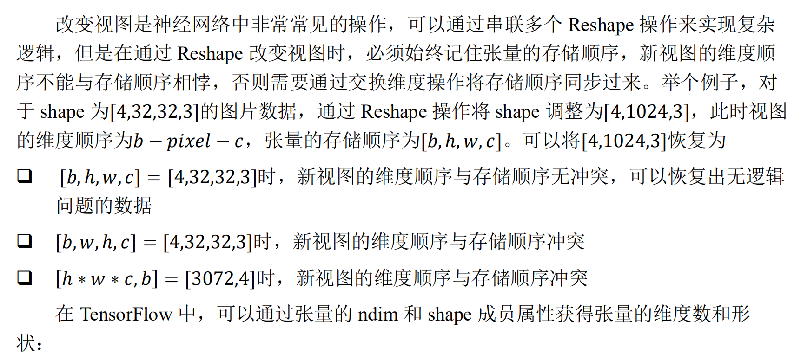

```python
In [68]: x.ndim,x.shape
Out[68]:(4, TensorShape([2, 4, 4, 3]))
```

> 通过 tf.reshape(x, new_shape)，可以将张量的视图任意的合法改变：

```python
In [69]: tf.reshape(x,[2,-1])
Out[69]:<tf.Tensor: id=520, shape=(2, 48), dtype=int32, numpy=
array([[ 0, 1, 2, 3, 4, 5, 6, 7, 8, 9, 10, 11, 12, 13, 14, 15,
 16, 17, 18, 19, 20, 21, 22, 23, 24, 25, 26, 27, 28, 29, 30, 31,…
 80, 81, 82, 83, 84, 85, 86, 87, 88, 89, 90, 91, 92, 93, 94, 95]])>
```

> 再次改变数据的视图为[2,16,3]：

```python
In [71]: tf.reshape(x,[2,-1,3])
Out[71]:<tf.Tensor: id=526, shape=(2, 16, 3), dtype=int32, numpy=
array([[[ 0, 1, 2], …
 [45, 46, 47]],
 [[48, 49, 50],…
  [93, 94, 95]]])>
```

> 通过上述的一系列连续变换视图操作时需要意识到，张量的存储顺序始终没有改变，数据在内存中仍然是按着初始写入的顺序0,1,2, … ,95保存的。


**增删维度**

> 增加一个长度为 1 的维度相当于给原有的数据增加一个新维度的概念，维度长度为 1，故数据并不需要改变，仅仅是改变数据的理解方式，因此它其实可以理解为改变视图的一种特殊方式。

```python
In [72]: 
x = tf.random.uniform([28,28],maxval=10,dtype=tf.int32)
Out[72]:
<tf.Tensor: id=552, shape=(28, 28), dtype=int32, numpy=
array([[4, 5, 7, 6, 3, 0, 3, 1, 1, 9, 7, 7, 3, 1, 2, 4, 1, 1, 9, 8, 6, 6,
 4, 9, 9, 4, 6, 0],…
```

> 通过 tf.expand_dims(x, axis)可在指定的 axis 轴前可以插入一个新的维度：

```python
In [73]: x = tf.expand_dims(x,axis=2)
Out[73]:
<tf.Tensor: id=555, shape=(28, 28, 1), dtype=int32, numpy=
array([[[4],
 [5],
 [7],
 [6],
 [3],…
```

> 同样的方法，我们可以在最前面插入一个新的维度，并命名为图片数量维度，长度为1 shape 变为[1,28,28,1]

```python
In [74]: x = tf.expand_dims(x,axis=0)
Out[74]:
<tf.Tensor: id=558, shape=(1, 28, 28), dtype=int32, numpy=
array([[[4, 5, 7, 6, 3, 0, 3, 1, 1, 9, 7, 7, 3, 1, 2, 4, 1, 1, 9, 8, 6,
 6, 4, 9, 9, 4, 6, 0],
 [5, 8, 6, 3, 6, 4, 3, 0, 5, 9, 0, 5, 4, 6, 4, 9, 4, 4, 3, 0, 6,
 9, 3, 7, 4, 2, 8, 9],…
```

> 需要注意的是，tf.expand_dims 的 axis 为正时，表示在当前维度之前插入一个新维度；为负时，表示当前维度之后插入一个新的维度。

**删除维度**

> 与增加维度一样，删除维度只能删除长度为 1 的维度，也不会改变张量的存储。继续考虑增加维度后 shape 为[1,28,28,1]的例子，如果希望将图片数量维度删除，可以通过 tf.squeeze(x, axis)函数，axis 参数为待删除的维度的索引号，图片数量的维度轴 axis=0：

```python
In [75]: x = tf.squeeze(x, axis=0)
Out[75]:
<tf.Tensor: id=586, shape=(28, 28, 1), dtype=int32, numpy=
array([[[8],
 [2],
 [2],
 [0],…
```

> 如果不指定维度参数 axis，即 tf.squeeze(x)，那么他会默认删除所有长度为 1 的维度：

```python
In [77]: 
x = tf.random.uniform([1,28,28,1],maxval=10,dtype=tf.int32)
tf.squeeze(x)
Out[77]:
<tf.Tensor: id=594, shape=(28, 28), dtype=int32, numpy=
array([[9, 1, 4, 6, 4, 9, 0, 0, 1, 4, 0, 8, 5, 2, 5, 0, 0, 8, 9, 4, 5, 0,
 1, 1, 4, 3, 9, 9],…
```

**交换维度**

> 改变视图、增删维度都不会影响张量的存储。在实现算法逻辑时，在保持维度顺序不变的条件下，仅仅改变张量的理解方式是不够的，有时需要直接调整的存储顺序，即交换维度(Transpose)。通过交换维度，改变了张量的存储顺序，同时也改变了张量的视图。

```python
In [78]: x = tf.random.normal([2,32,32,3])
tf.transpose(x,perm=[0,3,1,2])
Out[78]:
<tf.Tensor: id=603, shape=(2, 3, 32, 32), dtype=float32, numpy=
array([[[[-1.93072677e+00, -4.80163872e-01, -8.85614634e-01, ...,
 1.49124235e-01, 1.16427064e+00, -1.47740364e+00],
 [-1.94761145e+00, 7.26879001e-01, -4.41877693e-01, ...
```

> 如果希望将[𝑏, ℎ, w, 𝑐]交换为[𝑏,w , ℎ, 𝑐]，即将行列维度互换，则新维度索引为[0,2,1,3]:

```python
In [79]: 
x = tf.random.normal([2,32,32,3])
tf.transpose(x,perm=[0,2,1,3])
Out[79]:
<tf.Tensor: id=612, shape=(2, 32, 32, 3), dtype=float32, numpy=
array([[[[ 2.1266546 , -0.64206547, 0.01311932],
 [ 0.918484 , 0.9528751 , 1.1346699 ],
 ...,
```

> **数据复制**

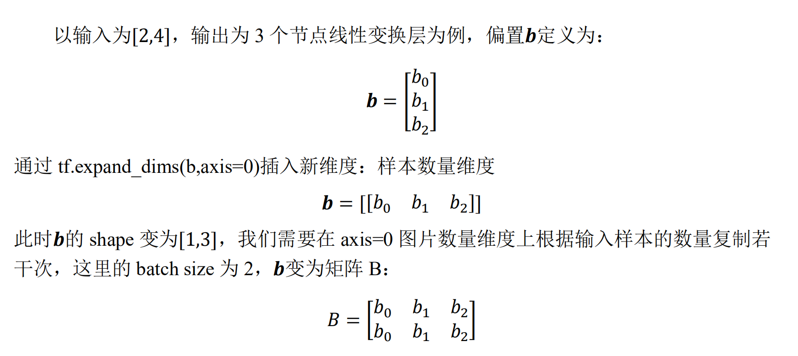

> 通过 tf.tile(b, multiples=[2,1])即可在 axis=0 维度复制 1 次，在 axis=1 维度不复制。首插入新的维度：

```python
In [80]: 
b = tf.constant([1,2])
b = tf.expand_dims(b, axis=0) 
b
Out[80]:
<tf.Tensor: id=645, shape=(1, 2), dtype=int32, numpy=array([[1, 2]])>
```

> 在 batch 维度上复制数据 1 份：

```python
In [81]: b = tf.tile(b, multiples=[2,1])
Out[81]:
<tf.Tensor: id=648, shape=(2, 2), dtype=int32, numpy=
array([[1, 2],
 [1, 2]])>
```

## Broadcastin

> 对于所有长度为 1 的维度，Broadcasting 的效果和 tf.tile 一样，都能在此维度上逻辑复制数据若干份，区别在于 tf.tile 会创建一个新的张量，执行复制 IO 操作，并保存复制后的张量数据，Broadcasting 并不会立即复制数据，它会逻辑上改变张量的形状，使得视图上变成了复制后的形状。
>
> Broadcasting 会通过深度学习框架的优化手段避免实际复制数据

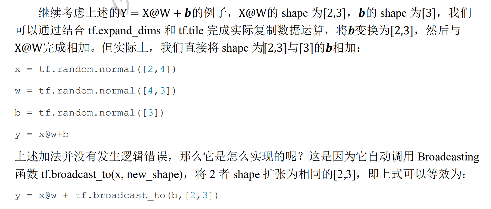


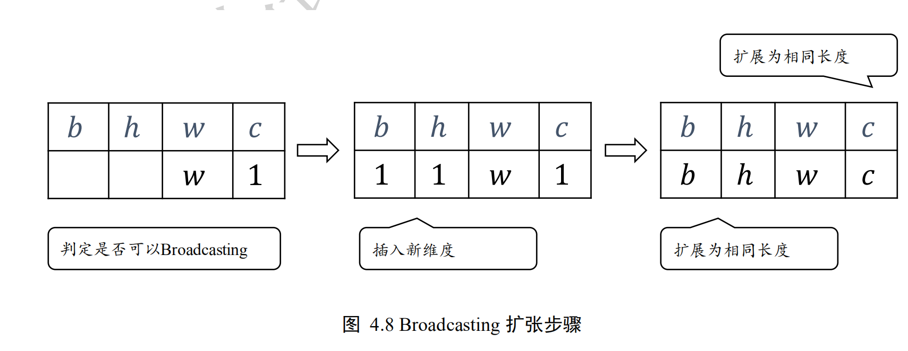

> 通过 tf.broadcast_to(x, new_shape)可以显式将现有 shape 扩张为 new_shape：

```python
In [87]:
A = tf.random.normal([32,1]) 
tf.broadcast_to(A, [2,32,32,3])
Out[87]
<tf.Tensor: id=13, shape=(2, 32, 32, 3), dtype=float32, numpy=
array([[[[-1.7571245 , -1.7571245 , -1.7571245 ],
 [ 1.580159 , 1.580159 , 1.580159 ],
 [-1.5324328 , -1.5324328 , -1.5324328 ],...
```

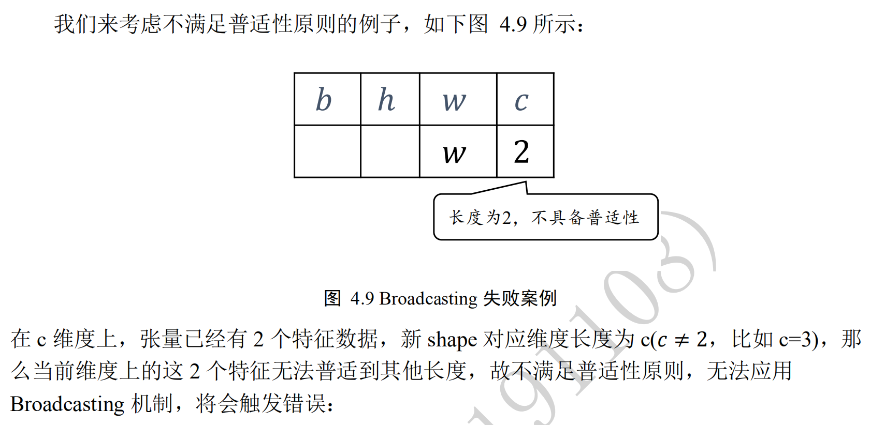

```python
In [88]:
A = tf.random.normal([32,2]) 
tf.broadcast_to(A, [2,32,32,4])
Out[88]:
InvalidArgumentError: Incompatible shapes: [32,2] vs. [2,32,32,4] 
[Op:BroadcastTo]
```

 

## 数学运算

> 加减乘除是最基本的数学运算，分别通过 tf.add, tf.subtract, tf.multiply, tf.divide 函数实现，TensorFlow 已经重载了+ −∗/运算符，一般推荐直接使用运算符来完成加减乘除运算。
>
> 整除和余除也是常见的运算之一，分别通过//和%运算符实现。我们来演示整除运算：

```python
In [89]:
a = tf.range(5)
b = tf.constant(2)
a//b
Out[89]:
<tf.Tensor: id=115, shape=(5,), dtype=int32, numpy=array([0, 0, 1, 1, 2])>
    
In [90]: a%b
Out[90]:
<tf.Tensor: id=117, shape=(5,), dtype=int32, numpy=array([0, 1, 0, 1, 0])>
```

**乘方**

> 通过 tf.pow(x, a)可以方便地完成𝑦 = 𝑥𝑎乘方运算，也可以通过运算符**实现𝑥 ∗∗ 𝑎运 算，实现如下：

```python
In [91]:
x = tf.range(4)
tf.pow(x,3)
Out[91]:
<tf.Tensor: id=124, shape=(4,), dtype=int32, numpy=array([ 0, 1, 8, 27])>
    
In [92]: x**2
Out[92]:
<tf.Tensor: id=127, shape=(4,), dtype=int32, numpy=array([0, 1, 4, 9])>
```

> 设置指数为1/𝑎形式即可实现根号运算：𝑎√𝑥:

```python
In [93]: x=tf.constant([1.,4.,9.])
x**(0.5)
Out[93]:
<tf.Tensor: id=139, shape=(3,), dtype=float32, numpy=array([1., 2., 3.], 
dtype=float32)>
```

> 特别地，对于常见的平方和平方根运算，可以使用 tf.square(x)和 tf.sqrt(x)实现。平方运算实现如下：

```python
In [94]:x = tf.range(5)
x = tf.cast(x, dtype=tf.float32)
x = tf.square(x)
Out[94]:
<tf.Tensor: id=159, shape=(5,), dtype=float32, numpy=array([ 0., 1., 4., 
9., 16.], dtype=float32)>

#平方根运算实现如下：
In [95]:tf.sqrt(x)
Out[95]:
<tf.Tensor: id=161, shape=(5,), dtype=float32, numpy=array([0., 1., 2., 3., 
4.], dtype=float32)>
```

 

**指数、对数**

>  通过 tf.pow(a, x)或者**运算符可以方便实现指数运算:

```python
In [96]: x = tf.constant([1.,2.,3.])
2**x
Out[96]:
<tf.Tensor: id=179, shape=(3,), dtype=float32, numpy=array([2., 4., 8.], 
dtype=float32)>

##特别地，对于自然指数𝑒𝑥,可以通过 tf.exp(x)实现：
In [97]: tf.exp(1.)
Out[97]:
<tf.Tensor: id=182, shape=(), dtype=float32, numpy=2.7182817>
```

> 在 TensorFlow 中，自然对数l g𝑒 𝑥可以通过 tf.math.log(x)实现:

```python
In [98]: x=tf.exp(3.)

tf.math.log(x)

Out[98]:

<tf.Tensor: id=186, shape=(), dtype=float32, numpy=3.0>
```

 

**矩阵相乘**

>根据矩阵相乘的定义，a 和 b 能够矩阵相乘的条件是，a 的倒数第一个维度长度(列)和 b 的倒数第二个维度长度(行)必须相等。比如张量 a shape:[4,3,28,32]可以与张量 b shape:[4,3,32,2]进行矩阵相乘：

```python
In [100]:
a = tf.random.normal([4,3,23,32])
b = tf.random.normal([4,3,32,2])
a@b
Out[100]:
<tf.Tensor: id=236, shape=(4, 3, 28, 2), dtype=float32, numpy=
array([[[[-1.66706240e+00, -8.32602978e+00],
 [ 9.83304405e+00, 8.15909767e+00],
 [ 6.31014729e+00, 9.26124632e-01],…
```

> 矩阵相乘函数支持自动 Broadcasting 机制：

```python
In [101]:
a = tf.random.normal([4,28,32])
b = tf.random.normal([32,16])
tf.matmul(a,b)
Out[101]:
<tf.Tensor: id=264, shape=(4, 28, 16), dtype=float32, numpy=
array([[[-1.11323869e+00, -9.48194981e+00, 6.48123884e+00, ...,
 6.53280640e+00, -3.10894990e+00, 1.53050375e+00],
 [ 4.35898495e+00, -1.03704405e+01, 8.90656471e+00,...
```

**前向传播实战**

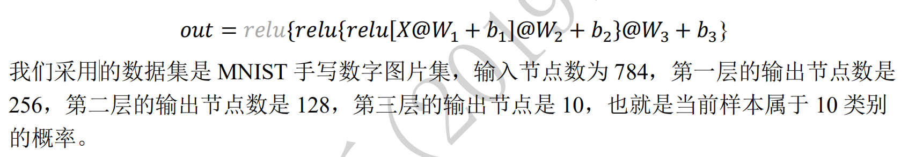

> 首先创建每个非线性函数的 w,b 参数张量：

```python
w1 = tf.Variable(tf.random.truncated_normal([784, 256], stddev=0.1))
b1 = tf.Variable(tf.zeros([256]))
w2 = tf.Variable(tf.random.truncated_normal([256, 128], stddev=0.1))
b2 = tf.Variable(tf.zeros([128]))
w3 = tf.Variable(tf.random.truncated_normal([128, 10], stddev=0.1))
b3 = tf.Variable(tf.zeros([10]))
```

> 在前向计算时，首先将 shape 为[𝑏, 28,28]的输入数据 Reshape 为[𝑏, 784]:

```python
x = tf.reshape(x, [-1, 28*28])
```

> 完成第一个非线性函数的计算，我们这里显示地进行 Broadcasting:

```python
h1 = x@w1 + tf.broadcast_to(b1, [x.shape[0], 256])
h1 = tf.nn.relu(h1)
```

> 同样的方法完成第二个和第三个非线性函数的前向计算，输出层可以不使用 ReLU 激活函数：

```python
# [b, 256] => [b, 128]
 h2 = h1@w2 + b2
 h2 = tf.nn.relu(h2)
 # [b, 128] => [b, 10]
 out = h2@w3 + b3
```

> 将真实的标注张量 y 转变为 one-hot 编码，并计算与 out 的均方差：

```python
 # mse = mean(sum(y-out)^2)
 # [b, 10]
 loss = tf.square(y_onehot - out)
 # mean: scalar
 loss = tf.reduce_mean(loss)
```

> 上述的前向计算过程都需要包裹在 with tf.GradientTape() as tape 上下文中，使得前向计算时能够保存计算图信息，方便反向求导运算。

> 通过 tape.gradient()函数求得网络参数到梯度信息

```python
# compute gradients
 grads = tape.gradient(loss, [w1, b1, w2, b2, w3, b3])
```

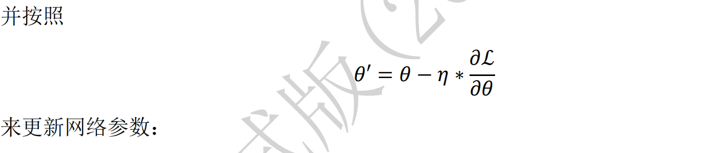

```python
# w1 = w1 - lr * w1_grad
 w1.assign_sub(lr * grads[0])
 b1.assign_sub(lr * grads[1])
 w2.assign_sub(lr * grads[2])
 b2.assign_sub(lr * grads[3])
 w3.assign_sub(lr * grads[4])
 b3.assign_sub(lr * grads[5])
```

> 其中 assign_sub()将原地(In-place)减去给定的参数值，实现参数的自我更新操作。网络训练误差值的变化曲线如图 4.11 所示。


## 前向传播实战

```python
import matplotlib.pyplot as plt
import tensorflow as tf
import tensorflow.keras.datasets as datasets

plt.rcParams['font.size'] = 16
plt.rcParams['font.family'] = ['STKaiti']
plt.rcParams['axes.unicode_minus'] = False


def load_data():
    # 加载 MNIST 数据集
    (x, y), (x_val, y_val) = datasets.mnist.load_data()
    # 转换为浮点张量， 并缩放到-1~1
    x = tf.convert_to_tensor(x, dtype=tf.float32) / 255.
    # 转换为整形张量
    y = tf.convert_to_tensor(y, dtype=tf.int32)
    # one-hot 编码
    y = tf.one_hot(y, depth=10)

    # 改变视图， [b, 28, 28] => [b, 28*28]
    x = tf.reshape(x, (-1, 28 * 28))

    # 构建数据集对象
    train_dataset = tf.data.Dataset.from_tensor_slices((x, y))
    # 批量训练
    train_dataset = train_dataset.batch(200)
    return train_dataset


def init_paramaters():
    # 每层的张量都需要被优化，故使用 Variable 类型，并使用截断的正太分布初始化权值张量
    # 偏置向量初始化为 0 即可
    # 第一层的参数
    w1 = tf.Variable(tf.random.truncated_normal([784, 256], stddev=0.1))
    b1 = tf.Variable(tf.zeros([256]))
    # 第二层的参数
    w2 = tf.Variable(tf.random.truncated_normal([256, 128], stddev=0.1))
    b2 = tf.Variable(tf.zeros([128]))
    # 第三层的参数
    w3 = tf.Variable(tf.random.truncated_normal([128, 10], stddev=0.1))
    b3 = tf.Variable(tf.zeros([10]))
    return w1, b1, w2, b2, w3, b3


def train_epoch(epoch, train_dataset, w1, b1, w2, b2, w3, b3, lr=0.001):
    for step, (x, y) in enumerate(train_dataset):
        with tf.GradientTape() as tape:
            # 第一层计算， [b, 784]@[784, 256] + [256] => [b, 256] + [256] => [b,256] + [b, 256]
            h1 = x @ w1 + tf.broadcast_to(b1, (x.shape[0], 256))
            h1 = tf.nn.relu(h1)  # 通过激活函数

            # 第二层计算， [b, 256] => [b, 128]
            h2 = h1 @ w2 + b2
            h2 = tf.nn.relu(h2)
            # 输出层计算， [b, 128] => [b, 10]
            out = h2 @ w3 + b3

            # 计算网络输出与标签之间的均方差， mse = mean(sum(y-out)^2)
            # [b, 10]
            loss = tf.square(y - out)
            # 误差标量， mean: scalar
            loss = tf.reduce_mean(loss)

            # 自动梯度，需要求梯度的张量有[w1, b1, w2, b2, w3, b3]
            grads = tape.gradient(loss, [w1, b1, w2, b2, w3, b3])

        # 梯度更新， assign_sub 将当前值减去参数值，原地更新
        w1.assign_sub(lr * grads[0])
        b1.assign_sub(lr * grads[1])
        w2.assign_sub(lr * grads[2])
        b2.assign_sub(lr * grads[3])
        w3.assign_sub(lr * grads[4])
        b3.assign_sub(lr * grads[5])

        if step % 100 == 0:
            print(epoch, step, 'loss:', loss.numpy())

    return loss.numpy()


def train(epochs):
    losses = []
    train_dataset = load_data()
    w1, b1, w2, b2, w3, b3 = init_paramaters()
    for epoch in range(epochs):
        loss = train_epoch(epoch, train_dataset, w1, b1, w2, b2, w3, b3, lr=0.001)
        losses.append(loss)

    x = [i for i in range(0, epochs)]
    # 绘制曲线
    print("绘制图线")

    plt.plot(x, losses, color='blue', marker='s', label='训练')
    plt.xlabel('Epoch')
    plt.ylabel('MSE')
    # plt.legend()
    # plt.savefig('MNIST数据集的前向传播训练误差曲线.png')
    plt.show()
    plt.close()


if __name__ == '__main__':
    print("开始训练")
    train(epochs=20)

```

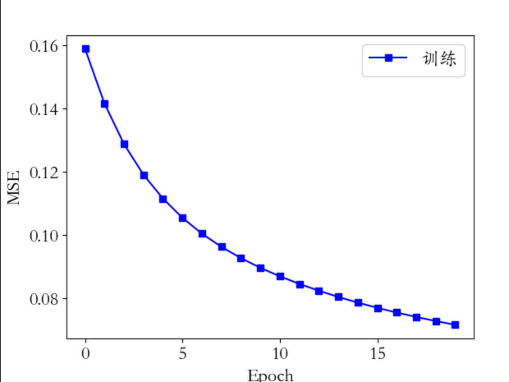


# TensorFlow进阶

## 合并与分割

**拼接**

> 在 TensorFlow 中，可以通过 tf.concat(tensors, axis)，其中 tensors 保存了所有需要合并的张量 List，axis 指定需要合并的维度。回到上面的例子，这里班级维度索引号为 0， 即 axis=0，合并张量 A,B 如下：

```python
In [1]:
a = tf.random.normal([4,35,8]) # 模拟成绩册 A b = tf.random.normal([6,35,8]) # 模拟成绩册 B
tf.concat([a,b],axis=0) # 合并成绩册
Out[1]:
<tf.Tensor: id=13, shape=(10, 35, 8), dtype=float32, numpy=
array([[[ 1.95299834e-01, 6.87859178e-01, -5.80048323e-01, ...,
 1.29430830e+00, 2.56610274e-01, -1.27798581e+00],
 [ 4.29753691e-01, 9.11329567e-01, -4.47975427e-01,
```

**合并**

> 合并操作可以在任意的维度上进行，唯一的约束是非合并维度的长度必须一致。比如 shape为[4,32,8]和 shape 为[6,35,8]的张量则不能直接在班级维度上进行合并，因为学生数维度的长度并不一致，一个为 32，另一个为 35：

```python
In [3]:
a = tf.random.normal([4,32,8])
b = tf.random.normal([6,35,8])
tf.concat([a,b],axis=0) # 非法拼接
Out[3]:
InvalidArgumentError: ConcatOp : Dimensions of inputs should match: shape[0] 
= [4,32,8] vs. shape[1] = [6,35,8] [Op:ConcatV2] ...
```

> 使用 tf.stack(tensors, axis)可以合并多个张量 tensors

```python
In [4]:
a = tf.random.normal([35,8])
b = tf.random.normal([35,8])
tf.stack([a,b],axis=0) # 堆叠合并为 2 个班级
Out[4]:
<tf.Tensor: id=55, shape=(2, 35, 8), dtype=float32, numpy=
```

> 同样可以选择在其他位置插入新维度，如在最末尾插入：

```python
In [5]:
a = tf.random.normal([35,8])
b = tf.random.normal([35,8])
tf.stack([a,b],axis=-1) # 在末尾插入班级维度
Out[5]:
<tf.Tensor: id=69, shape=(35, 8, 2), dtype=float32, numpy=
array([[[ 0.3456724 , -1.7037214 ],
 [ 0.41140947, -1.1554345 ],
 [ 1.8998919 , 0.56994915],…
```

**分割**

> 通过 tf.split(x, axis, num_or_size_splits)可以完成张量的分割操作，其中
>
> ❑ x：待分割张量
>
> ❑ axis：分割的维度索引号 
>
> ❑ num_or_size_splits：切割方案。当 num_or_size_splits 为单个数值时，如 10，表示切割为 10 份；当 num_or_size_splits 为 List 时，每个元素表示每份的长度，如[2,4,2,2]表示切割为 4 份，每份的长度分别为 2,4,2,2

> 现在我们将总成绩册张量切割为 10 份：

```python
In [8]:
x = tf.random.normal([10,35,8])
# 等长切割
result = tf.split(x,axis=0,num_or_size_splits=10)
len(result)
Out[8]: 10
#可以查看切割后的某个张量的形状，它应是某个班级的所有成绩册数据，shape 为[35,8]之 类：
In [9]: result[0]
Out[9]: <tf.Tensor: id=136, shape=(1, 35, 8), dtype=float32, numpy=
array([[[-1.7786729 , 0.2970506 , 0.02983334, 1.3970423 ,
 1.315918 , -0.79110134, -0.8501629 , -1.5549672 ],
 [ 0.5398711 , 0.21478991, -0.08685189, 0.7730989 ,…
```

> 可以看到，切割后的班级 shape 为[1,35,8]，保留了班级维度，这一点需要注意。

> 我们进行不等长的切割：将数据切割为 4 份，每份长度分别为[4,2,2,2]:

```python
In [10]: x = tf.random.normal([10,35,8])
# 自定义长度的切割
result = tf.split(x,axis=0,num_or_size_splits=[4,2,2,2])
len(result)
Out[10]: 4
    
In [10]: result[0]
Out[10]: <tf.Tensor: id=155, shape=(4, 35, 8), dtype=float32, numpy=
array([[[-6.95693314e-01, 3.01393479e-01, 1.33964568e-01, ...,
```


##  数据统计


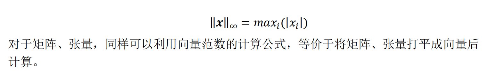

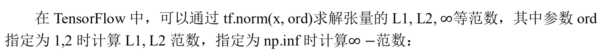

```python
In [13]: x = tf.ones([2,2])
tf.norm(x,ord=1) # 计算 L1 范数
Out[13]: <tf.Tensor: id=183, shape=(), dtype=float32, numpy=4.0>
In [14]: tf.norm(x,ord=2) # 计算 L2 范数
Out[14]: <tf.Tensor: id=189, shape=(), dtype=float32, numpy=2.0>
In [15]: import numpy as np
tf.norm(x,ord=np.inf) # 计算∞范数
Out[15]: <tf.Tensor: id=194, shape=(), dtype=float32,numpy=1.0>
```

 

**最大最小值、均值、和**

> 通过 **tf.reduce_max, tf.reduce_min, tf.reduce_mean, tf.reduce_sum** 可以求解张量在某个维度上的最大、最小、均值、和，也可以求全局最大、最小、均值、和信息。

> 考虑 shape 为[4,10]的张量，其中第一个维度代表样本数量，第二个维度代表了当前样本分别属于 10 个类别的概率，需要求出每个样本的概率最大值为：

```python
In [16]: x = tf.random.normal([4,10])
tf.reduce_max(x,axis=1) # 统计概率维度上的最大值
Out[16]:<tf.Tensor: id=203, shape=(4,), dtype=float32, 
numpy=array([1.2410722 , 0.88495886, 1.4170984 , 0.9550192 ],
```

> 求出每个样本的概率的均值：

```python
In [18]: tf.reduce_mean(x,axis=1) # 统计概率维度上的均值
Out[18]:<tf.Tensor: id=209, shape=(4,), dtype=float32, 
numpy=array([ 0.39526337, -0.17684573, -0.148988 , -0.43544054], 
dtype=float32)>
```

> 当不指定 axis 参数时，tf.reduce_*函数会求解出全局元素的最大、最小、均值、和


> 在求解误差函数时，通过 TensorFlow 的 MSE 误差函数可以求得每个样本的误差，需要计算样本的平均误差，此时可以通过 tf.reduce_mean 在样本数维度上计算均值：

```python
In [20]:
out = tf.random.normal([4,10]) # 网络预测输出
y = tf.constant([1,2,2,0]) # 真实标签
y = tf.one_hot(y,depth=10) # one-hot 编码
loss = keras.losses.mse(y,out) # 计算每个样本的误差
loss = tf.reduce_mean(loss) # 平均误差
loss
```

> 除了希望获取张量的最值信息，还希望获得最值所在的索引号，例如分类任务的标签预测。考虑 10 分类问题，我们得到神经网络的输出张量 out，shape 为[2,10]，代表了 2 个样本属于 10 个类别的概率，由于元素的位置索引代表了当前样本属于此类别的概率，预测\时往往会选择概率值最大的元素所在的索引号作为样本类别的预测值：

```python
In [22]:out = tf.random.normal([2,10])
out = tf.nn.softmax(out, axis=1) # 通过 softmax 转换为概率值
out
Out[22]:<tf.Tensor: id=257, shape=(2, 10), dtype=float32, numpy=
array([[0.18773547, 0.1510464 , 0.09431915, 0.13652141, 0.06579739,
 0.02033597, 0.06067333, 0.0666793 , 0.14594753, 0.07094406],
 [0.5092072 , 0.03887136, 0.0390687 , 0.01911005, 0.03850609,
 0.03442522, 0.08060656, 0.10171875, 0.08244187, 0.05604421]],
 dtype=float32)>
```

> 以第一个样本为例，可以看到，它概率最大的索引为𝑖 = 0，最大概率值为 0.1877。

> 通过 tf.argmax(x, axis)，tf.argmin(x, axis)可以求解在 axis 轴上，x 的最大值、最小值所在的索引号：

```python
In [23]:pred = tf.argmax(out, axis=1) # 选取概率最大的位置
pred
Out[23]:<tf.Tensor: id=262, shape=(2,), dtype=int64, numpy=array([0, 0], 
dtype=int64)>
```

> 可以看到，这 2 个样本概率最大值都出现在索引 0 上，因此最有可能都是类别 0，我们将类别 0 作为这 2 个样本的预测类别。

 

##  张量比较

> 为了计算分类任务的准确率等指标，一般需要将预测结果和真实标签比较，统计比较结果中正确的数量来就是计算准确率。考虑 100 个样本的预测结果：

```python
In [24]:out = tf.random.normal([100,10])
out = tf.nn.softmax(out, axis=1) # 输出转换为概率
pred = tf.argmax(out, axis=1) # 选取预测值
Out[24]:<tf.Tensor: id=272, shape=(100,), dtype=int64, numpy=
array([0, 6, 4, 3, 6, 8, 6, 3, 7, 9, 5, 7, 3, 7, 1, 5, 6, 1, 2, 9, 0, 6,
 5, 4, 9, 5, 6, 4, 6, 0, 8, 4, 7, 3, 4, 7, 4, 1, 2, 4, 9, 4,…
```

> 可以看到我们模拟的 100 个样本的预测值，我们与这 100 样本的真实值比较：

```python
In [25]: # 真实标签
y = tf.random.uniform([100],dtype=tf.int64,maxval=10)
Out[25]:<tf.Tensor: id=281, shape=(100,), dtype=int64, numpy=
array([0, 9, 8, 4, 9, 7, 2, 7, 6, 7, 3, 4, 2, 6, 5, 0, 9, 4, 5, 8, 4, 2,
 5, 5, 5, 3, 8, 5, 2, 0, 3, 6, 0, 7, 1, 1, 7, 0, 6, 1, 2, 1, 3,
```

> 即可获得每个样本是否预测正确。通过 tf.equal(a, b)(或 tf.math.equal(a, b))函数可以比较这 2个张量是否相等：

```python
In [26]:out = tf.equal(pred,y) # 预测值与真实值比较
Out[26]:<tf.Tensor: id=288, shape=(100,), dtype=bool, numpy=
array([False, False, False, False, True, False, False, False, False,
 False, False, False, False, False, True, False, False, True,
```

> tf.equal()函数返回布尔型的张量比较结果，只需要统计张量中 True 元素的个数，即可知道预测正确的个数。为了达到这个目的，我们先将布尔型转换为整形张量，再求和其中 1 的个数，可以得到比较结果中 True 元素的个数：

```python
In [27]:out = tf.cast(out, dtype=tf.float32) # 布尔型转 int 型
correct = tf.reduce_sum(out) # 统计 True 的个数
Out[27]:<tf.Tensor: id=293, shape=(), dtype=float32, numpy=12.0>
```

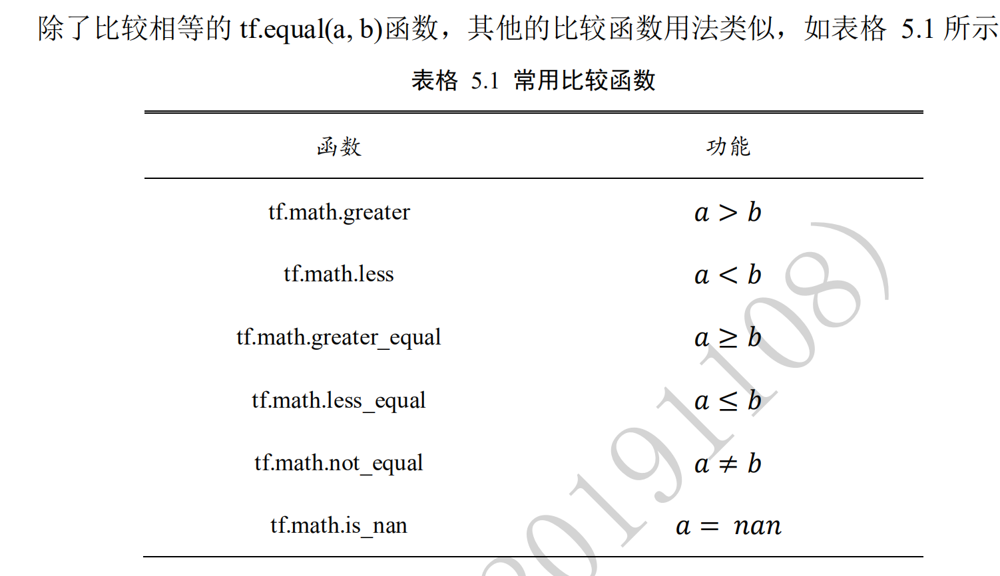

## 填充与复制

**填充**

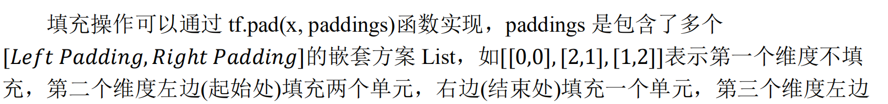

```python
In [28]:a = tf.constant([1,2,3,4,5,6])
b = tf.constant([7,8,1,6])
b = tf.pad(b, [[0,2]]) # 填充
b
Out[28]:<tf.Tensor: id=3, shape=(6,), dtype=int32, numpy=array([7, 8, 1, 6, 
0, 0])>
```

**复制**

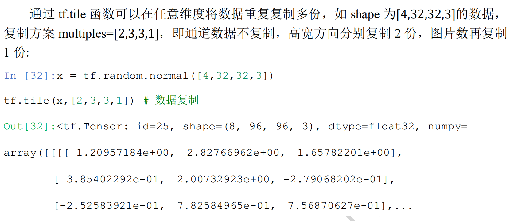

## 数据限幅

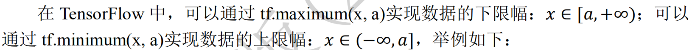

```python
In [33]:x = tf.range(9)
tf.maximum(x,2) # 下限幅 2
Out[33]:<tf.Tensor: id=48, shape=(9,), dtype=int32, numpy=array([2, 2, 2, 3, 
4, 5, 6, 7, 8])>
In [34]:tf.minimum(x,7) # 上限幅 7
Out[34]:<tf.Tensor: id=41, shape=(9,), dtype=int32, numpy=array([0, 1, 2, 3, 
4, 5, 6, 7, 7])>
```

> 那么 ReLU 函数可以实现为：

```python
def relu(x):
 return tf.minimum(x,0.) # 下限幅为 0 即可
```

> 更方便地，我们可以使用 tf.clip_by_value 实现上下限幅：

```python
In [36]:x = tf.range(9)
tf.clip_by_value(x,2,7) # 限幅为 2~7
Out[36]:<tf.Tensor: id=66, shape=(9,), dtype=int32, numpy=array([2, 2, 2, 3, 
4, 5, 6, 7, 7])>
```

## 高级操作

**tf.gather**


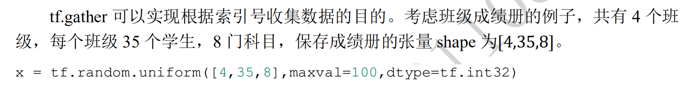

> 现在需要收集第 1-2 个班级的成绩册，可以给定需要收集班级的索引号：[0,1]，班级的维度 axis=0:

```python
In [38]:tf.gather(x,[0,1],axis=0) # 在班级维度收集第 1-2 号班级成绩册
Out[38]:<tf.Tensor: id=83, shape=(2, 35, 8), dtype=int32, numpy=
array([[[43, 10, 93, 85, 75, 87, 28, 19],
 [52, 17, 44, 88, 82, 54, 16, 65],
 [98, 26, 1, 47, 59, 3, 59, 70],…
```

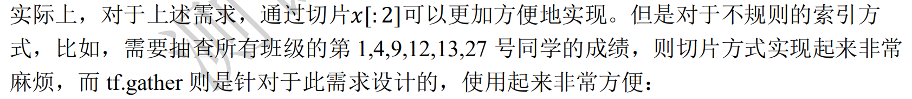

```python
In [39]: # 收集第 1,4,9,12,13,27 号同学成绩
tf.gather(x,[0,3,8,11,12,26],axis=1)
Out[39]:<tf.Tensor: id=87, shape=(4, 6, 8), dtype=int32, numpy=
array([[[43, 10, 93, 85, 75, 87, 28, 19],
 [74, 11, 25, 64, 84, 89, 79, 85],…
```

> 可以看到，tf.gather 非常适合索引没有规则的场合，其中索引号可以乱序排列，此时收集的数据也是对应顺序：

```python
In [41]:a=tf.range(8)
a=tf.reshape(a,[4,2]) # 生成张量 a
Out[41]:<tf.Tensor: id=115, shape=(4, 2), dtype=int32, numpy=
array([[0, 1],
 [2, 3],
 [4, 5],
 [6, 7]])>
In [42]:tf.gather(a,[3,1,0,2],axis=0) # 收集第 4,2,1,3 号元素
Out[42]:<tf.Tensor: id=119, shape=(4, 2), dtype=int32, numpy=
array([[6, 7],
 [2, 3],
 [0, 1],
 [4, 5]])>
```

**tf.gather_nd**

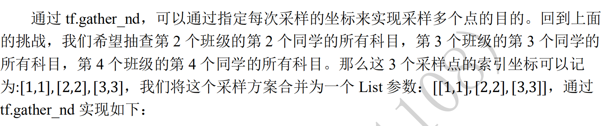

```python
In [47]: # 根据多维度坐标收集数据
tf.gather_nd(x,[[1,1],[2,2],[3,3]])
Out[47]:<tf.Tensor: id=256, shape=(3, 8), dtype=int32, numpy=
array([[45, 34, 99, 17, 3, 1, 43, 86],
 [11, 25, 84, 95, 97, 95, 69, 69],
 [ 0, 89, 52, 29, 76, 7, 2, 98]])>
```

**tf.boolean_mask**


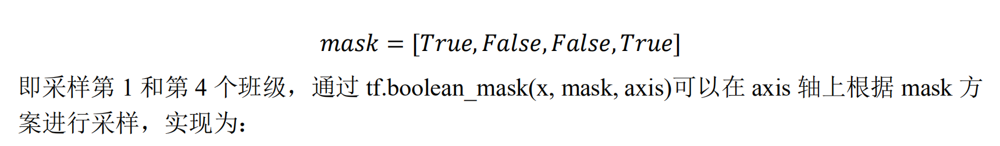

```python
In [49]: # 根据掩码方式采样班级
tf.boolean_mask(x,mask=[True, False,False,True],axis=0)
Out[49]:<tf.Tensor: id=288, shape=(2, 35, 8), dtype=int32, numpy=
array([[[43, 10, 93, 85, 75, 87, 28, 19],…
```

> 注意掩码的长度必须与对应维度的长度一致

**tf.where**

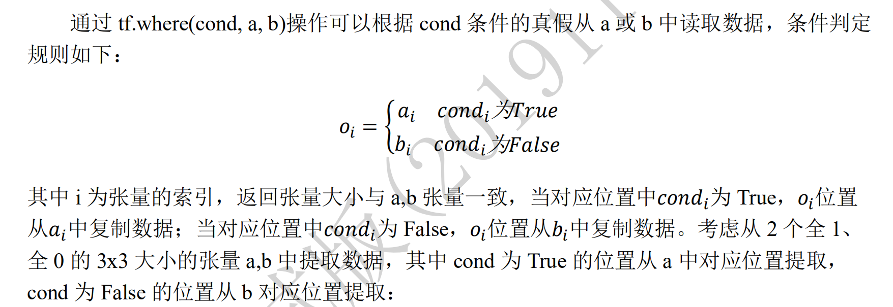


```python
In [53]:
a = tf.ones([3,3]) # 构造 a 为全 1
b = tf.zeros([3,3]) # 构造 b 为全 0
# 构造采样条件
cond = 
tf.constant([[True,False,False],[False,True,False],[True,True,False]])
tf.where(cond,a,b) # 根据条件从 a,b 中采样
Out[53]:<tf.Tensor: id=384, shape=(3, 3), dtype=float32, numpy=
array([[1., 0., 0.],
 [0., 1., 0.],
 [1., 1., 0.]], dtype=float32)>
```

> 考虑如下 cond 张量：

```python
In [54]: cond # 构造 cond
Out[54]:<tf.Tensor: id=383, shape=(3, 3), dtype=bool, numpy=
array([[ True, False, False],
 [False, True, False],
 [ True, True, False]])>
```

> 其中 True 共出现 4 次，每个 True 位置处的索引分布为[0,0],[1,1],[2,0],[2,1]，可以直接通过 tf.where(cond)来获得这些索引坐标：

```python
In [55]:tf.where(cond) # 获取 cond 中为 True 的元素索引
Out[55]:<tf.Tensor: id=387, shape=(4, 2), dtype=int64, numpy=
array([[0, 0],
 [1, 1],
 [2, 0],
 [2, 1]], dtype=int64)>
```


>那么这有什么用途呢？考虑一个例子，我们需要提取张量中所有正数的数据和索引。首先构造张量 a，并通过比较运算得到所有正数的位置掩码位置

```python
In [56]:x = tf.random.normal([3,3]) # 构造 a
Out[56]:<tf.Tensor: id=403, shape=(3, 3), dtype=float32, numpy=
array([[-2.2946844 , 0.6708417 , -0.5222212 ],
 [-0.6919401 , -1.9418817 , 0.3559235 ],
 [-0.8005251 , 1.0603906 , -0.68819374]], dtype=float32)>

#通过比较运算，得到正数的掩码：
In [57]:mask=x>0 # 比较操作，等同于 tf.equal()
mask
Out[57]:<tf.Tensor: id=405, shape=(3, 3), dtype=bool, numpy=
array([[False, True, False],
 [False, False, True],
 [False, True, False]])>

#通过 tf.where 提取此掩码处 True 元素的索引：
In [58]:indices=tf.where(mask) # 提取所有大于 0 的元素索引
Out[58]:<tf.Tensor: id=407, shape=(3, 2), dtype=int64, numpy=
array([[0, 1],
 [1, 2],
 [2, 1]], dtype=int64)>

#拿到索引后，通过 tf.gather_nd 即可恢复出所有正数的元素
In [59]:tf.gather_nd(x,indices) # 提取正数的元素值
Out[59]:<tf.Tensor: id=410, shape=(3,), dtype=float32, 
numpy=array([0.6708417, 0.3559235, 1.0603906], dtype=float32)>

#实际上，当我们得到掩码 mask 之后，也可以直接通过 tf.boolean_mask 获取对于元素
In [60]:tf.boolean_mask(x,mask) # 通过掩码提取正数的元素值
Out[60]:<tf.Tensor: id=439, shape=(3,), dtype=float32, 
numpy=array([0.6708417, 0.3559235, 1.0603906], dtype=float32)>
```


**scatter_nd**


# 神经网络

## 全连接层

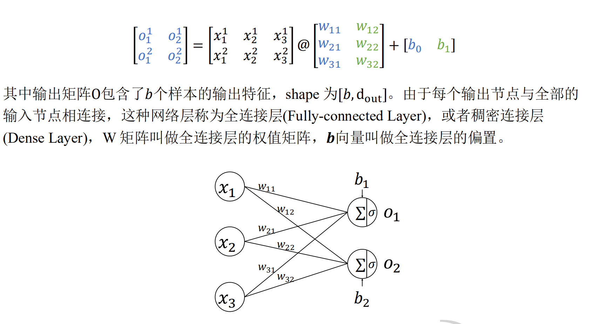

**张量方式实现**

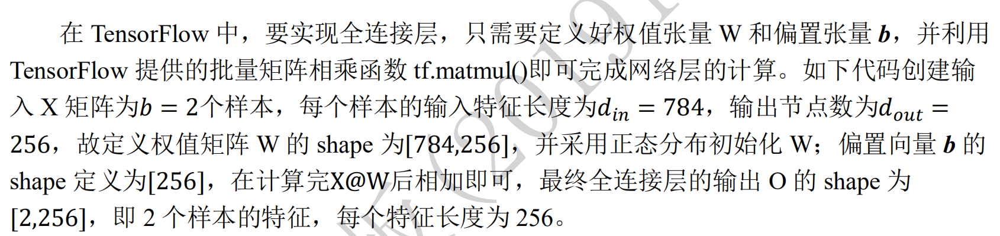

```python
In [1]: # 创建 W,b 张量
x = tf.random.normal([2,784])
w1 = tf.Variable(tf.random.truncated_normal([784, 256], stddev=0.1))
b1 = tf.Variable(tf.zeros([256]))
o1 = tf.matmul(x,w1) + b1 # 线性变换
o1 = tf.nn.relu(o1) # 激活函数
Out[1]:
<tf.Tensor: id=31, shape=(2, 256), dtype=float32, numpy=
array([[ 1.51279330e+00, 2.36286330e+00, 8.16453278e-01,
 1.80338228e+00, 4.58602428e+00, 2.54454136e+00,…
```

**层方式实现**

>全连接层本质上是矩阵的相乘相加运算，实现并不复杂。但是作为最常用的网络层之 一，TensorFlow 中有更加高层、使用更方便的层实现方式：layers.Dense(units, activation)，只需要指定**输出节点数 Units**  和激活函数类型即可。输入节点数将根据第一次运算时的输入 shape 确定，同时根据输入、输出节点数自动创建并初始化权值矩阵 W 和偏置向量 **b**，使用非常方便。其中 **activation 参数指定当前层的激活函数** ，可以为常见的激活函数或自定义激活函数，也可以指定为 None 无激活函数。

```python
In [2]:
x = tf.random.normal([4,28*28])
from tensorflow.keras import layers # 导入层模块
# 创建全连接层，指定输出节点数和激活函数
fc = layers.Dense(512, activation=tf.nn.relu) 
h1 = fc(x) # 通过 fc 类完成一次全连接层的计算
Out[2]:
<tf.Tensor: id=72, shape=(4, 512), dtype=float32, numpy=
array([[0.63339347, 0.21663809, 0. , ..., 1.7361937 , 0.39962345,
 2.4346168 ],…
```

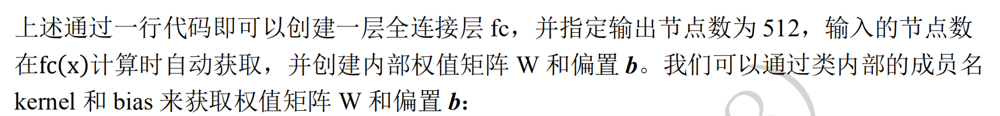

```python
In [3]: fc.kernel # 获取 Dense 类的权值矩阵
Out[3]:
<tf.Variable 'dense_1/kernel:0' shape=(784, 512) dtype=float32, numpy=
array([[-0.04067389, 0.05240148, 0.03931375, ..., -0.01595572,
 -0.01075954, -0.06222073],
In [4]: fc.bias # 获取 Dense 类的偏置向量
Out[4]:
<tf.Variable 'dense_1/bias:0' shape=(512,) dtype=float32, numpy=
array([0., 0., 0., 0., 0., 0., 0., 0., 0., 0., 0., 0., 0., 0., 0., 0., 0.,
```

> 在优化参数时，需要获得网络的所有待优化的参数张量列表，可以通过类的trainable_variables 来返回待优化参数列表：

```python
In [5]: fc.trainable_variables
Out[5]: # 返回待优化参数列表
[<tf.Variable 'dense_1/kernel:0' shape=(784, 512) dtype=float32,…,
<tf.Variable 'dense_1/bias:0' shape=(512,) dtype=float32, numpy=…]
```

## 神经网络

**张量方式实现**

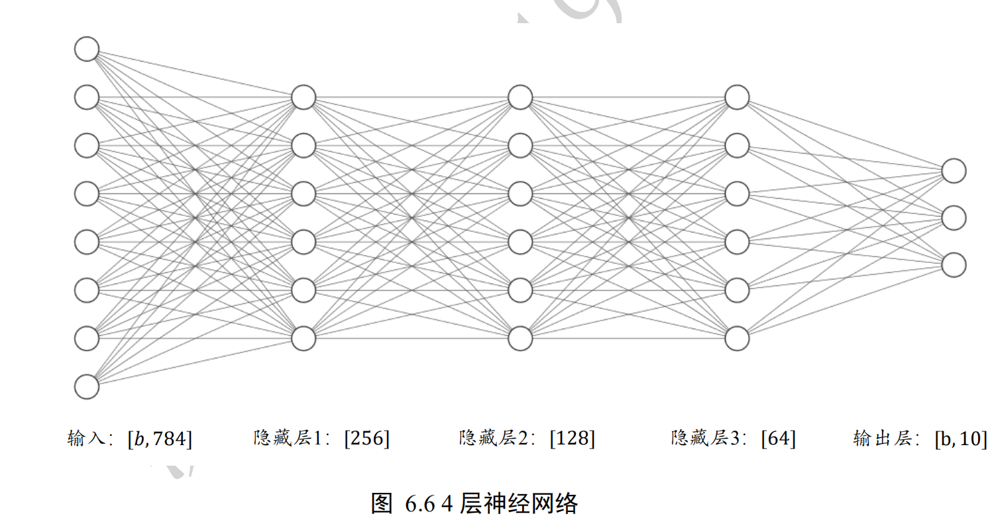

> 对于多层神经网络，以图 6.6 网络结构为例，分别定义各层的权值矩阵 W 和偏置向量**b** 如下：

```python
# 隐藏层 1 张量
w1 = tf.Variable(tf.random.truncated_normal([784, 256], stddev=0.1))
b1 = tf.Variable(tf.zeros([256]))
# 隐藏层 2 张量
w2 = tf.Variable(tf.random.truncated_normal([256, 128], stddev=0.1))
b2 = tf.Variable(tf.zeros([128]))
# 隐藏层 3 张量
w3 = tf.Variable(tf.random.truncated_normal([128, 64], stddev=0.1))
b3 = tf.Variable(tf.zeros([64]))
# 输出层张量
w4 = tf.Variable(tf.random.truncated_normal([64, 10], stddev=0.1))
b4 = tf.Variable(tf.zeros([10]))
```

> 在计算时，只需要按照网络层的顺序，将上一层的输出送入当前层的输入即可，重复直至最后一层，将输出层的输出作为网络的输出：

```python
with tf.GradientTape() as tape: # 梯度记录器
 # x: [b, 28*28]
 # 隐藏层 1 前向计算，[b, 28*28] => [b, 256]
 h1 = x@w1 + tf.broadcast_to(b1, [x.shape[0], 256])
 h1 = tf.nn.relu(h1)
 # 隐藏层 2 前向计算，[b, 256] => [b, 128]
 h2 = h1@w2 + b2
 h2 = tf.nn.relu(h2)
 # 隐藏层 3 前向计算，[b, 128] => [b, 64] 
 h3 = h2@w3 + b3
 h3 = tf.nn.relu(h3)
 # 输出层前向计算，[b, 64] => [b, 10] 
 h4 = h3@w4 + b4
```

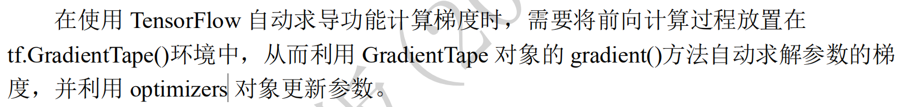

**层方式实现**

> 通过层方式实现起来更加简洁，首先新建各个网络层，并指定各层的激活函数类型：

```python
fc1 = layers.Dense(256, activation=tf.nn.relu) # 隐藏层 1
fc2 = layers.Dense(128, activation=tf.nn.relu) # 隐藏层 2
fc3 = layers.Dense(64, activation=tf.nn.relu) # 隐藏层 3
fc4 = layers.Dense(10, activation=None) # 输出层
在前向计算时，依序通过各个网络层即可：
x = tf.random.normal([4,28*28])
h1 = fc1(x) # 通过隐藏层 1 得到输出
h2 = fc2(h1) # 通过隐藏层 2 得到输出
h3 = fc3(h2) # 通过隐藏层 3 得到输出
h4 = fc4(h3) # 通过输出层得到网络输出
```

> 对于这种数据依次向前传播的网络，也可以通过 Sequential 容器封装成一个网络大类对 象，调用大类的前向计算函数即可完成所有层的前向计算：

```python
# 通过 Sequential 容器封装为一个网络类
model = layers.Sequential([ 
 layers.Dense(256, activation=tf.nn.relu) , # 创建隐藏层 1
 layers.Dense(128, activation=tf.nn.relu) , # 创建隐藏层 2
 layers.Dense(64, activation=tf.nn.relu) , # 创建隐藏层 3
 layers.Dense(10, activation=None) , # 创建输出层
]) 

# 前向计算时只需要调用一次网络大类对象即可完成所有层的按序计算：
out = model(x) # 前向计算得到输出
```

## 激活函数

**Sigmoid**

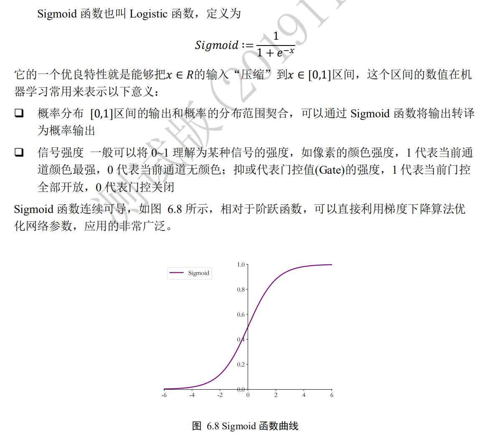

> 在 TensorFlow 中，可以通过 tf.nn.sigmoid 实现 Sigmoid 函数：

```python
In [7]:x = tf.linspace(-6.,6.,10) x # 构造-6~6 的输入向量
Out[7]:
<tf.Tensor: id=5, shape=(10,), dtype=float32, numpy=
array([-6. , -4.6666665, -3.3333333, -2. , -0.6666665,
 0.666667 , 2. , 3.333334 , 4.666667 , 6. ]…
In [8]:tf.nn.sigmoid(x) # 通过 Sigmoid 函数
Out[8]:
<tf.Tensor: id=7, shape=(10,), dtype=float32, numpy=
array([0.00247264, 0.00931597, 0.03444517, 0.11920291, 0.33924365,
 0.6607564 , 0.8807971 , 0.96555483, 0.99068403, 0.9975274 ],
 dtype=float32)>
#可以看到，向量的范围由[−6,6]映射到[0,1]的区间。
```

**ReLU**

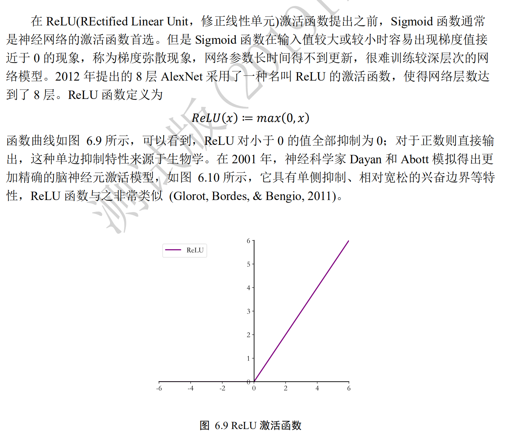

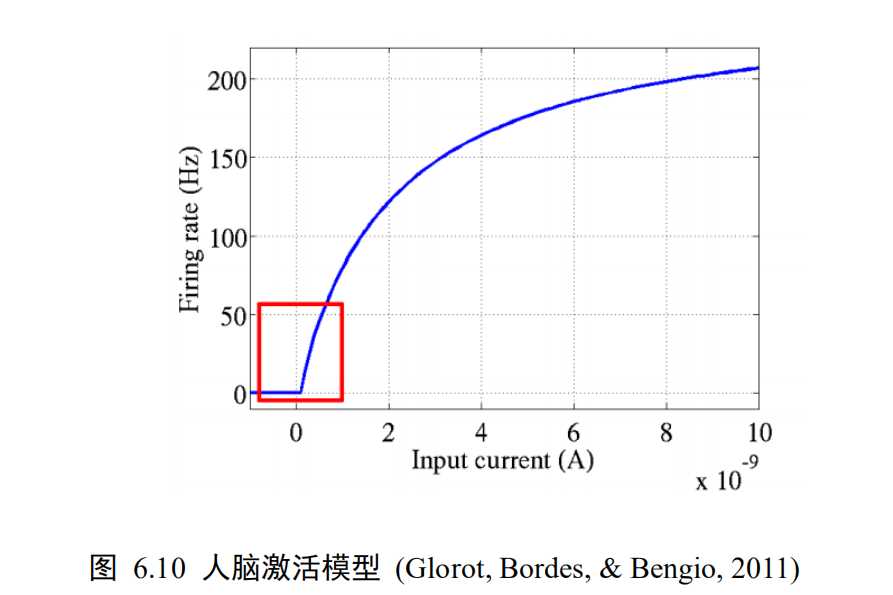

> 在 TensorFlow 中，可以通过 tf.nn.relu 实现 ReLU 函数：

```python
In [9]:tf.nn.relu(x) # 通过 ReLU 激活函数
Out[9]:
<tf.Tensor: id=11, shape=(10,), dtype=float32, numpy=
array([0. , 0. , 0. , 0. , 0. , 0.666667,
 2. , 3.333334, 4.666667, 6. ], dtype=float32)>
```


**LeakyReLU**

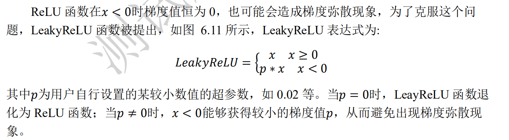


> 在 TensorFlow 中，可以通过 tf.nn.leaky_relu 实现 LeakyReLU 函数：

```python
In [10]:tf.nn.leaky_relu(x, alpha=0.1) # 通过 LeakyReLU 激活函数
Out[10]:
<tf.Tensor: id=13, shape=(10,), dtype=float32, numpy=
array([-0.6 , -0.46666667, -0.33333334, -0.2 , -0.06666666,
 0.666667 , 2. , 3.333334 , 4.666667 , 6. ],
 dtype=float32)>
```

**Tanh**


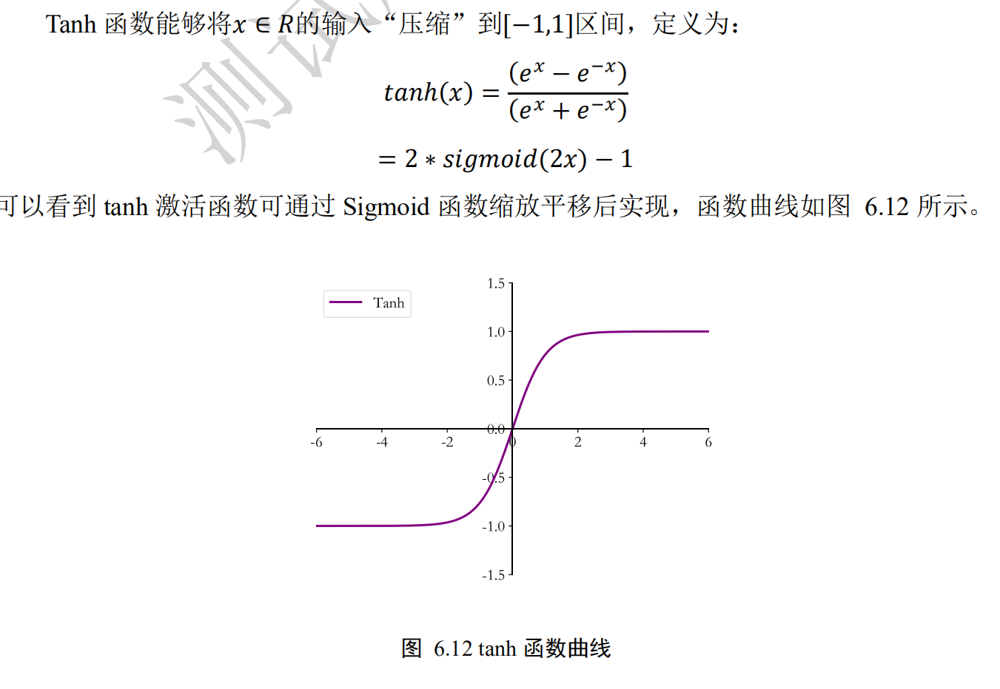

> 在 TensorFlow 中，可以通过 tf.nn.tanh 实现 tanh 函数：

```python
In [11]:tf.nn.tanh(x) # 通过 tanh 激活函数
Out[11]:
<tf.Tensor: id=15, shape=(10,), dtype=float32, numpy=
array([-0.9999877 , -0.99982315, -0.997458 , -0.9640276 , -0.58278286,
 0.5827831 , 0.9640276 , 0.997458 , 0.99982315, 0.9999877 ],
 dtype=float32)>
#可以看到向量的范围被映射到[−1,1]之间。
```

## 误差计算

**均方误差**

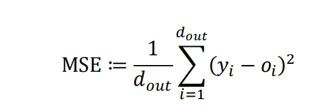

> 均方差广泛应用在回归问题中，在分类问题中也可以应用均方差误差。在 TensorFlow中，可以通过函数方式或层方式实现 MSE 误差计算：

```python
In [16]:
o = tf.random.normal([2,10]) # 构造网络输出
y_onehot = tf.constant([1,3]) # 构造真实值
y_onehot = tf.one_hot(y_onehot, depth=10)
loss = keras.losses.MSE(y_onehot, o) # 计算均方差
loss
Out[16]:
<tf.Tensor: id=27, shape=(2,), dtype=float32, numpy=array([0.779179 , 
```

> TensorFlow MSE 函数返回的是每个样本的均方差，需要在样本数量上再次平均来获得batch 的均方差：

```python
In [17]:
loss = tf.reduce_mean(loss) # 计算 batch 均方差
loss
Out[17]:
<tf.Tensor: id=30, shape=(), dtype=float32, numpy=1.2188747>
```

>  也可以通过层方式实现，对应的类为 keras.losses.MeanSquaredError()：

```python
In [18]: # 创建 MSE 类
criteon = keras.losses.MeanSquaredError()
loss = criteon(y_onehot,o) # 计算 batch 均方差
loss
Out[18]:
<tf.Tensor: id=54, shape=(), dtype=float32, numpy=1.2188747>
```

**交叉熵**

